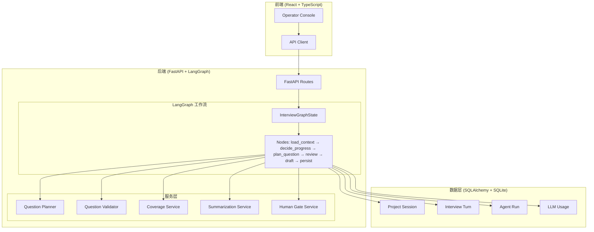
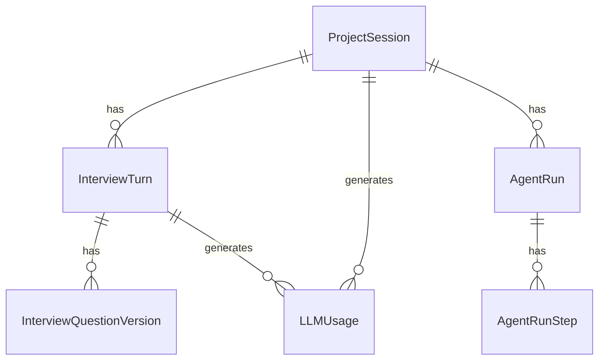
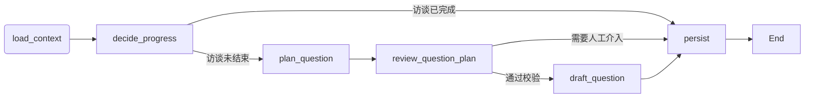

**Stateful Interview Agent** 是一个本地全栈应用，专注于对目标代码仓库执行结构化、长上下文的软件项目访谈。它的核心目标不是简单地与AI对话，而是通过**持续维护访谈状态**、**依据覆盖缺口规划下一问**、**记录人工评审信号**，生成一份对现有项目实现足够深入、清晰且可交付的"Code Understand"理解型访谈记录。

## 为什么需要状态化访谈Agent

传统的AI对话应用通常将每一轮交互视为孤立的提示词（prompt），模型只能看到本轮的对话内容。这种方式在需要深度理解复杂代码库时存在明显局限：模型无法追踪已探讨的主题、容易在不同轮次中重复提问相同内容、也难以判断访谈是否已经达到预期覆盖度。

本项目通过引入**状态化编排**机制，将整个访谈过程建模为一个有向无环图（DAG），每个节点的执行都基于完整的状态上下文。这使得系统能够：

- 追踪已覆盖的代码分支和主题领域
- 根据当前阶段约束问题的类型和深度
- 整合人工评审反馈并让它们真正影响后续规划
- 在长访谈场景下通过记忆压缩维持有效的上下文窗口

Sources: [README_zh.md](README_zh.md#L1-L20)

## 系统架构全景

项目采用分层架构设计，核心分为前端交互层、后端服务层和数据持久层，通过LangGraph实现工作流编排。



整体架构遵循以下核心原则：FastAPI提供RESTful接口，SQLAlchemy负责数据持久化，LangGraph负责多轮状态化编排，Prompt资产以YAML文件管理并通过管理器渲染。前端使用Vite + React + TypeScript + Tailwind CSS构建本地Operator Console。

Sources: [app/main.py](app/main.py#L1-L30)
Sources: [app/graphs/interview_graph.py](app/graphs/interview_graph.py#L100-L152)

## 核心概念与术语

理解本项目需要掌握几个关键概念，它们共同构成了状态化访谈的基础。

### 访谈阶段体系

项目将软件理解型访谈划分为五个主要阶段，每个阶段有明确的目标和约束：

| 阶段 | 目标 | 问题类型约束 |
|------|------|-------------|
| 全景地图构建 (Panorama Mapping) | 建立项目整体认知 | 整体架构、模块关系、技术栈 |
| 架构理解 (Architecture) | 深入理解系统设计模式 | 模块职责、接口定义、数据流向 |
| 代码细节补全 (Code Detail) | 掌握关键实现逻辑 | 核心算法、业务逻辑、边界处理 |
| 用例与场景 (Use Cases) | 理解实际使用方式 | 用户流程、异常处理、配置逻辑 |
| 最终收口 (Wrap Up) | 确认完整性，形成交付物 | 总结确认、遗漏补充 |

默认主流程始终运行在`understand_current_code`模式下，这意味着后期问题的约束方向是"解释当前代码如何工作"，而不是滑向重构设计或修改建议。

Sources: [app/services/stage_manager.py](app/services/stage_manager.py#L1-L50)

### InterviewGraphState 状态模型

LangGraph工作流的核心是`InterviewGraphState`，它是一个TypedDict，定义了每个节点之间传递的完整状态结构。这个状态包含访谈进度、上下文内容、覆盖度信息、人类评审信号等多个维度的数据：

```python
class InterviewGraphState(TypedDict, total=False):
    run_id: int
    project_id: int
    answer_text: str
    human_review_signal: dict
    
    current_turn_no: int
    next_turn_no: int
    current_stage: str
    next_stage: str
    
    coverage_state: dict
    retrieved_context: str
    repo_grounding_context: str
    
    planner_decision: dict
    validation_result: dict
    generated_question: str
    
    interview_finished: bool
```

Sources: [app/graphs/interview_state.py](app/graphs/interview_state.py#L1-L44)

### Coverage State 覆盖度追踪

系统维护一个面向评分规则（rubric）的覆盖度状态，同时追踪分支（branch）/主题（topic）证据和框架覆盖情况。Coverage State的核心数据结构包含：框架覆盖矩阵、已探索的代码分支、问题历史、以及每个分支的证据记录。这使得系统能够识别"哪些主题还没有被充分探讨"，从而指导Planner生成更有针对性的下一问。

Sources: [app/models/project.py](app/models/project.py#L30-L35)
Sources: [app/services/coverage_service.py](app/services/coverage_service.py#L1-L50)

## 数据模型设计

项目使用SQLAlchemy定义数据模型，实现项目、会话与轮次的完整管理。



核心数据模型包括：`ProjectSession`（项目会话）管理整个访谈项目的基本信息；`InterviewTurn`（访谈轮次）记录每一轮的问题、回答和元数据；`AgentRun`和`AgentRunStep`追踪执行轨迹；`LLMUsage`记录Token消耗统计。

Sources: [app/models/project.py](app/models/project.py#L1-L50)
Sources: [app/models/turn.py](app/models/turn.py#L1-L50)

## 核心能力矩阵

| 能力维度 | 具体实现 | 技术支撑 |
|---------|---------|---------|
| **状态化编排** | 多轮工作流基于LangGraph状态图执行 | StateGraph + MemorySaver checkpointer |
| **阶段感知提问** | Planner根据当前阶段选择问题类型 | stage_manager + question_planner |
| **问题校验** | Validator检查问题是否合规 | question_validator + mode_service |
| **覆盖度追踪** | Framework gap + branch evidence双追踪 | coverage_service + rubric_task_service |
| **记忆压缩** | 旧回答生成摘要，检索式上下文供给 | summarization_service + context_engineering |
| **人类协作** | 评审信号真进入工作流影响规划 | human_gate_service + human_review_signal |
| **版本管理** | 问题版本历史与差异对比 | question_version_service |
| **执行追踪** | 每次/navive生成独立run trace | run_trace_service + agent_run模型 |

Sources: [app/services/question_planner.py](app/services/question_planner.py#L1-L80)
Sources: [app/services/human_gate_service.py](app/services/human_gate_service.py#L1-L50)

## LangGraph工作流节点设计

工作流由六个核心节点组成，每个节点承担特定的职责，节点之间通过条件边形成动态流转：



- **load_context**：从数据库加载项目上下文、访谈历史、覆盖度状态
- **decide_progress**：判断是否继续访谈，决定下一阶段
- **plan_question**：核心规划节点，基于覆盖缺口和人类信号生成问题规划
- **review_question_plan**：评审问题规划，触发必要的人工审核门
- **draft_next_question**：根据规划生成实际的问题文本
- **persist**：将结果持久化到数据库，更新状态

Sources: [app/graphs/interview_graph.py](app/graphs/interview_graph.py#L35-L80)

## 项目结构速览

```
stateful_interview_agent/
├── app/
│   ├── api/routes/           # FastAPI路由定义
│   ├── core/                 # 配置、数据库、LLM客户端
│   ├── graphs/               # LangGraph状态、节点、图定义
│   ├── logging/              # JSONL结构化日志子系统
│   ├── models/               # SQLAlchemy数据模型
│   ├── prompts/              # Prompt资产与渲染层
│   ├── schemas/              # Pydantic请求/响应schema
│   └── services/             # 业务逻辑服务层
├── frontend/
│   ├── src/api/              # 类型化API客户端
│   ├── src/components/       # React组件
│   ├── src/hooks/            # 前端状态管理hooks
│   └── src/types/            # TypeScript类型定义
├── tests/                    # 后端测试套件
├── .env.example              # 环境变量示例
└── pyproject.toml            # Python项目配置
```

Sources: [README_zh.md](README_zh.md#L100-L130)

## 技术栈概览

| 层级 | 技术选型 | 用途 |
|------|---------|------|
| 后端框架 | FastAPI | REST API服务 |
| ORM | SQLAlchemy | 数据持久化 |
| 数据库 | SQLite | 本地数据存储 |
| 工作流编排 | LangGraph | 多轮状态化对话管理 |
| LLM集成 | OpenAI Compatible API | 大语言模型调用 |
| 前端框架 | React + TypeScript | Web UI构建 |
| 构建工具 | Vite | 前端开发与构建 |
| 样式 | Tailwind CSS v4 | 样式管理 |
| 国际化 | i18n | 中英文双语支持 |

Sources: [README_zh.md](README_zh.md#L70-L90)

## 下一步学习路径

完成本概览后，建议按照以下顺序深入学习：

1. **[快速启动：5分钟搭建本地开发环境](2-kuai-su-qi-dong-5fen-zhong-da-jian-ben-di-kai-fa-huan-jing)** - 配置本地开发环境并运行项目

2. **[访谈阶段体系：全景图到最终收口](3-fang-tan-jie-duan-ti-xi-cong-quan-jing-tu-dao-zui-zhong-shou-kou)** - 深入理解项目核心的分阶段设计

3. **[后端架构概览：FastAPI + SQLAlchemy + LangGraph](5-hou-duan-jia-gou-gai-lan-fastapi-sqlalchemy-langgraph)** - 理解后端各层职责与交互

4. **[LangGraph工作流：访谈图的节点与边设计](6-langgraphgong-zuo-liu-fang-tan-tu-de-jie-dian-yu-bian-she-ji)** - 详细分析工作流节点实现

对于想了解核心服务实现的读者，可以从以下页面入手：

- **[问题规划器：QuestionPlanner的生成策略](10-wen-ti-gui-hua-qi-questionplannerde-sheng-cheng-ce-lue)** - Planner如何基于覆盖缺口生成问题
- **[覆盖度服务：CoverageState的分支与主题追踪](12-fu-gai-du-fu-wu-coveragestatede-fen-zhi-yu-zhu-ti-zhui-zong)** - 覆盖度如何指导问题选择
- **[Human-in-the-Loop：评审信号如何影响工作流](14-human-in-the-loop-ping-shen-xin-hao-ru-he-ying-xiang-gong-zuo-liu)** - 人类反馈如何真正进入工作流