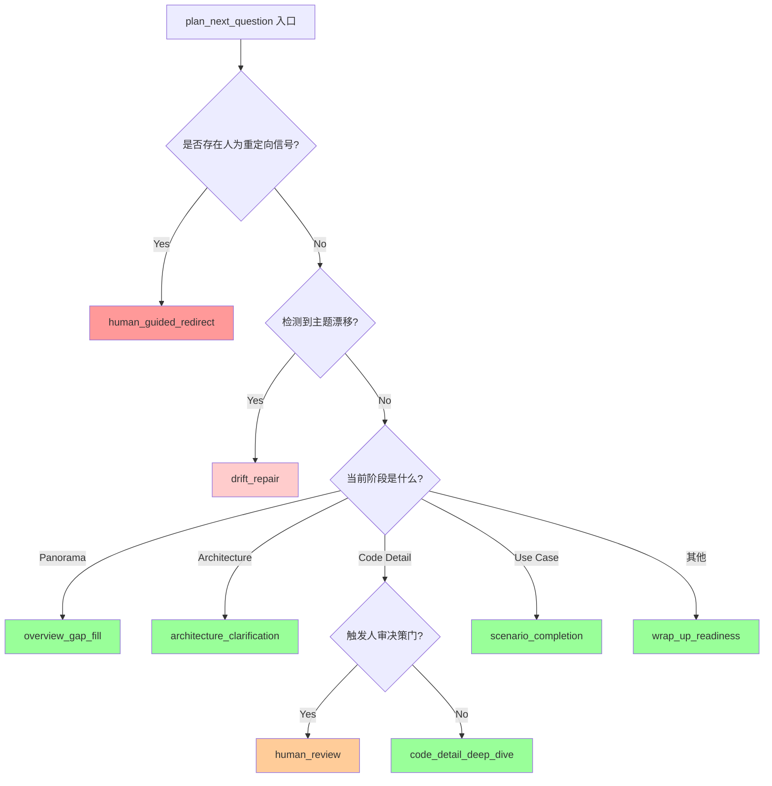
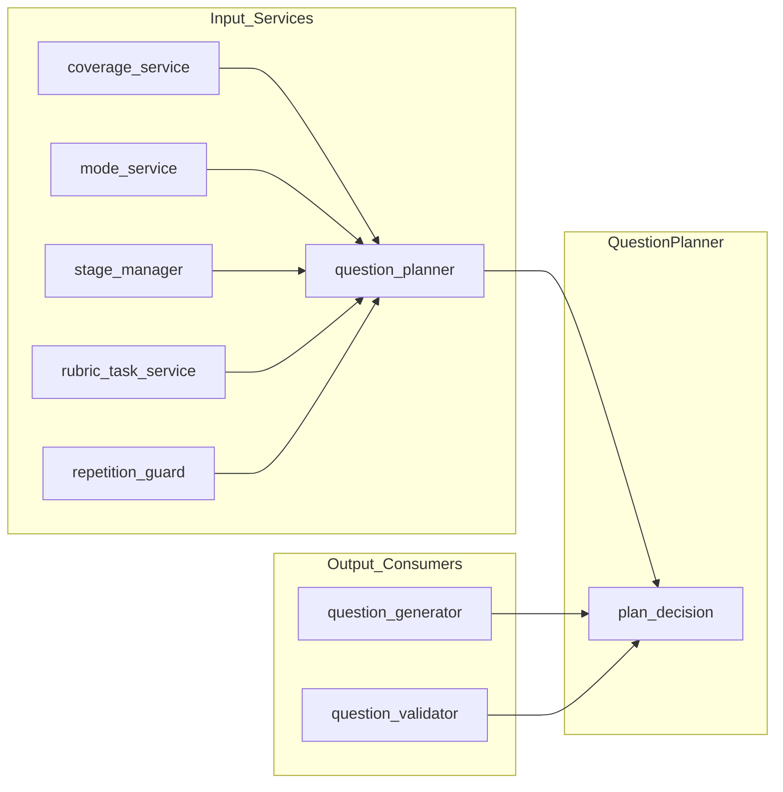

QuestionPlanner 是状态化访谈 Agent 的核心决策枢纽，负责在每个对话轮次决定"下一个问题应该问什么"。它通过多层决策链综合考虑当前阶段、人为反馈、覆盖度状态和主题漂移等信号，输出结构化的 `planner_decision` 指导后续的问题生成与检索流程。

Sources: [question_planner.py](app/services/question_planner.py#L1-L50)

## 核心决策函数：plan_next_question

主入口函数 `plan_next_question` 接收以下关键输入参数：

| 参数 | 类型 | 作用 |
|------|------|------|
| `turns` | `list[InterviewTurn]` | 历史对话轮次，用于提取上下文和分支证据 |
| `current_stage` | `str` | 当前访谈阶段（Panorama/Architecture/Code Detail/Use Case/Wrap-up） |
| `next_turn_no` | `int` | 下一轮的编号 |
| `coverage_state` | `dict` | 覆盖度状态，包含 framework、branches、question_history |
| `human_review_signal` | `dict \| None` | 人审反馈信号，可能触发重定向 |
| `agent_mode` | `str` | Agent 运行模式（understand/review/propose） |
| `task_board_json` | `str \| None` | 任务看板的序列化状态 |

Sources: [question_planner.py](app/services/question_planner.py#L36-L56)

函数返回一个包含 `question_intent`、`target_type`、`target_label`、`constraints`、`prompt_id` 等字段的决策字典。这个字典将传递至问题生成阶段，控制检索上下文的优先级和问题约束。

## 决策优先级链：六层过滤机制

QuestionPlanner 采用**级联式决策**架构，每一层根据特定条件决定是否返回结果，形成清晰的优先级链：



Sources: [question_planner.py](app/services/question_planner.py#L75-L420)

### 第一层：人类重定向信号（最高优先级）

当 `human_review_signal` 包含以下任一条件时，返回 `human_guided_redirect` 决策：

- `direction == "redirect"`
- `verdict in {"insufficient", "drifted"}`
- `preferred_focus` 非空
- `note` 非空

此时 Planner 会调用 `resolve_human_review_target` 将人类意图解析为目标标签，并强制要求后续问题遵循人类指定的聚焦方向。

Sources: [question_planner.py](app/services/question_planner.py#L75-L118)

### 第二层：主题漂移修复

当 `detect_topic_drift(coverage_state, current_stage)` 检测到漂移时（除非在 Panorama 阶段的首次漂移），返回 `drift_repair` 决策。漂移修复决策的核心约束是"返回最高优先级的框架缺口，避免陷入分支局部细节"。

Sources: [question_planner.py](app/services/question_planner.py#L133-L170)

### 第三至六层：阶段特定的覆盖度填补

根据 `current_stage` 分发至不同的生成策略：

| 阶段 | 问题意图 | 目标类型 | 关键约束 |
|------|----------|----------|----------|
| Panorama | `overview_gap_fill` | `framework_gap` | 保持宏观层级，不提及具体文件/类/方法 |
| Architecture | `architecture_clarification` | `module_or_call_chain` | 询问协作机制或调用链，避免浅层重复 |
| Code Detail | `code_detail_deep_dive` 或 `human_review` | `file`/`class`/`method`/`execution_path` | 必须引用具体代码制品 |
| Use Case | `scenario_completion` | `scenario` | 收集触发者、输入、输出、边界条件 |
| Wrap-up | `wrap_up_readiness` | `coverage_gap` | 仅关闭剩余小缺口，不开新话题 |

Sources: [question_planner.py](app/services/question_planner.py#L172-L410)

## 关键辅助函数

### 分支选择：choose_branch_for_stage

从多个证据分支中选择当前阶段最适合的一个。核心逻辑：

1. **排除已排除的分支**：过滤 `excluded_branch_ids`
2. **Code Detail 阶段额外过滤**：排除最近 4 个问题中已使用的分支 `recent_branch_ids`
3. **兜底策略**：返回第一个未被排除的分支

Sources: [question_planner.py](app/services/question_planner.py#L505-L525)

### 非冗余目标选择：choose_non_redundant_code_detail_target

在 Code Detail 阶段避免重复询问相同目标：

1. 构建当前候选目标的签名 `build_question_signature`
2. 检查签名是否出现在最近问题历史或排除集合中
3. 遍历所有分支寻找非冗余候选
4. 兜底返回第一个分支

Sources: [question_planner.py](app/services/question_planner.py#L528-L561)

### 目标类型识别：choose_code_detail_target

基于分支文本的正则匹配推断目标类型：

```python
FILE_PATTERN = re.compile(r"\b[\w./-]+\.(?:py|ts|tsx|js|jsx|java|go|rb|yaml|yml|json)\b")
CLASS_PATTERN = re.compile(r"\b[A-Z][A-Za-z0-9_]{2,}\b")
METHOD_PATTERN = re.compile(r"\b[a-z_][a-z0-9_]{2,}\s*\(")
```

匹配优先级：**文件 > 类 > 方法 > 执行路径**

Sources: [question_planner.py](app/services/question_planner.py#L475-L502)

### 优先级排序：prioritized_stage_gaps

为每个阶段定义覆盖度缺口的优先级顺序：

```python
priority_order = {
    PANORAMA_STAGE: ["purpose", "target_users", "boundaries", "major_modules", ...],
    ARCHITECTURE_STAGE: ["module_responsibilities", "collaboration_mechanisms", ...],
    CODE_DETAIL_STAGE: ["specific_files_count", "specific_methods_count", ...],
    USE_CASE_STAGE: ["representative_scenarios_count", "actors_roles_count", ...],
}
```

Sources: [question_planner.py](app/services/question_planner.py#L423-L453)

## 输出契约设计

`plan_next_question` 返回的决策字典定义了完整的问题生成指令：

```python
{
    "question_intent": "code_detail_deep_dive",      # 问题意图分类
    "phase": "Code Detail Completion",               # 当前阶段
    "intent_mode": "understand_current_code",        # 意图模式
    "mode": "understand_current_code",               # Agent 模式
    "target_type": "file",                           # 目标类型
    "target_label": "app/services/question_...",     # 目标标签
    "target_identifier": "app/services/...",         # 目标标识符
    "target_branch_id": "br_001",                    # 关联分支ID
    "selected_framework_gap": "specific_files_count",# 框架缺口
    "confidence": 0.7,                               # 决策置信度
    "retrieval_focus": "code-detail counts, ...",    # 检索优先级描述
    "constraints": ["Stay in understand-...", ...],  # 约束列表
    "prompt_id": "next_question_code_detail",        # Prompt 模板ID
    "reasoning": "Code-detail gaps remaining: ...",  # 决策理由
    "why_this_question": "Code-detail should ...",   # 可读解释
    "validation_constraints": ["must be implementation...", ...], # 校验约束
}
```

Sources: [question_planner.py](app/services/question_planner.py#L290-L315)

## 与其他服务的交互

### 依赖关系图



- **coverage_service**：提供 `framework_gaps_for_stage()`、`detect_topic_drift()` 和分支证据
- **mode_service**：提供 `get_mode_constraints()` 和 `is_understanding_mode()` 以生成模式约束
- **stage_manager**：提供阶段常量（`PANORAMA_STAGE`、`ARCHITECTURE_STAGE` 等）
- **rubric_task_service**：提供任务看板优先级 `get_next_priority_task()`
- **repetition_guard**：提供 `build_question_signature()` 用于去重判断

Sources: [question_planner.py](app/services/question_planner.py#L1-L35)

## 调用链路

在 LangGraph 节点 `generate_question_node` 中，`plan_next_question` 被调用两次：

1. **首次调用**（第133行）：基于当前状态生成初步决策
2. **二次调用**（第192行）：当问题生成器检测到问题过于相似时，用 `excluded_branch_ids` 和 `excluded_target_signatures` 重新规划

```python
planner_decision = planner_decision_override or plan_next_question(
    turns=turns,
    current_stage=current_stage,
    next_turn_no=turn_no,
    coverage_state=coverage_state,
    human_review_signal=human_review_review_...,
    agent_mode=project.agent_mode or AgentMode.UNDERSTAND_...,
    task_board_json=serialize_task_board(task_board),
)
```

Sources: [interview_nodes.py](app/graphs/interview_nodes.py#L133-L143)

## 设计模式总结

QuestionPlanner 采用了以下架构模式：

1. **策略模式**：每个阶段对应一个独立的生成策略，通过 if-elif 链分发
2. **级联决策**：高优先级条件（人类信号、漂移）先于常规覆盖度填补
3. **去重守卫**：通过签名机制和排除集合避免重复提问
4. **可观测决策**：每个决策包含 `reasoning`、`why_this_question` 等元数据便于调试

这些设计确保了问题生成的**可控性**（人类可干预）、**多样性**（避免重复）、**阶段适配性**（不同阶段不同策略）和**可追溯性**（每个决策有清晰理由）。

---

**延伸阅读**：

- [问题校验器：Validator的阶段约束与模式检查](11-wen-ti-xiao-yan-qi-validatorde-jie-duan-yue-shu-yu-mo-shi-jian-cha) — 了解 Planner 输出如何经过 Validator 校验
- [覆盖度服务：CoverageState的分支与主题追踪](12-fu-gai-du-fu-wu-coveragestatede-fen-zhi-yu-zhu-ti-zhui-zong) — 深入理解覆盖度检测机制
- [Human-in-the-Loop：评审信号如何影响工作流](14-human-in-the-loop-ping-shen-xin-hao-ru-he-ying-xiang-gong-zuo-liu) — 了解 human_review_signal 的完整生命周期