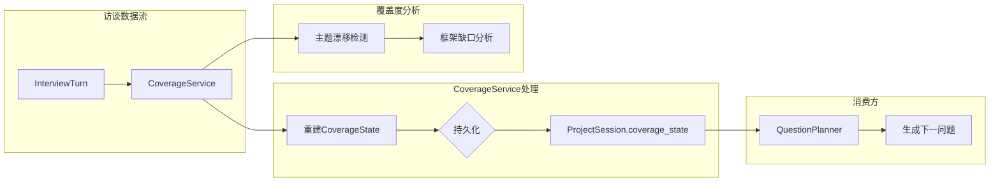

覆盖度服务（CoverageService）是状态化访谈Agent的核心组件之一，承担着**访谈进度追踪**与**下一问题规划**的双重职责。在LangGraph工作流中，它作为桥梁连接了已完成的访谈轮次与即将生成的问题——通过结构化地记录每个轮次的主题分支、框架覆盖情况，为QuestionPlanner提供「哪里已覆盖、哪里是空白」的科学依据，从而实现真正的**需求驱动型问题生成**，而非简单的随机提问。

## 架构概览：CoverageService的核心定位

CoverageService在整个访谈系统中的位置可以概括为「**双向数据枢纽**」：它接收来自InterviewTurn的历史数据（问题、回答、分析结果），经过结构化处理后输出CoverageState；这个状态随后被QuestionPlanner消费，用于指导下一问题的生成方向。



CoverageService的核心功能可以分解为四个层次：

| 层次 | 功能 | 关键函数 |
|------|------|----------|
| 状态管理 | CoverageState的加载、保存与重建 | `load_coverage_state`, `save_coverage_state`, `rebuild_coverage_state` |
| 分支追踪 | 主题分支的识别、合并与优先级计算 | `extract_keywords`, `find_matching_branch`, `compute_branch_priority` |
| 框架覆盖 | 全景图、架构、代码细节等维度覆盖度统计 | `rebuild_framework_coverage`, `framework_gaps_for_stage` |
| 漂移检测 | 识别访谈是否偏离当前阶段的核心目标 | `detect_topic_drift` |

Sources: [coverage_service.py](app/services/coverage_service.py#1-50)

## CoverageState的数据结构设计

CoverageState是一个JSON序列化的字典，存储在`ProjectSession.coverage_state`字段中。其结构经过精心设计，兼顾了**完整性**与**可演进性**。

### 顶层结构

```python
def default_coverage_state() -> dict[str, Any]:
    return {
        "version": 2,
        "branch_count": 0,
        "updated_through_turn_no": 0,
        "branches": [],           # 主题分支列表
        "question_history": [],   # 问题历史（用于去重）
        "framework": {},          # 框架覆盖度
    }
```

其中`version`字段的存在是为了兼容数据结构的历史演进——当CoverageState的schema发生变化时，可以通过版本号判断是否需要迁移。

Sources: [coverage_service.py](app/services/coverage_ervice.py#113-122)

### 分支结构（Branch）

每个分支代表访谈过程中识别出的一个**主题线索**。分支并非预先定义，而是通过分析每轮访谈的回答**动态发现**的：

```python
{
    "branch__id": "authentication-flow",
    "label": "用户认证流程",
    "stage": "Architecture Understanding",
    "status": "partial",           # needs_follow_up | partial | covered
    "priority": 0.52,
    "keywords": ["auth", "token", "jwt", "login", "session"],
    "evidence_turn_ids": ["uuid-1", "uuid-2"],
    "evidence_turn_nos": [1, 3],
    "summary": "用户认证采用JWT token方案...",
    "unresolved_points": ["token刷新机制未明确"],
    "key_points": ["使用JWT", "支持OAuth2"],
    "last_turn_no": 3,
}
```

分支的核心设计哲学是**增量合并**：当新的访谈轮次产生的关键词与现有分支有重叠时，系统会自动将该轮次合并到已有分支中，而非创建新分支。这种设计使得访谈过程中自然浮现的主题能够被聚合追踪。

Sources: [coverage_service.py](app/services/coverage_service.py#206-245)

### 框架覆盖结构（Framework）

框架覆盖度从六个维度评估访谈的完整性，每个维度对应访谈的不同阶段：

```python
{
    "panorama": {           # 全景图维度
        "purpose": False,
        "target_users": False,
        "boundaries": False,
        "major_modules": False,
        "high_level_workflow": False,
        "initial_module_relationships": False,
    },
    "architecture": {       # 架构维度
        "architecture_style_or_organization": False,
        "module_responsibilities": False,
        "collaboration_mechanisms": False,
        "key_call_chains": False,
        "system_structure": False,
        "design_rationale_or_quality_attributes": False,
    },
    "code_detail": {        # 代码细节维度（计数型）
        "specific_files_count": 0,
        "specific_classes_count": 0,
        "specific_methods_count": 0,
        "execution_paths_count": 0,
        "library_usage_points_count": 0,
        "error_handling_points_count": 0,
        "protocol_implementation_points_count": 0,
        "state_management_points_count": 0,
    },
    "use_cases": {          # 用例维度（计数型）
        "representative_scenarios_count": 0,
        "actors_roles_count": 0,
        "input_output_patterns_count": 0,
        "boundary_conditions_count": 0,
        "extension_points_count": 0,
    },
    "human_collaboration": { # 人机协作维度
        "human_judgment_turn_count": 0,
        "human_correction_turn_count": 0,
        "human_redirection_turn_count": 0,
        "human_prioritization_turn_count": 0,
    },
    "stage_turn_counts": {   # 各阶段轮次统计
        "Panorama Mapping": 0,
        "Architecture Understanding": 0,
        "Code Detail Completion": 0,
        "Use Cases & Scenarios": 0,
        "Final Wrap-up": 0,
    },
}
```

这种设计的精妙之处在于区分了**布尔型覆盖**（如panorama维度的各个字段，只有「是否覆盖」两种状态）与**计数型覆盖**（如code_detail维度，需要累积统计）。对于布尔型字段，系统直接通过关键词匹配判断是否已覆盖；对于计数型字段，则通过正则表达式从回答中提取具体的技术元素。

Sources: [coverage_service.py](app/services/coverage_service.py#259-302)

## 分支追踪机制：从关键词到主题聚类

分支追踪是CoverageService最核心的能力。它的目标是**从非结构化的访谈文本中自动识别主题，并将其聚合成可追踪的分支**。这个过程可以分为四个步骤：关键词提取、分支匹配、分支合并、优先级计算。

### 关键词提取

`extract_keywords`函数负责从问题文本、回答摘要、回答正文和分析结果中提取有意义的关键词。提取过程包含以下过滤策略：

1. **停用词过滤**：移除常见英文停用词（如"the", "and", "system", "service"等）
2. **长度过滤**：只保留长度≥3的单词
3. **频率排序**：按词频降序排列，取前8个

```python
def extract_keywords(*texts: str) -> list[str]:
    tokens = []
    for text in texts:
        lowered = text.lower()
        for token in re.findall(r"[a-zA-Z][a-zA-Z0-9_-]{2,}", lowered):
            if token in STOPWORDS or token.isdigit():
                continue
            tokens.append(token)

    scored: dict[str, int] = {}
    for token in tokens:
        scored[token] = scored.get(token, 0) + 1

    return [
        token
        for token, _ in sorted(scored.items(), key=lambda item: (-item[1], item[0]))
    ][:8]
```

停用词表中不仅包含常见词汇，还特别加入了技术领域的高频泛化词汇（如"system", "service", "module"），以避免这些词主导关键词列表。

Sources: [coverage_service.py](app/services/coverage_service.py#553-569)

### 分支匹配与合并

当提取出候选关键词后，系统需要判断这些关键词是否与已有分支存在关联。`find_matching_branch`函数使用**Jaccard相似度**来衡量关键词集合的重叠程度：

```python
def find_matching_branch(
    branches: list[dict[str, Any]], candidate_keywords: list[str]
) -> dict[str, Any] | None:
    candidate_set = set(candidate_keywords)
    best_match = None
    best_score = 0.0
    for branch in branches:
        existing_set = set(branch["keywords"])
        if not existing_set:
            continue
        overlap = len(candidate_set & existing_set)
        union = len(candidate_set | existing_set)
        score = overlap / union if union else 0.0
        if overlap >= 2 and score > best_score:
            best_match = branch
            best_score = score
    return best_match
```

匹配规则要求**至少2个关键词重叠**且**Jaccard分数最高**才会触发合并。这一阈值设计避免了过早合并不同主题的分支。

分支合并时会更新以下字段：
- `keywords`：合并两个关键词集合（上限10个）
- `evidence_turn_ids`与`evidence_turn_nos`：追加新的证据轮次
- `summary`：更新为最新轮次的摘要
- `unresolved_points`：追加新的未解决问题
- `key_points`：合并关键知识点（上限6个）
- `status`：根据合并后的状态重新评估

Sources: [coverage_service.py](app/services/coverage_service.py#577-597)

### 优先级计算

分支优先级决定了QuestionPlanner在选择下一个探索方向时的偏好。`compute_branch_priority`函数采用加权评分模型：

```python
def compute_branch_priority(branch: dict[str, Any]) -> float:
    priority = 0.4
    if branch["status"] == "needs_follow_up":
        priority += 0.35
    elif branch["status"] == "partial":
        priority += 0.2
    if branch["unresolved_points"]:
        priority += 0.15
    priority += min(len(branch["keywords"]), 6) * 0.03
    return round(priority, 3)
```

优先级计算体现了以下设计意图：
- **基础分0.4**：确保所有分支都有被探索的机会
- **未解决事项加分**：有待跟进点（unresolved_points）的分支获得最高优先级（+0.35）
- **部分覆盖加分**：已收集一些证据但未完成的分支获得中等优先级（+0.2）
- **关键词广度加分**：主题越丰富（关键词越多），优先级略微提升

Sources: [coverage_service.py](app/services/coverage_service.py#603-613)

## 框架覆盖度追踪：多维度的覆盖分析

框架覆盖度的核心价值在于将访谈进度**量化**。不同于分支追踪关注「**哪些主题被讨论过**」，框架覆盖关注「**哪些维度的知识已获取**」。

### 关键词映射机制

每个维度（panorama、architecture等）都维护着一组**关键词映射表**。例如，全景图维度的关键词映射为：

```python
PANORAMA_KEYWORDS = {
    "purpose": {"purpose", "goal", "achieve", "problem", "supports", "helps"},
    "target_users": {"user", "users", "customer", "customers", "operator", ...},
    "boundaries": {"boundary", "boundaries", "scope", "limit", ...},
    "major_modules": {"module", "modules", "service", "services", ...},
    "high_level_workflow": {"workflow", "flow", "routing", "pipeline", ...},
    "initial_module_relationships": {"between", "connect", "handoff", ...},
}
```

当系统分析一轮访谈的文本时，只要任意关键词出现在文本中，就将对应的覆盖标志设为`True`：

```python
for key, keywords in PANORAMA_KEYWORDS.items():
    if any(keyword in text for keyword in keywords):
        panorama[key] = True
```

Sources: [coverage_service.py](app/services/coverage_service.py#65-90)

### 计数型维度的统计

对于code_detail等计数型维度，系统使用正则表达式从回答中提取具体的技术元素：

```python
FILE_PATTERN = re.compile(r"\b[\w./-]+\.(?:py|ts|tsx|js|jsx|java|go|rb|yaml|yml|json)\b")
CLASS_PATTERN = re.compile(r"\b[A-Z][A-Za-z0-9_]{2,}\b")
METHOD_PATTERN = re.compile(r"\b[a-z_][a-z0-9_]{2,}\s*\(")
LIBRARY_PATTERN = re.compile(
    r"\b(?:openai|fastapi|sqlalchemy|langgraph|langchain|pydantic|react|tailwind|vite)\b",
    re.IGNORECASE,
)
```

这些模式在每一轮访谈的回答文本中执行匹配，累积计数。这种设计使得系统能够追踪访谈是否深入到了具体的代码细节层面，而不仅仅停留在泛泛而谈。

Sources: [coverage_service.py](app/services/coverage_service.py#55-63)

### 阶段缺口分析

`framework_gaps_for_stage`函数根据当前访谈阶段返回对应的覆盖缺口：

```python
def framework_gaps_for_stage(coverage_state: dict[str, Any], stage: str) -> list[str]:
    if stage == "Panorama Mapping":
        return gap_map.get("panorama", [])
    if stage == "Architecture Understanding":
        return gap_map.get("architecture", [])
    if stage == "Code Detail Completion":
        return gap_map.get("code_detail", [])
    if stage == "Use Cases & Scenarios":
        return gap_map.get("use_cases", [])
    return []
```

这个接口被QuestionPlanner直接消费，用于生成针对性的覆盖缺口问题。例如，当处于"Panorama Mapping"阶段且"purpose"未覆盖时，QuestionPlanner会优先生成关于项目目的的问题。

Sources: [coverage_service.py](app/services/coverage_service.py#615-675)

## 与QuestionPlanner的集成：覆盖度驱动的提问策略

CoverageState的最终消费者是QuestionPlanner。两者之间的集成遵循「**覆盖度引导**」原则：QuestionPlanner不是随机生成问题，而是基于CoverageState提供的覆盖缺口和分支优先级来决定下一问题的方向。

### 消费接口

QuestionPlanner通过以下方式消费CoverageState：

```python
def plan_next_question(
    *,
    turns: list[InterviewTurn],
    current_stage: str,
    next_turn_no: int,
    coverage_state: dict[str, Any],  # 核心输入
    ...
):
    framework = normalize_framework_coverage(
        coverage_state.get("framework", default_framework_coverage())
    )
    branches = coverage_state.get("branches", [])
    stage_gaps = framework_gaps_for_stage(coverage_state, current_stage)
    drift = detect_topic_drift(coverage_state, current_stage)
    ...
```

QuestionPlanner的决策逻辑可以概括为：

1. **优先处理Human Review信号**：如果人类评审者提供了重定向指示，优先遵循人类意图
2. **检测并修正主题漂移**：如果当前活跃分支偏离了阶段目标，生成返回问题
3. **填补框架覆盖缺口**：从当前阶段的覆盖缺口中选择一个作为问题主题
4. **深耕高优先级分支**：如果没有明显缺口，选择优先级最高的分支继续深入

Sources: [question_planner.py](app/services/question_planner.py#42-90)

### 漂移检测与修正

`detect_topic_drift`函数负责识别访谈是否偏离了当前阶段的核心目标：

```python
DRIFT_NARROW_TOPIC_MARKERS = {
    "safety", "audit", "edge", "exception", "failure",
    "retry", "fallback", "boundary", "subprocess",
}

def detect_topic_drift(coverage_state: dict[str, Any], stage: str) -> dict[str, Any]:
    # 在全景图阶段，如果还有宏观缺口但活跃分支聚焦在狭窄的安全/边界话题上
    if stage == "Panorama Mapping" and panorama_gaps and narrow_topic_hits >= 2:
        return {
            "detected": True,
            "reason": "Panorama still has macro gaps, but the active branch is drifting...",
            "branch_id": top_branch.get("branch_id"),
        }
    # 在架构阶段，如果讨论进入了变更规划而非理解当前架构
    if stage in {"Architecture Understanding", "Code Detail Completion"} and any(
        marker in branch_text for marker in {"should change", "redesign", "refactor", ...}
    ):
        return {
            "detected": True,
            "reason": "The active branch is drifting from understanding to change-planning...",
        }
    return {"detected": False, "reason": "", "branch_id": None}
```

漂移检测的触发条件包括：
- **狭窄话题入侵**：在宏观阶段（Panorama/Architecture）讨论安全审计、边界条件等狭窄话题
- **变更规划偏移**：在理解阶段讨论「应该怎么改」而非「现在是什么」

当检测到漂移时，QuestionPlanner会生成一个「返回」类型的问题，引导访谈回到当前阶段的覆盖缺口上。

Sources: [coverage_service.py](app/services/coverage_service.py#677-720)

## 持久化与重建：CoverageState的生命周期

CoverageState的生命周期与ProjectSession紧密绑定。它以JSON字符串的形式存储在数据库中，在每次访谈轮次完成后被更新。

### 加载与保存

```python
def load_coverage_state(project: ProjectSession) -> dict[str, Any]:
    raw_value = getattr(project, "coverage_state", None)
    if not raw_value:
        return default_coverage_state()
    
    try:
        parsed = json.loads(raw_value)
    except json.JSONDecodeError:
        return default_coverage_state()
    # 版本兼容处理...
    return normalize_framework_coverage(parsed)

def save_coverage_state(project: ProjectSession, coverage_state: dict[str, Any]) -> None:
    project.coverage_state = json.dumps(coverage_state, ensure_ascii=True, sort_keys=True)
```

Sources: [coverage_service.py](app/services/coverage_service.py#124-160)

### 完整重建

`rebuild_coverage_state`函数用于在必要时从头重建整个CoverageState。它遍历项目中的所有访谈轮次，逐轮分析并更新覆盖度：

```python
def rebuild_coverage_state(turns: list[InterviewTurn]) -> dict[str, Any]:
    branches: list[dict[str, Any]] = []
    question_history: list[dict[str, Any]] = []

    for turn in turns:
        # 构建问题历史条目
        question_history.append(build_question_history_entry(...))
        
        if not turn.answer_text:
            continue
            
        # 提取关键词、分析回答、合并分支...
        ...
        
    # 计算所有分支的优先级
    for branch in branches:
        branch["priority"] = compute_branch_priority(branch)
        
    return {
        "branch_count": len(branches),
        "branches": sorted(branches, key=lambda item: item["priority"], reverse=True),
        "framework": rebuild_framework_coverage(turns),
        ...
    }
```

这种重建能力至关重要——它保证了即使CoverageState在持久化过程中出现损坏或版本不兼容，也能通过重新分析访谈历史来恢复正确的覆盖度状态。

Sources: [coverage_service.py](app/services/coverage_service.py#162-255)

## 进阶阅读路径

覆盖度服务的设计深度依赖于几个核心概念，建议按以下顺序延伸阅读：

- **[问题规划器：QuestionPlanner的生成策略](10-wen-ti-gui-hua-qi-questionplannerde-sheng-cheng-ce-lue)** — 了解CoverageState如何被消费，以及QuestionPlanner如何基于覆盖缺口生成具体问题
- **[上下文工程：长访谈下的记忆压缩与检索](13-shang-xia-wen-gong-cheng-chang-fang-tan-xia-de-ji-yi-ya-suo-yu-jian-suo)** — 当访谈轮次超过一定数量时，CoverageState如何与压缩后的历史记忆协同工作
- **[Human-in-the-Loop：评审信号如何影响工作流](14-human-in-the-loop-ping-shen-xin-hao-ru-he-ying-xiang-gong-zuo-liu)** — 了解人类评审信号如何与覆盖度分析互动，共同指导问题生成方向