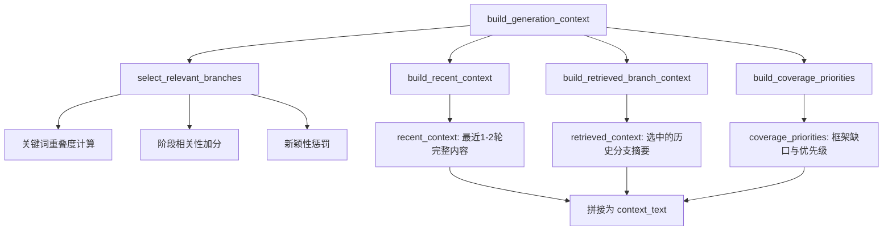

在状态化访谈Agent中，如何在长访谈（可能涉及数十轮对话）中高效管理上下文，是决定系统能否持续生成高质量问题的核心挑战。本文档深入剖析该项目的上下文工程架构，涵盖**记忆压缩**、**语义检索**、**分支评分**三大核心机制，并展示它们如何在LangGraph工作流中协同工作。

## 核心挑战与设计思路

长访谈场景面临三个相互制约的约束：其一，LLM的上下文窗口存在 token 上限；其二，访谈需要跨轮次追踪多个主题分支；其三，问题生成必须基于「已讨论内容」但又需避免重复。项目的解决方案是构建**分层上下文架构**，将记忆分为「近期上下文」「历史分支上下文」「覆盖度优先级」三个层次，按需动态组合。

Sources: [context_engineering.py](app/services/context_engineering.py#L1-L50)
## 架构总览：三层上下文模型

项目的上下文构建由 `build_generation_context()` 函数主导，它接收当前轮次的会话历史与覆盖度状态，输出一个结构化上下文字典，供问题生成器消费。其内部工作流程如下：



该函数返回一个包含以下字段的字典：

| 字段 | 内容 | 用途 |
|------|------|------|
| `recent_context` | 最近1-2轮的问题与回答（含摘要） | 保持对话连贯性 |
| `retrieved_context` | 选中的历史分支详情 | 提供深挖依据 |
| `coverage_priorities` | 当前阶段的框架缺口 | 引导问题方向 |
| `selected_branch_ids` | 检索到的分支ID列表 | 追踪已覆盖主题 |
| `stage_objective` | 当前阶段的教学目标 | 系统提示词补充 |

Sources: [context_engineering.py](app/services/context_engineering.py#L50-L95)

## 记忆压缩：从完整回答到结构化摘要

项目采用**双轨压缩策略**：对最近的完整轮次保留原始回答，对更早的轮次则使用LLM生成的摘要。这一策略在 `transcript_service.py` 的 `build_compact_interview_context()` 函数中实现：

```python
# 核心逻辑
if turn.turn_no == latest_completed_turn_no:
    lines.append(f"Answer: {answer_text}")  # 最新轮次：完整回答
elif turn.answer_summary:
    lines.append(f"Summary: {turn.answer_summary}")  # 早期轮次：摘要
else:
    lines.append(f"Answer: {answer_text}")  # 无摘要时回退
```

这确保了：

1. **最近一轮的回答完整保留** — 因为问题生成需要精确理解用户刚刚说了什么
2. **历史轮次使用摘要** — 将大量token压缩为结构化的关键点列表
3. **支持覆盖** — 当 `latest_answer_override` 参数传入时，可临时替换最新回答的内容（用于处理正在提交中的答案）

Sources: [transcript_service.py](app/services/transcript_service.py#L35-L60)
Sources: [test_history_compression.py](tests/test_history_compression.py#L20-L40)

### LLM摘要生成：summarization_service.py

当需要对回答进行深度压缩时，系统调用 `summarization_service.py` 中的 `summarize_answer()` 函数。该函数使用专门的Prompt模板提取：

- **关键点 (key_points)**：回答的核心内容
- **后续锚点 (follow_up_achors)**：需要进一步深挖的方向
- **RAG分块 (rag_chunks)**：用于语义检索的文本片段

```python
prompt = get_prompt_manager().render(
    "answer_summary",
    {
        "system_prompt": system_prompt,
        "stage": turn.stage,
        "question_text": turn.question_text,
        "answer_text": turn.answer_text,
    },
)
response = client.chat.completions.create(
    model=settings.openai_model,
    messages=prompt.messages,
    temperature=0.2,
)
```

如果LLM调用失败，系统会降级到基于正则的**回退摘要策略**——提取前两个完整句子并限制在320字符内。

Sources: [summarization_service.py](app/services/summarization_service.py#L30-L80)
Sources: [summarization_service.py](app/services/summarization_service.py#L130-L145)

## 语义检索：从覆盖度状态中选取相关分支

项目的检索机制并非传统RAG的向量相似度搜索，而是基于**Coverage State（覆盖度状态）**的**结构化分支检索**。这是一个巧妙的设计：将每轮访谈中提取的「主题分支」存入 `coverage_state.branches`，检索时通过多维度打分选取最相关的分支。

### 覆盖度状态的分支结构

每个分支是一个包含以下字段的字典：

```python
{
    "branch_id": "auth_handoff",
    "label": "auth and orchestration handoff",
    "stage": "Architecture Understanding",
    "status": "needs_follow_up",  # covered | partial | needs_follow_up
    "priority": 0.95,
    "keywords": ["auth", "gateway", "session", "orchestration"],
    "evidence_turn_ids": [2],
    "evidence_turn_nos": [8],
    "summary": "API gateway routes to auth...",
    "unresolved_points": ["Session handoff between..."],
    "key_points": [...],
}
```

分支由 `coverage_service.py` 的 `rebuild_coverage_state()` 函数从访谈历史中自动构建——每当一轮回答完成，系统提取关键词、摘要、未完成点，并将其归并到现有分支或创建新分支。

Sources: [coverage_service.py](app/services/coverage_service.py#L180-L250)

### 多维度评分算法

`select_relevant_branches()` 函数实现了核心的分支选择逻辑，综合以下因素计算每个分支的最终得分：

```python
score = float(branch.get("priority", 0.0))  # 基础优先级

# 1. 阶段相关性加分
if branch.get("stage") == current_stage:
    score += 0.4 * stage_weight  # 当前阶段分支获得显著加分
elif current_stage == ARCHITECTURE_STAGE and branch.get("stage") == PANORAMA_STAGE:
    score += 0.18  # 架构阶段可回溯全景阶段

# 2. 状态加分
if status == "needs_follow_up":
    score += 0.35  # 待深化的分支优先
elif status == "partial":
    score += 0.18

# 3. 关键词重叠
if keyword_overlap:
    score += min(keyword_overlap * 0.18, 0.54)

# 4. 框架缺口匹配
gap_hits = sum(1 for gap in stage_gaps if gap.replace("_", " ") in label_and_summary)
if gap_hits:
    score += gap_hits * 0.35

# 5. 阶段相关性bonus
score += stage_relevance_bonus(...)

# 6. 新颖性惩罚（核心！）
novelty_penalty = recent_branch_counts.get(branch_id, 0) * 0.34
if recent_top_branch_id == branch_id:
    novelty_penalty += 0.28
novelty_penalty += stage_misalignment_penalty(...)
score -= novelty_penalty
```

Sources: [context_engineering.py](app/services/context_engineering.py#L200-L270)

**新颖性惩罚机制**是避免问题重复的关键设计：
- 如果某个分支在最近6轮的 `question_history` 中频繁出现，它会被扣分
- 如果当前轮次正好是上一轮刚问过的分支，额外加罚0.28分
- 阶段错位惩罚：例如在全景阶段讨论具体代码实现会触发0.45分的惩罚

最终返回得分最高的**前3个分支**，确保上下文长度可控。

Sources: [context_engineering.py](app/services/context_engineering.py#L270-L280)
Sources: [test_context_retrieval.py](tests/test_context_retrieval.py#L60-L120)

### 阶段感知的相关性bonus

`stage_relevance_bonus()` 函数根据当前访谈阶段，给特定内容的分支额外加分：

```python
if current_stage == CODE_DETAIL_STAGE:
    if any(marker in text for marker in (".py", ".ts", ".tsx", ".js", "class", "method")):
        return 0.28
    return -0.1  # 代码阶段不应讨论架构概念
if current_stage == USE_CASE_STAGE:
    if any(marker in text for marker in ("scenario", "actor", "input", "output")):
        return 0.26
```

Sources: [context_engineering.py](app/services/context_engineering.py#L295-L315)

## 与LangGraph工作流的集成

上下文工程并非独立运行，而是深度嵌入到LangGraph的节点执行流程中。以下是它在 `interview_graph. nodes.py` 中的典型调用位置：

```python
# 在生成下一个问题之前
context = build_generation_context(
    turns=state.turns,
    current_stage=state.current_stage,
    next_turn_no=state.next_turn_no,
    coverage_state=state.coverage_state,
    latest_answer_override=pending_answer,
)
# 将上下文注入到Prompt模板中
prompt = render_prompt("question_generation", context=context)
```

这种设计确保每次问题生成时，LLM接收到的上下文已经过压缩和检索优化，既包含足够的历史信息，又不会超出token限制。

Sources: [context_engineering.py](app/services/context_engineering.py#L30-L94)

## 双重重复防护：词汇 + 语义

除了分支级别的检索去重，项目还在问题生成完成后进行**单问题级别的重复检测**。这由 `repetition_guard.py` 中的两阶段检查实现：

### 第一阶段：精确匹配

```python
def is_question_too_similar(new_question, old_questions, threshold=0.82):
    for old in old_questions:
        if similarity(new_question, old) >= threshold:
            return True
```

使用 `difflib.SequenceMatcher` 计算词汇相似度，阈值设为0.82。

### 第二阶段：语义冗余检测

当词汇相似度在 [0.45, 0.82) 区间且问题意图相同时，启用 **OpenAI Embedding** 进行语义相似度计算：

```python
if settings.duplicate_guard_use_embeddings:
    embedding_score = get_embedding_similarity(text, previous_question)
    if embedding_score >= settings.duplicate_guard_embedding_threshold:
        return True  # 语义上也重复
```

这提供了双重保护：词汇层面的快速过滤 + 语义层面的精确判断。

Sources: [repetition_guard.py](app/services/repetition_guard.py#L100-L140)
Sources: [embedding_similarity.py](app/services/embedding_similarity.py#L20-L40)

## 上下文工程的关键设计原则

通过分析代码实现，可以提炼出以下五个核心原则：

| 原则 | 实现方式 | 效果 |
|------|----------|------|
| **分层记忆** | 最近轮次保留完整回答，历史轮次使用摘要 | 平衡信息密度与token消耗 |
| **结构化索引** | 将非结构化访谈转化为分支+关键词+摘要 | 支持有针对性的检索而非全文搜索 |
| **阶段感知** | 阶段相关性bonus与惩罚机制 | 确保问题始终聚焦当前访谈目标 |
| **新颖性优先** | 基于访问历史的惩罚算法 | 主动引导访谈向未覆盖领域延伸 |
| **双重去重** | 词汇相似度 + 语义Embedding | 防止低质量重复问题 |

Sources: [context_engineering.py](app/services/context_engineering.py#L200-L345)
Sources: [coverage_service.py](app/services/coverage_service.py#L250-L280)

## 总结

本项目的上下文工程采用了一种**「记忆压缩 + 结构化检索 + 阶段感知评分」**的复合架构。与传统RAG系统不同，它不依赖向量数据库做全文相似度搜索，而是利用访谈自身的**阶段结构**和**覆盖度状态**作为索引，实现了一种轻量级但高度可控的上下文选择机制。

这种设计的优势在于：
- 无需额外的向量存储与计算
- 检索结果天然具有访谈阶段的语义意义
- 新颖性惩罚机制可引导访谈自然延伸，避免"原地打转"

如果你需要进一步了解覆盖度服务的完整实现，或想查看如何在实际工作流中调整上下文工程的参数，请参阅：

- [覆盖度服务：CoverageState的分支与主题追踪](12-fu-gai-du-fu-wu-coveragestatede-fen-zhi-yu-zhu-ti-zhui-zong) — 了解分支的构建与优先级计算
- [问题规划器：QuestionPlanner的生成策略](10-wen-ti-gui-hua-qi-questionplannerde-sheng-cheng-ce-lue) — 了解上下文如何被问题规划器消费
- [LangGraph工作流：访谈图的节点与边设计](6-langgraphgong-zuo-liu-fang-tan-tu-de-jie-dian-yu-bian-she-ji) — 了解上下文构建在整体架构中的位置