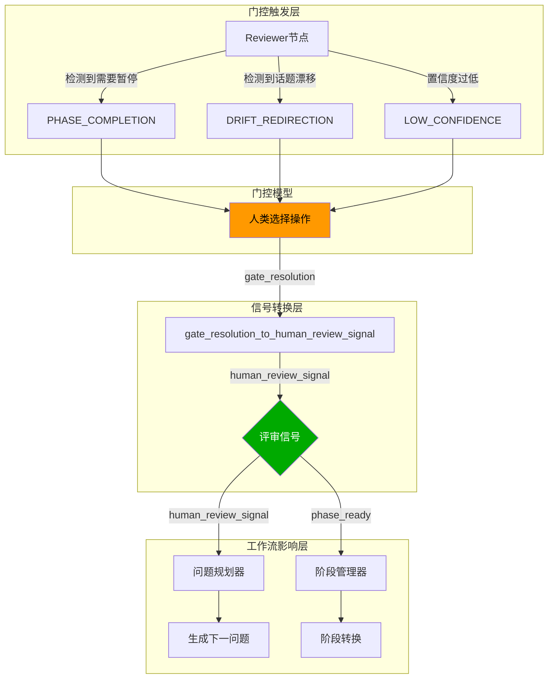
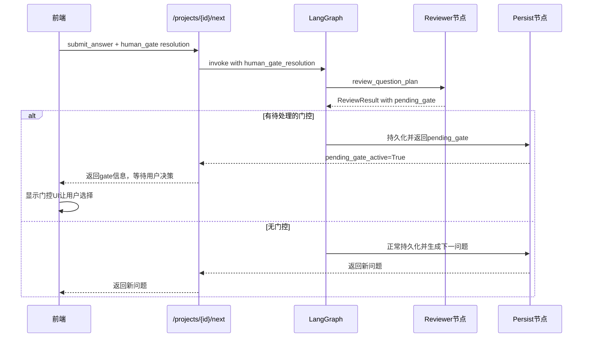

在状态化访谈Agent中，Human-in-the-Loop（人机协作）机制是确保AI行为符合预期、让人类能够在关键决策点介入控制的核心设计。本系统通过**决策门（Human Gate）**和**评审信号（Review Signal）**两套机制实现人机协作：前者是系统主动暂停等待人类确认，后者是人类主动反馈影响后续生成。

## 核心架构概览

整个HITL系统由三个层次组成：门控触发层、信号转换层和工作流影响层。当系统检测到需要人类判断的场景时会创建门控暂停工作流，用户响应后其选择被转换为信号传递给Planner和Stage Manager，从而影响下一个问题的生成方向和阶段推进决策。



## 门控类型与触发时机

系统定义了六种类型的决策门，每种门控在特定场景下被触发：

| 门控类型 | 触发条件 | 用户选项 | 影响 |
|---------|---------|---------|------|
| **PHASE_COMPLETION** | Reviewer检测到当前阶段任务完成 | Proceed / Continue Phase / Review Gaps | 决定是否进入下一阶段 |
| **DRIFT_REDIRECTION** | 检测到对话话题偏离主线 | Redirect / Continue / New Branch | 决定是否拉回主题或开辟新分支 |
| **LOW_CONFIDENCE** | Planner置信度低于阈值(0.4) | Proceed / Find Alternative / Provide Guidance | 决定是否接受当前问题或重新规划 |
| **BRANCH_PRIORITIZATION** | 多个主题分支候选 | 选择具体分支 / Auto Select | 决定下一个问题的具体方向 |
| **MODE_TRANSITION** | Agent模式切换请求 | Accept / Decline | 决定是否切换模式(理解→评审→改进) |
| **SCENARIO_COMPLETION** | 场景契约验证不完整 | Continue Collecting / Accept Current / Skip | 决定是否继续收集场景细节 |

### 门控创建与结构

门控通过 `human_gate_service.py` 中的工厂函数创建。以阶段完成门为例：

```python
# app/services/human_gate_service.py#L57-L94
def create_phase_completion_gate(
    phase: str,
    task_summary: dict[str, Any] | None = None,
) -> HumanGate:
    return HumanGate(
        gate_type=GateType.PHASE_COMPLETION,
        phase=phase,
        reason=f"Phase '{phase}' has completed required tasks. Confirm to proceed to the next phase?",
        options=[
            GateOption(action="confirm", label="Proceed", description="Advance to the next phase"),
            GateOption(action="extend", label="Continue Phase", description="Stay in current phase"),
            GateOption(action="review", label="Review Gaps", description="Address remaining gaps first"),
        ],
        default_action="confirm",
        additional_context=task_summary or {},
    )
```

每个 `HumanGate` 包含唯一标识 `gate_id`、门控类型、原因描述、可选操作列表，以及用于存储额外上下文的 `additional_context` 字段。

## 评审信号如何影响工作流

用户响应门控后，其选择被转换为**评审信号（Review Signal）**，这个信号随后流向两个关键消费者：问题规划器和阶段管理器。

### 信号转换机制

信号转换发生在 `load_project_context` 节点中，通过 `gate_resolution_to_human_review__signal` 函数将用户的门控响应转换为统一格式的信号：

```python
# app/services/human_gate_service.py#L372-L399
def gate_resolution_to_human_review_signal(
    gate: HumanGate,
    action: str,
    *,
    preferred_next_focus: str | None = None,
    note: str | None = None,
    phase_ready: bool | None = None,
) -> dict[str, Any]:
    signal: dict[str, Any] = {
        "direction": "continue",
        "gate_type": gate.gate_type.value,
        "gate_action": action,
        "gate_id": gate.gate_id,
    }
    
    if preferred_next_focus:
        signal["preferred_next_focus"] = preferred_next_focus
    if note:
        signal["note"] = note
    if phase_ready is not None:
        signal["phase_ready"] = phase_ready
    
    # 根据门控类型设置特定字段
    if gate.gate_type == GateType.DRIFT_REDIRECTION:
        signal["direction"] = "redirect" if action == "redirect" else "continue"
    elif gate.gate_type == GateType.PHASE_COMPLETION:
        signal["phase_ready"] = action == "confirm"
```

### 信号对问题规划的影响

Planner在生成下一个问题时，会接收并使用 `human_review_review_signal` 中的信息来调整决策：

```python
# app/graphs/interview_nodes.py#L582-L590
planner_decision = plan_next_question(
    turns=turns,
    current_stage=state["next_stage"],
    next_turn_no=state["next_turn_no"],
    coverage_state=state.get("coverage_state", {}),
    human_review_signal=state.get("human_review_signal"),  # 传入评审信号
    agent_mode=project.agent_agent_ode,
    task_board_json=serialize_task_board(task_board),
)
```

`preferred_next_focus` 字段可以直接影响Planner选择哪个主题分支，`direction` 字段决定是继续当前方向还是转向，`note` 字段携带用户的具体指导意见。

### 信号对阶段转换的影响

`stage_manager.py` 中的 `decide_next_stage` 函数会检查 `human_review_signal` 中的 `phase_ready` 字段：

```python
# app/services/stage_manager.py#L115-L145
human_phase_ready = bool((human_review_ ## 文档中关于phase_Ready的引用可能存在截断问题，实际应该是human_phase_ready = bool((human_review_signal or {}).get("phase_ready"))来获取信号中的phase_ready字段。这个变量在阶段转换决策中起着关键作用，当用户在阶段完成门中选择"Proceed"时，phase_ready为True，系统会考虑提前进入下一阶段。

比如在全景图阶段，只要人类标记该阶段覆盖已完成(phase_ready=True)且至少完成了2个turn，那么即使还有一些关键gap，系统也会允许过渡到架构理解阶段。这体现了对人类判断的尊重——当用户明确表示某阶段已充分时，系统会采纳这个判断而不是机械地卡在原地。
```

if current_stage == PANORAMA_STAGE and human_phase_ready and panorama_turns >= 2 and len(panorama_critical_gaps) <= 1:
    return {
        "next_stage": clamp_## stage_not_before_current(ARCHITECTURE_STAGE, current_stage),
        "reason": "A human marked panorama coverage as sufficiently complete, so the interview can move into architecture understanding.",
        "gaps": architecture_gaps,
    }
```

## 工作流中的门控流转

工作流采用LangGraph实现，门控在Reviewer节点后被检测并触发。整个流程如下：



当Reviewer检测到需要门控时，`route_after_review` 函数会将工作流路由到 `persist` 节点而不是 `draft_question`：

```python
# app/graphs/interview_graph.py#L113-L116
def route_after_review(state: InterviewGraphState):
    if state.get("pending_## gate"):
        return "persist"  # 暂停等待用户决策
    return "draft_question"  # 继续生成问题
```

## 前端交互实现

前端通过 `StatusPanel` 组件展示待处理门控，用户选择后通过API提交：

```typescript
// frontend/src/components/StatusPanel.tsx#L227-L234
{project?.pending_gate ? (
  <div className="gate-notice">
    <p className="mt-2 text-sm leading-6 text-amber-950">
      {project.pending_gate.reason}
    </p>
    <p className="text-xs text-amber-800">
      Options: {(project.pending_gate.options ?? []).map((option) => option.label).join(' / ')}
    </p>
  </div>
) : null}
```

用户选择的操作通过 `human_ gate` 字段随下一个请求发送：

```typescript
// frontend/src/hooks/useProject.ts#L299
human_ gate: payload?.human_ gate ?? null,
```

## 状态持久化

待处理的门控存储在项目的 `pending_gate_json` 字段中：

```python
# app/graphs/interview_nodes.py#L784-L803
if state.get("pending_gate"):
    gate = HumanGate.model_validate(state["pending_gate"])
    project.pending_gate_json = serialize_## gate(gate)
    gate_event = emit_human_gate_event(
        gate_## type=gate.gate_type.value,
        reason=gate.reason,
        resolution=None,
        turn_## no=pending_turn.turn_## no,
        project_## id=state["project_id"],
    )
    # ... 持久化到数据库
    return {
        "message": "Human input is required before the next question can be generated.",
        "pending_gate_## active": True,
    }
```

## 信号追踪与可观测性

系统通过事件日志完整记录门控的创建、显示、解析全过程：

```python
# app/graphs/interview_nodes.py#L741-L755
if state.get("human_review_signal"):
    pending_turn.human_review_json = json.dumps(state["human_review_signal"])
    review_event = emit_human_review_event(
        turn_## no=pending_turn.turn_## no,
        verdict=state["human_review_signal"].get("verdict"),
        direction=state["human_review_signal"].get("direction"),
        preferred_next_focus=state["human_review_signal"].get("preferred_next_focus"),
        note=state["human_review_signal"].get("note"),
        project_## id=state["project_id"],
    )
    current_event_log = add_event_to_log(current_event_log, review_event)
```

这使得每一次人类干预都有完整的审计轨迹。

## 总结

本系统的Human-in-the-Loop设计通过三层架构实现人机协作：Reviewer节点负责检测需要暂停的时机并创建决策门，用户响应后通过 `gate_resolution_to_human_review_signal` 转换为统一的评审信号，最后这个信号流向Planner和Stage Manager影响问题的生成方向和阶段转换决策。

Sources: [human_gate_service.py](app/services/human_gate_service.py#L1-L419), [question_reviewer.py](app/services/question_reviewer.py#L1-L367), [mode_service.py](app/services/mode_service.py#L1-L217), [interview_nodes.py](app/graphs/interview_nodes.py#L1-L933), [interview_graph.py](app/graphs/interview_graph.py#L1-L152), [stage_manager.py](app/services/stage_manager.py#L1-L292), [projects.py](app/api/routes/projects.py#L520-L600)

---

## 下一步阅读

- [问题重写机制：基于上一轮回答的版本管理](15-wen-ti-zhong-xie-ji-zhi-ji-yu-shang-lun-hui-da-de-ban-ben-guan-li) - 了解问题版本管理和重写机制
- [问题规划器：QuestionPlanner的生成策略](10-wen-ti-gui-hua-qi-questionplannerde-sheng-cheng-ce-lue) - 深入理解Planner如何接收和应用评审信号
- [执行轨迹API：Run Trace的前后端契约](17-zhi-xing-gui-ji-api-run-tracede-qian-hou-duan-qi-yue) - 了解完整的可观测性设计