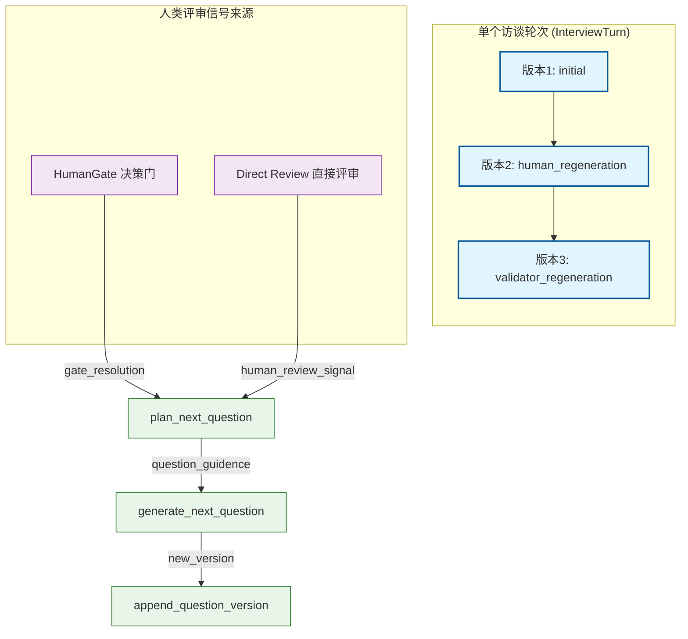

在状态化访谈Agent中，一个核心需求是能够基于人类的评审反馈对问题进行重写。当AI生成的问题不符合访谈阶段要求、偏离主题、或被人类标记为"需要重定向"时，系统需要保留原始问题版本并生成新的替代版本，同时记录每一次生成的完整上下文供后续审计与回溯。

本节详细阐述问题重写机制的数据模型设计、服务层实现、以及与人类评审信号（Human Review Signal）的集成方式。

## 架构概览

问题重写机制采用**版本链（Version Chain）**模式：在同一个Turn下维护多个问题版本，每次重写都追加新版本而非覆盖旧版本。这种设计既保证了审计能力，又支持"撤销到上一版本"的业务需求。



**数据流说明**：人类评审信号从两种渠道进入系统——**决策门（HumanGate）**的resolved结果，或**直接评审（Direct Review）**的反馈意见。信号被传递至问题规划器（Question Planner），后者根据信号内容决定是否触发重写意图（human_guided_redirect）。生成器（Question Generator）在构造Prompt时注入评审上下文，最终由版本服务（Question Version Service）将新版本持久化。

Sources: [app/graphs/interview_nodes.py](app/graphs/interview_nodes.py#1-50), [app/services/question_version_service.py](app/services/question_version_service.py#1-50), [app/services/question_planner.py](app/services/question_planner.py#60-95)

## 数据模型设计

问题版本的核心数据模型定义在 `InterviewQuestionVersion` 中，该模型通过外键关联到 `InterviewTurn`，形成一对多的版本链结构。

Sources: [app/models/question_version.py](app/models/question_version.py#1-49)

### 核心字段

| 字段 | 类型 | 说明 |
|------|------|------|
| `turn_id` | FK | 关联的访谈轮次 |
| `version_no` | Integer | 版本序号，从1开始递增 |
| `generation_kind` | String | 生成类型：`initial`、`human_regeneration`、`validator_regeneration` |
| `question_text` | Text | 问题文本 |
| `question_plan_json` | Text | 问题规划器的决策JSON |
| `human_review_json` | Text | 触发本次生成的人类评审信号（可选） |
| `prompt_tokens` | Integer | 消耗的Prompt tokens |
| `completion_tokens` | Integer | 消耗的Completion tokens |
| `is_estimated` | Boolean | 是否为估算值（用于预算控制） |

`generation_kind` 字段是版本类型的关键标识：
- **`initial`**: 首次生成的问题，对应Turn的 `question_text`
- **`human_regeneration`**: 人类评审触发的重写
- **`validator_regeneration`**: 校验器失败触发的重写

模型通过SQLAlchemy的ORM关系直接映射到 `InterviewTurn`，Turn模型提供了便捷的访问属性：

```python
@property
def current_question_version_no(self) -> int:
    if self.question_versions:
        return self.question_versions[-1].version_no
    return 1

@property
def question_regeneration_count(self) -> int:
    return max(0, self.current_question_version_no - 1)
```

Sources: [app/models/turn.py](app/models/turn.py#90-100)

## 版本服务层实现

版本管理逻辑集中在 `question_version_service.py` 中，提供三个核心函数：

Sources: [app/services/question_version_service.py](app/services/question_version_service.py#1-138)

### 版本规范化：normalize_question_versions

由于系统可能在某些边界情况下产生重复版本（例如LLM重试、事务回滚），每次追加新版本前会先执行规范化处理：

```python
def normalize_question_versions(db: Session, turn: InterviewTurn) -> list[InterviewQuestionVersion]:
    # 1. 按时间序获取所有版本
    versions = db.query(InterviewQuestionVersion)\
        .filter(InterviewQuestionVersion.turn_id == turn.id)\
        .order_by(...).all()
    
    # 2. 去除重复artifact（文本相同且都无人类评审）
    deduplicated = []
    for version in versions:
        if is_duplicate_artifact(previous, version):
            db.delete(version)
            continue
        deduplicated.append(version)
    
    # 3. 重新编号并校正generation_kind
    for index, version in enumerate(versions, start=1):
        version.version_no = index
        if index == 1:
            version.generation_kind = "initial"
        elif version.generation_kind == "initial":
            version.generation_kind = "human_regeneration"
    
    return versions
```

规范化确保版本链的**连续性**（编号无断裂）和**准确性**（首个版本标记为initial，后续人类触发的版本标记为regeneration）。

### 追加新版本：append_question_version

追加新版本时，系统自动完成：
1. 调用规范化确保链状态正确
2. 计算当前最大版本号并加1
3. 汇总本次生成的token消耗
4. 将人类评审信号序列化为JSON存储

```python
def append_question_version(*, db, turn, generation_kind, human_review_signal, ...) -> InterviewQuestionVersion:
    existing_versions = normalize_question_versions(db, turn)
    summary = summarize_usage_metrics(usage_metrics_list)
    
    version = InterviewQuestionVersion(
        turn_id=turn.id,
        version_no=existing_versions[-1].version_no + 1,
        generation_kind=generation_kind,
        human_review_json=json.dumps(human_review_signal) if human_review_signal else None,
        ...
    )
    db.add(version)
    return version
```

Sources: [app/services/question_version_service.py](app/services/question_version_service.py#98-138)

## 人类评审信号与重写触发

问题重写的核心触发源是人类评审信号。该信号的设计参考了 `Human-Loop` 产品的最佳实践，将评审结果结构化为可操作的指令。

Sources: [app/services/human_gate_service.py](app/services/human_gate_service.py#1-80)

### 信号结构

```python
# 典型的human_review_signal结构
{
    "verdict": "insufficient",      # 判定：insufficient, drifted, acceptable
    "direction": "redirect",        # 方向：continue, redirect, extend_phase
    "preferred_next_focus": "error handling",  # 期望的下一步聚焦
    "note": "请更关注异常处理流程",  # 人类备注
    "phase": "Architecture",        # 更正的阶段（可选）
}
```

### 规划器响应

当 `plan_next_question` 接收到人类评审信号时，会检查是否满足重写条件：

```python
# question_planner.py 中的关键逻辑
if review and (
    review.get("direction") == "redirect"
    or review.get("verdict") in {"insufficient", "drifted"}
    or preferred_focus
    or review_note
):
    return {
        "question_intent": "human_guided_redirect",
        "human_review_applied": True,
        "human_review_signal": review,
        "constraints": base_constraints + [
            "Follow the human redirection signal explicitly",
        ],
        ...
    }
```

这种设计使得**重写决策前置到规划阶段**，而非在生成后通过校验失败才触发重写，从而减少无效的LLM调用。

Sources: [app/services/question_planner.py](app/services/question_planner.py#60-95)

### Prompt集成

生成器在构造Prompt时，将人类评审上下文格式化后注入：

```python
def format_human_review_context(human_review_signal: dict | None) -> str:
    if not human_review_signal:
        return "No explicit human review signal was provided for this turn."
    
    parts = [
        f"Verdict: {human_review_signal.get('verdict', 'unknown')}",
        f"Direction: {human_review_signal.get('direction', 'continue')}",
    ]
    if human_review_signal.get("preferred_next_focus"):
        parts.append(f"Preferred next focus: {human_review_signal['preferred_next_focus']}")
    if human_review_signal.get("note"):
        parts.append(f"Human note: {human_review_signal['note']}")
    
    return " | ".join(parts)
```

该上下文在 `generate_next_question_from_history` 中作为Prompt变量传入，使LLM能够理解"为什么要重写"以及"应该朝哪个方向调整"。

Sources: [app/services/question_generator.py](app/services/question_generator.py#290-315)

## 与工作流节点的集成

在LangGraph的工作流中，问题生成通过 `generate_question_for_state` 函数完成。该函数在调用问题生成器之前，会先检查是否存在重复问题，并触发分支阻断：

```python
# interview_nodes.py 中的生成流程
def generate_question_for_state(..., human_review_signal, ...):
    # 1. 重建覆盖度状态
    coverage_state = rebuild_coverage_state(turns)
    
    # 2. 调用规划器（传入人类评审信号）
    planner_decision = plan_next_question(
        turns=turns,
        human_review_signal=human_review_signal,
        ...
    )
    
    # 3. 检查问题重复性，必要时阻断并重新规划
    if is_question_too_similar(next_question, old_questions):
        blocked_branch_ids = {planner_decision.get("target_branch_id")}
        # 重新规划，绕过重复分支
        planner_decision = plan_next_question(..., excluded_branch_ids=blocked_branch_ids)
    
    # 4. 生成新问题
    next_question_result = generate_next_question_from_history(...)
    
    # 5. 追加版本记录
    version = append_question_version(
        db=db,
        turn=turn,
        generation_kind=...,  # 根据触发来源确定
        human_review_signal=human_review_signal,
        ...
    )
```

Sources: [app/graphs/interview_nodes.py](app/graphs/interview_nodes.py#75-180)

## 版本使用场景

### 场景一：人类Redirect重定向

用户在访谈过程中发现AI偏离了主题，通过前端界面选择"重定向"并指定"请回到异常处理流程"。该信号通过 `HumanGate` 解析为 `human_review_signal`：

```python
{
    "direction": "redirect",
    "preferred_next_focus": "error handling flow",
    "verdict": "drifted"
}
```

规划器识别 `direction == "redirect"`，生成 `human_guided_redirect` 意图，新版本标记为 `human_regeneration`。

### 场景二：Validator校验失败

问题生成后，校验器发现不符合当前阶段要求（例如在Panorama阶段出现了代码细节）：

```python
# validator检测到阶段不匹配
validate_question_for_stage(text, current_stage="Panorama Mapping", ...)
# -> {"is_valid": false, "reasons": ["Panorama questions must avoid deep implementation detail."]}
```

此时会触发重新生成，新版本标记为 `validator_regeneration`，且 `human_review_json` 中记录校验失败的原因。

Sources: [app/services/question_validator.py](app/services/question_validator.py#80-120)

### 场景三：主题漂移自动检测

覆盖度服务（CoverageService）持续监控主题漂移：

```python
drift = detect_topic_drift(coverage_state, current_stage)
if drift["detected"]:
    # 触发drift_repair意图，自动重写问题
    return {
        "question_intent": "drift_repair",
        "drift_detected": True,
    }
```

漂移修复同样追加新版本，但 `generation_kind` 由系统自动判断（根据是否存在对应的human_review_json）。

Sources: [app/services/question_planner.py](app/services/question_planner.py#96-130)

## 版本追溯与审计

版本链的设计使得每一次问题变更都可追溯：

1. **版本对比**：通过 `version_no` 可以快速定位任意版本
2. **Token统计**：`InterviewTurn` 提供了聚合属性计算人类干预导致的额外消耗

```python
@property
def human_intervention_regeneration_usage_summary(self) -> dict[str, int]:
    versions = [v for v in self.question_versions if v.generation_kind == "human_regeneration"]
    return {
        "prompt_tokens": sum(v.prompt_tokens for v in versions),
        "completion_tokens": sum(v.completion_tokens for v in versions),
        "total_tokens": sum(v.total_tokens for v in versions),
    }
```

3. **评审回溯**：`human_review_json` 记录了触发重写的完整人类信号，后续可用于分析人类反馈模式

## 总结与扩展

问题重写机制的核心价值在于：

- **审计完备性**：每个版本都可追溯，保留完整的生成上下文
- **灵活触发**：支持人类主动触发、校验器自动触发、漂移检测自动触发三种模式
- **状态一致性**：规范化逻辑确保版本链始终处于有效状态
- **Token可控性**：通过版本统计可以精确计算人类干预带来的额外成本

在实际业务中，该机制可以进一步扩展为：
- 支持版本回滚（撤销到指定版本）
- 版本对比展示（展示两个版本的问题文本差异）
- 自动化版本选择（根据历史数据训练模型选择最优版本）