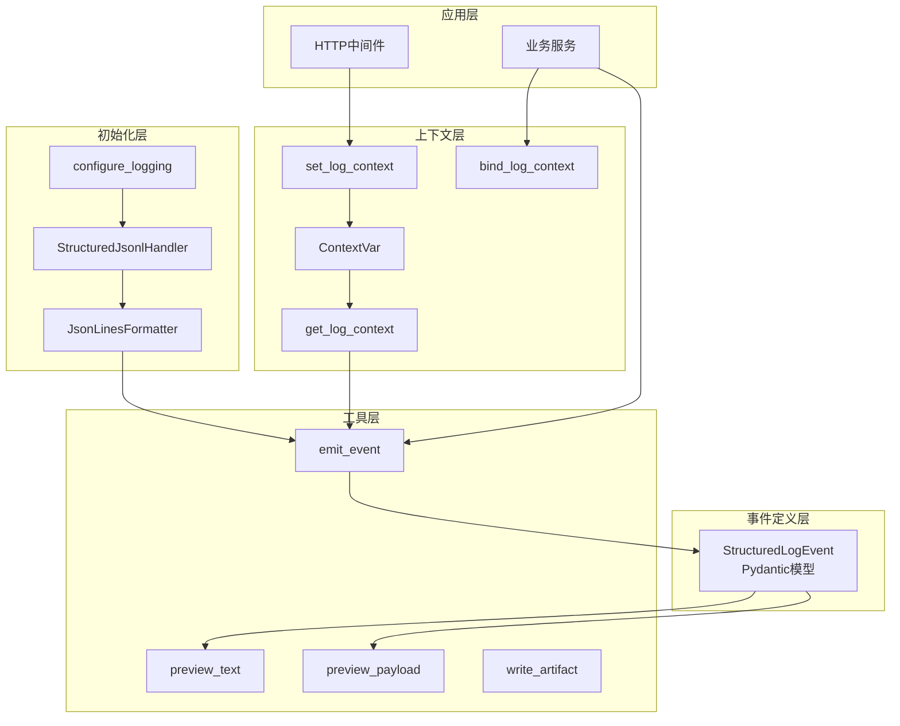

本系统为状态化访谈Agent提供可观测性能力，通过JSONL（JSON Lines）格式实现结构化日志输出，支持请求链路追踪、跨服务上下文传播和运行时问题的快速定位。

## 设计目标

传统的文本日志虽然简单，但在复杂的多轮对话系统中面临三大困境：日志分散难以关联、关键字段无法索引、调试时需手动解析消息格式。本日志子系统通过**事件驱动**的日志模型，将每次日志记录转化为结构化数据，使每条日志都携带可追溯的上下文信息，支持后续的日志聚合分析与问题排查。

## 核心架构

日志子系统由五个核心模块组成，各模块职责清晰、协同工作：



**模块职责说明：**

| 模块 | 文件 | 核心职责 |
|------|------|----------|
| 初始化层 | `config.py` | 配置日志处理器、格式化器，管理应用级日志配置 |
| 上下文层 | `context.py` | 提供线程安全的上下文变量，跨请求传播trace_id、project_id等 |
| 事件定义层 | `event.py` | 定义结构化日志事件的数据模型 |
| 工具层 | `utils.py` | 提供emit_event、preview_payload等便捷函数 |
| 应用层 | `main.py`、业务服务 | 在HTTP请求和业务逻辑中注入日志记录 |

Sources: [config.py](app/logging/config.py#L1-L56), [context.py](app/logging/context.py#L1-L29), [event.py](app/logging/event.py#L1-L36), [utils.py](app/logging/utils.py#L1-L129)

## JSONL输出格式

每条日志记录以独立的JSON行形式写入文件，确保日志文件可流式读取且与标准文本日志工具兼容。典型的日志条目结构如下：

```json
{
  "timestamp":"2026-01-15T10:23:45.123456+00:00",
  "level":"INFO",
  "logger":"app.llm",
  "event":"llm.call.complete",
  "message":"Completed next-question LLM call",
  "request_id":"a1b2c3d4-e5f6-7890-abcd-ef1234567890",
  "trace_id":"a1b2c3d4-e5f6-7890-abcd-ef1234567890",
  "project_id":42,
  "turn_no":5,
  "stage":"Architecture Exploration",
  "operation":"question_generation",
  "status":"success",
  "duration_ms":1245.67,
  "usage":{"prompt_tokens":3200,"completion_tokens":180,"total_tokens":3380},
  "output":{
    "prompt_id":"next_question_v2",
    "prompt_version":3,
    "cleaned_output":"Q6: How does the authentication module handle token refresh?"
  }
}
```

### 关键字段说明

| 字段 | 类型 | 说明 |
|------|------|------|
| `event` | string | 事件类型标识，格式为`领域.子类.动作`，如`llm.call.complete` |
| `request_id` | string | HTTP请求级唯一标识，用于关联单个请求的所有日志 |
| `trace_id` | string | 跨请求的追踪标识，支持分布式追踪链路 |
| `project_id` | int | 访谈项目ID，关联特定项目的所有活动 |
| `turn_no` | int | 当前访谈轮次编号 |
| `stage` | string | 当前所处访谈阶段（Panorama/Architecture/Use Case等） |
| `duration_ms` | float | 操作耗时（毫秒），用于性能分析 |
| `usage` | dict | LLM调用消耗统计（token数量、费用估算） |

Sources: [formatter.py](app/logging/formatter.py#L1-L25), [event.py](app/logging/event.py#L1-L36)

## 上下文传播机制

日志子系统采用Python的`ContextVar`实现线程安全的上下文传播。这一设计确保了以下场景的日志关联能力：

1. **HTTP请求入口**：中间件在请求开始时设置`request_id`、`trace_id`
2. **业务逻辑层**：服务函数无需显式传递这些标识，日志自动继承上下文
3. **跨async边界**：在异步环境中正确传播上下文

```python
# 请求入口处设置上下文
token = set_log_context(
    request__id=request_id,
    trace_id=trace_id,
    request_method=request.method,
    request_path=request.url.path,
)

# 业务逻辑中直接使用，无需再次传入
emit_event(
    "llm",
    "llm.call.complete", 
    "LLM调用完成",
    status="success",
    duration_ms=elapsed,
    # request_id、trace_id自动从上下文继承
)
```

Sources: [context.py](app/logging/context.py#L1-L29), [main.py](app/main.py#L38-L56)

## 分类日志与目录结构

系统按日志类别自动创建子目录，相同类别的日志归并在同一文件，便于按领域快速定位问题：

```
logs/
├── 2026-01-15/
│   ├── requests/
│   │   └── 2026-01-15.jsonl    # HTTP请求日志
│   ├── llm/
│   │   └── 2026-01-15.jsonl    # LLM调用日志
│   ├── services/
│   │   └── 2026-01-15.jsonl    # 业务服务日志
│   ├── errors/
│   │   └── 2026-01-15.jsonl    # 错误日志（所有>=ERROR级别）
│   ├── graphs/
│   │   └── 2026-01-15.jsonl    # LangGraph工作流日志
│   └── artifacts/              # 大型载荷存储
│       └── 2026-01-15/
│           └── llm/
│               └── 1032456789012-next-question-q5-messages.txt
```

分类规则由`StructuredJsonlHandler`根据logger名称动态确定：对于以`app.`开头的logger，取其第二级作为类别（如`app.llm`→`llm`），其他则归入`app`类别。

Sources: [config.py](app/logging/config.py#L18-L26)

## 配置选项

日志行为可通过环境变量或`.env`文件配置，主要选项如下：

| 配置项 | 类型 | 默认值 | 说明 |
|--------|------|--------|------|
| `LOG_LEVEL` | string | `"INFO"` | 全局日志级别 |
| `LOG_DIR` | string | `"./logs"` | 日志输出根目录 |
| `LOG_LLM_PAYLOADS` | bool | `true` | 是否记录LLM调用时的完整prompt和响应 |
| `LOG_ARTIFACTS_ENABLED` | bool | `false` | 是否将超长文本保存为独立文件 |
| `LOG_PRETTY_JSON` | bool | `false` | 是否输出格式化JSON（启用时降低写入性能） |
| `LOG_TEXT_PREVIEW_CHARS` | int | `240` | 文本字段预览截断长度 |

典型配置示例：

```bash
# .env
LOG_LEVEL=DEBUG
LOG_DIR=./logs
LOG_LLM_PAYLOADS=true
LOG_ARTIFACTS_ENABLED=true
LOG_PRETTY_JSON=false
```

Sources: [config.py](app/core/config.py#L1-L34)

## 业务服务中的日志使用

系统各服务通过统一的`emit_event`接口记录结构化日志，以下是问题生成服务的完整日志流程：

```python
# 1. LLM调用开始记录
emit_event(
    "llm",
    "llm.call.start",
    "Starting next-question LLM call",
    operation="question_generation",
    stage=current_stage,
    turn_no=next_turn_no,
    status="started",
    input={
        "prompt_id": prompt.prompt_id,
        "prompt_version": prompt.version,
        "model": settings.openai_model,
        "messages": preview_payload(prompt.messages, ...) if settings.log_llm_payloads else None,
    },
)

# 2. LLM调用完成记录
emit_event(
    "llm",
    "llm.call.complete",
    "Completed next-question LLM call",
    operation="question_generation",
    status="success",
    duration_ms=round((time.perf_counter() - start_time) * 1000, 2),
    usage=usage_metrics,
    output={"cleaned_output": preview_payload(cleaned, ...)},
)
```

关键设计要点：
- **事件命名规范**：采用`领域.子领域.动作`的三段式命名
- **自动上下文继承**：project_id、turn_no等字段无需重复传递
- **大载荷处理**：`preview_payload`自动截断过长内容并可选保存为独立artifact
- **异常追踪**：通过`exc_info`参数自动记录错误类型、消息和完整堆栈

Sources: [question_generator.py](app/services/question_generator.py#L33-L108)

## 调试与日志分析

### 实时日志查看

按类别实时追踪特定模块的日志输出：

```bash
# 追踪LLM调用日志
tail -f logs/$(date +%Y-%m-%d)/llm/$(date +%Y-%m-%d).jsonl | jq .

# 追踪特定项目的所有日志
grep '"project_id":42' logs/$(date +%Y-%m-%d)/*/*.jsonl

# 追踪错误日志
grep '"level":"ERROR"' logs/$(date +%Y-%m-%d)/errors/$(date +%Y-%m-%d).jsonl
```

### 请求链路分析

通过`trace_id`串联单个请求的完整调用链：

```python
# 查找特定请求的所有日志
grep '"trace_id":"a1b2c3d4-xxxx"' logs/2026-01-15/*/*.jsonl | jq -s 'sort_by(.timestamp)'
```

### 性能瓶颈定位

利用`duration_ms`字段统计各操作的耗时分布：

```bash
# 统计LLM调用耗时
cat logs/2026-01-15/llm/2026-01-15.jsonl | \
  jq -r 'select(.event == "llm.call.complete") | .duration_ms' | \
  awk '{sum+=$1; count++} END {print "Avg:", sum/count "ms, Total:", count "calls"}'
```

Sources: [utils.py](app/logging/utils.py#L87-L129)

## 测试验证

日志子系统通过完整的集成测试覆盖关键场景：

```python
def test_flow_writes_structured_logs_to_files(self):
    # 触发完整业务流程
    created = self.client.post("/projects", json={...})
    started = self.client.post(f"/projects/{project_id}/start")
    saved = self.client.post(f"/projects/{project_id}/answer", json={...})
    advanced = self.client.post(f"/projects/{project_id}/next", json={})

    # 验证日志文件生成
    jsonl_files = sorted(logs_dir.rglob("*.jsonl"))
    self.assertTrue(jsonl_files)

    # 验证关键事件记录
    event_names = {event["event"] for event in events}
    self.assertIn("http.request.start", event_names)
    self.assertIn("llm.call.complete", event_names)
    self.assertIn("workflow.node.complete", event_names)

    # 验证上下文传播
    trace_ids = {event.get("trace_id") for event in next_request_events}
    self.assertTrue(trace_ids)
```

测试验证了日志从HTTP请求到业务服务到LLM调用的完整链路，以及上下文在各个阶段的正确传播。

Sources: [test_logging_observability.py](tests/test_logging_observability.py#L98-L149)

## 相关文档

- [执行轨迹API：Run Trace的前后端契约](17-zhi-xing-gui-ji-api-run-tracede-qian-hou-duan-qi-yue) — 了解如何通过API获取结构化执行轨迹
- [调试接口：Debug路由与状态检查](18-diao-shi-jie-kou-debuglu-you-yu-zhuang-tai-jian-cha) — 掌握运行时状态调试方法
- [核心概念：访谈阶段体系](3-fang-tan-jie-duan-ti-xi-cong-quan-jing-tu-dao-zui-zhong-shou-kou) — 理解日志中`stage`字段的业务含义