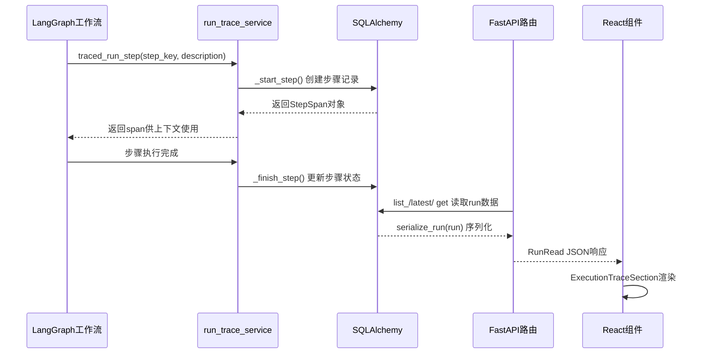

执行轨迹API是状态化访谈Agent的核心可观测性接口，负责将Agent运行时的步骤级追踪数据从前端渲染层到底层数据持久化的完整契约。本文档详细阐述该API的架构设计、数据模型、端点定义以及前后端实现细节。

## 架构概览

执行轨迹API采用经典的**三层架构**：数据持久化层（SQLAlchemy模型）、服务转换层（run_trace_服务）、API接口层（FastAPI路由）。整体数据流向遵循以下模式：LangGraph工作流中的各个节点通过`traced_run_step`上下文管理器记录执行步骤，步骤数据经由数据库持久化后，通过RESTful端点暴露给前端，前端`ExecutionTraceSection`组件负责可视化渲染。



数据流转过程中，核心契约在于`RunRead`和`RunStepRead`两个Pydantic Schema，它们定义了前后端共同认可的数据结构。Sources: [app/schemas/run_trace.py](app/schemas/run_trace.py#L1-L48), [app/services/run_trace_ervice.py](app/services/run_trace_ervice.py#L1-L100)

## 数据模型契约

### 后端Schema定义

后端提供三个核心Schema，分别对应不同的数据粒度。`RunStepRead`描述单个执行步骤的详细信息，包含步骤索引、键名、状态标签、持续时间以及LLM token消耗等字段。`RunRead`则聚合整个运行会话的元数据，并通过`steps`字段包含所有子步骤的列表。`ProjectRunSummary`用于项目级别的聚合统计。

| Schema | 用途 | 关键字段 |
|--------|------|----------|
| `RunStepRead` | 单步追踪 | step_key, label, status, duration_ms, total_tokens, meta |
| `RunRead` | 运行会话 | status, current_step_*, total_llm_*, step_count, steps[] |
| `ProjectRunSummary` | 聚合统计 | cumulative_generation_time_ms, run_count, average_run_duration_ms |

`RunRead`中的`current_step_key`、`current_step_label`和`current_step_status`三个字段是前端轮询渲染"当前执行中"状态的关键依据。系统通过查找状态为`running`的步骤来确定当前活跃步骤，若无进行中步骤则回退至最后一步。Sources: [app/schemas/run_trace.py](app/schemas/run_trace.py#L1-L48)

### 前端类型定义

前端TypeScript类型与后端Pydantic Schema保持严格对称，这种对称性是前后端契约稳定性的基础。前端在`RunStepRead`中定义了完整的类型映射，包括status的可选值（pending/running/completed/failed）以及其他元数据字段。

```typescript
// 前端类型定义 (frontend/src/types/api.ts)
export type RunStepRead = {
  id: number
  step_index: number
  step_key: string
  label: string
  status: 'pending' | 'running' | 'completed' | 'failed' | string
  description: string | null
  method: string | null
  started_at: string
  ended_at: string | null
  duration_ms: number | null
  next_step_hint: string | null
  prompt_tokens: number
  completion_tokens: number
  total_tokens: number
  meta: Record<string, unknown>
}
```

前后端字段命名遵循相同的snake_case约定，时间戳统一使用ISO 8601格式的字符串。Sources: [frontend/src/types/api.ts](frontend/src/types/api.ts#L133-L160)

## API端点设计

### 端点清单

执行轨迹API包含三个核心端点，均挂载在`/projects/{project_id}/runs`路径下：

| 方法 | 路径 | 响应模型 | 功能描述 |
|------|------|----------|----------|
| GET | `/projects/{project_id}/runs` | `RunRead[]` | 列出项目的所有运行记录，按时间倒序 |
| GET | `/projects/{project_id}/runs/latest` | `RunRead` | 获取最近一次运行记录 |
| GET | `/projects/{project_id}/runs/{run_id}` | `RunRead` | 获取指定ID的运行记录 |

这三个端点满足前端两类典型需求：一是项目详情页需要展示所有历史运行列表；二是轮询场景下需要持续获取最新运行状态。Sources: [app/api/routes/projects.py](app/api/routes/projects.py#L665-L700)

### 请求响应示例

以下是`GET /projects/{project_id}/runs/latest`端点的典型响应结构：

```json
{
  "id": 42,
  "project_id": 17,
  "turn_no": 3,
  "request_id": "req_abc123",
  "trace_id": "trace_xyz789",
  "status": "running",
  "started_at": "2025-01-15T10:30:00",
  "ended_at": null,
  "duration_ms": null,
  "total_llm_tokens": 2450,
  "total_llm_calls": 2,
  "step_count": 6,
  "current_step_key": "call_llm",
  "current_step_label": "Call model",
  "current_step_status": "running",
  "steps": [
    {
      "id": 101,
      "step_index": 1,
      "step_key": "load_project_context",
      "label": "Load project context",
      "status": "completed",
      "description": null,
      "method": "database lookup",
      "started_at": "2025-01-15T10:30:00.123",
      "ended_at": "2025-01-15T10:30:00.456",
      "duration_ms": 333,
      "next_step_hint": "refresh_summaries",
      "prompt_tokens": 0,
      "completion_tokens": 0,
      "total_tokens": 0,
      "meta": {}
    },
    {
      "id": 102,
      "step_index": 2,
      "step_key": "refresh_summaries",
      "label": "Refresh summaries",
      "status": "completed",
      "description": null,
      "method": "summary maintenance",
      "started_at": "2025-01-15T10:30:00.456",
      "ended_at": "2025-01-15T10:30:00.789",
      "duration_ms": 333,
      "next_step_hint": "refresh_coverage",
      "prompt_tokens": 0,
      "completion_tokens": 0,
      "total_tokens": 0,
      "meta": {}
    }
  ]
}
```

此响应结构同时满足列表渲染（steps数组遍历）和实时状态显示（current_step_*字段）的需求。Sources: [app/services/run_trace_ervice.py](app/services/run_trace_ervice.py#L250-L300)

## 服务层实现

### StepSpan上下文管理器

`traced_run_`step是整个追踪系统的核心抽象，以上下文管理器的形式嵌入LangGraph节点中。它自动处理步骤的生命周期：进入时创建数据库记录、退出时更新完成状态、异常时标记失败并记录错误信息。

```python
@contextmanager
def traced_run_step(
    *,
    run_id: int | None,
    project_id: int,
    turn_no: int | None,
    step_key: str,
    description: str | None = None,
    next_step_hint: str | None = None,
) -> Iterator[StepSpan | None]:
    if run_id is None:
        yield None
        return

    try:
        span = _start_step(...)  # 创建步骤记录
    except Exception as exc:
        # 记录错误但不影响主流程
        _emit_trace_write_error(...)
        yield None
        return
    
    try:
        yield span  # 暴露span给调用方修改meta
    except Exception as exc:
        _finish_step(span, status="failed", error_message=str(exc))
        finalize_run(run_id=run_id, status="failed")
        raise
    else:
        _finish_step(span, status="completed")
```

调用方可通过返回的`StepSpan`对象在执行过程中动态设置元数据（如LLM调用参数、检索结果等）和token使用量。Sources: [app/services/run_trace_ervice.py](app/services/run_trace_ervice.py#L204-L260)

### 步骤定义与元数据

`STEP_`DEFINITIONS字典预定义了系统认可的标准步骤键及其标签。扩展新的追踪步骤只需在此字典中添加映射关系，前端将自动渲染对应的标签文本。

```python
STEP_DEFINITIONS = {
    "load_project_": context: {"label": "Load project context", "method": "database lookup"},
    "refresh_summaries": {"label": "Refresh summaries", "method": "summary maintenance"},
    "refresh_coverage": {"label": "Refresh coverage", "method": "rule-based coverage map"},
    "build_compact_": context: {"label": "Build compact context", "method": "history compaction"},
    "retrieve_relevant_branches": {"label": "Retrieve relevant context", "method": "rule-based retrieval"},
    "render_prompt": {"label": "Render prompt", "method": "prompt asset renderer"},
    "call_llm": {"label": "Call model", "method": "OpenAI-compatible chat.completions"},
    "validate_question": {"label": "Validate question", "method": "rule-based validator"},
    "persist_result": {"label": "Persist result", "method": "database write"},
}
```

这九个步骤覆盖了从上下文加载、LLM调用到结果持久化的完整链路。每个步骤的`method`字段为前端提供技术实现的可读说明。Sources: [app/services/run_trace_ervice.py](app/services/run_trace_ervice.py#L21-L45)

## 前端消费模式

### 轮询与状态管理

前端通过`useProject` hook统一管理项目状态，其中runs数组和activeRun状态专门用于执行轨迹的展示。加载项目详情时，Promise.all并发请求获取项目、轮次、状态、转录以及运行列表：

```typescript
async function loadProjectDetails(projectId: number) {
  const [project, turns, status, transcript, runs] = await Promise.all([
    getProject(projectId),
    getProjectTurns(projectId),
    getProjectStatus(projectId),
    getProjectTranscript(projectId),
    getProjectRuns(projectId).catch(() => []),  // 容错处理
  ])
  return { project, turns, status, transcript, runs }
}
```

对于需要实时更新的场景（如问题生成进行中），前端会设置定时轮询获取最新运行状态，并通过`activeRun`状态追踪当前进行中的运行。 Sources: [frontend/src/hooks/useProject.ts](frontend/src/hooks/useProject.ts#L45-L65)

### 可视化组件

`ExecutionTraceSection`组件负责将RunRead数据渲染为可折叠的时间线视图。组件接收run对象、locale和翻译函数，根据run.status判断整体状态，根据各step.status渲染不同的视觉样式（completed绿色、running琥珀色、failed玫瑰色、pending灰色）。

组件内部使用两个useMemo优化计算性能：一个用于统计已完成步骤数量，另一个用于查找当前进行中的步骤。当用户展开详情区时，组件自动滚动到底部以显示最新步骤。 Sources: [frontend/src/components/ExecutionTraceSection.tsx](frontend/src/components/ExecutionTraceSection.tsx#L1-L180)

## 持久化模型

### AgentRun模型

AgentRun对应数据库中的`agent_runs`表，记录一次完整的问题生成会话。关键字段包括：project_外键关联项目、turn_no记录所属轮次、request_id和trace__id用于分布式追踪、status标记运行状态（running/completed/failed）、duration_记录总耗时、total_llm_tokens和total_llm_calls聚合整个运行的LLM消耗统计。

### AgentRunStep模型

AgentRunStep对应`agent_run_steps`表，记录单个执行步骤的详细信息。每个步骤通过run_外键关联至父运行，通过step_index维护顺序。meta_字段以JSON字符串形式存储可变元数据，支持存储任意结构化信息（如检索结果、验证规则匹配详情等）。

两个模型通过SQLAlchemy的一对多关系级联管理，删除运行时会自动清理关联的步骤记录。 Sources: [app/models/agent_run.py](app/models/agent_run.py#L1-L35), [app/models/agent_run_step.py](app/models/agent_run_step.py#L1-L47)

## 使用指引

### 添加新步骤追踪

若需在新的工作流节点中添加执行追踪，按以下步骤操作：首先在`STEP_DEFINITIONS`中添加步骤键值对定义标签和方法；然后在目标节点函数中导入`traced_`run_步骤并使用上下文管理器包装执行逻辑：

```python
from app.services.run_trace_ervice import traced_run_step

def my_custom_node(state: dict):
    with traced_run_step(
        run_id=state["run_id"],
        project_id=state["project_id"],
        turn_no=state["turn_turno"],
        step_key="my_custom_step",
        description="执行自定义逻辑",
        next_step_hint="next_step_key",
    ) as span:
        # 业务逻辑
        if span:
            span.set_meta(key="value")
            span.set_usage({"prompt_tokens": 100, "completion_tokens": 50, "total_tokens": 150})
        return result
```

### 前端渲染扩展

若需在执行轨迹中展示额外的步骤信息，有两种方式：一是修改后端Schema添加新字段并更新serialize_`run`函数；二是利用meta字段存储任意JSON数据，前端组件通过访问step.meta获取并渲染自定义内容。