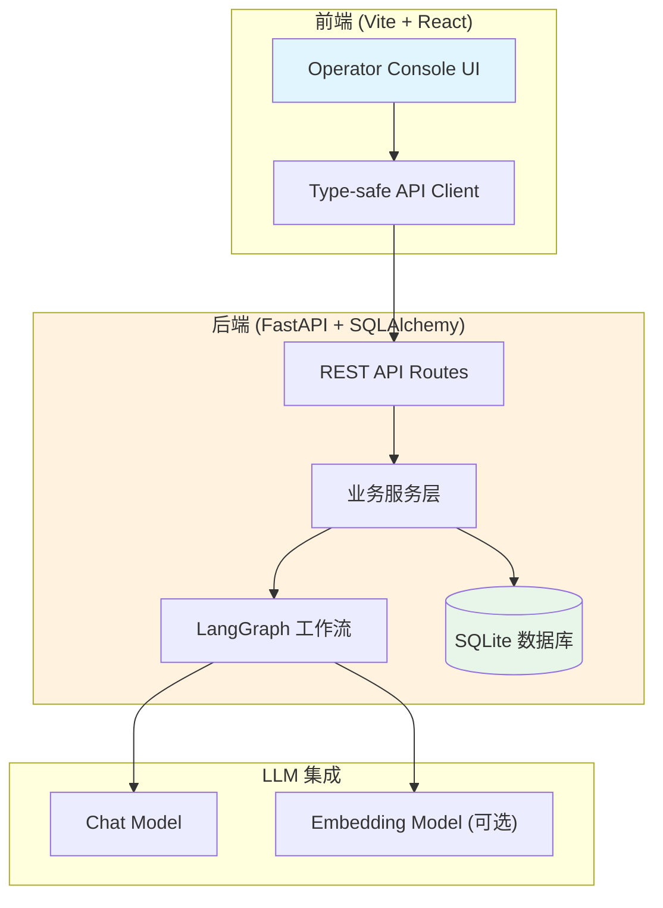

本文将指导你在5分钟内完成项目的本地开发环境搭建。**Stateful Interview Agent** 是一个本地全栈应用，用于针对目标代码仓库执行结构化、长上下文的软件项目访谈。整个搭建过程仅需5个步骤，无需复杂的容器配置。

## 前置要求

在开始之前，请确保你的开发环境满足以下条件：

| 工具 | 版本要求 | 验证命令 |
|------|---------|---------|
| Python | ≥ 3.10 | `python --version` |
| Node.js | ≥ 18.0 | `node --version` |
| uv | 最新版 | `uv --version` |

如果尚未安装 **uv**（Python 包管理器），可以通过以下命令快速安装：

```bash
curl -LsSf https://astral.sh/uv/install.sh | sh
```

Sources: [pyproject.toml](pyproject.tonl#L7-L7)

---

## 项目架构概览

在开始搭建之前，先了解项目的整体架构有助于后续的问题排查。本项目采用前后端分离的架构模式：



**核心组件说明：**

- **后端服务**：基于 FastAPI 构建，提供项目、会话、访谈、运行轨迹等 RESTful API
- **工作流引擎**：使用 LangGraph 实现多轮状态化访谈编排，支持 Planner → Validator → Coverage 的完整链路
- **数据持久化**：SQLAlchemy + SQLite，存储项目、会话、轮次、LLM 使用统计等数据
- **前端界面**：Vite + React + TypeScript + Tailwind CSS，提供双语 Operator Console

Sources: [README_zh.md](README_zh.md#L55-L80)

---

## 快速启动：5步完成环境搭建

### 步骤 1：克隆项目与依赖安装

首先克隆项目并安装后端依赖：

```bash
# 克隆项目（如果你已有仓库，可跳过）
git clone <repository-url>
cd stateful_interview_agent

# 使用 uv 安装后端依赖
uv sync
```

此命令会自动创建虚拟环境并安装所有 Python 依赖，包括 FastAPI、LangGraph、SQLAlchemy 等核心包。

Sources: [pyproject.tonl](pyproject.toml#L10-L18)
Sources: [README_zh.md](README_zh.md#L181-L182)

### 步骤 2：安装前端依赖

进入前端目录并安装 Node.js 依赖：

```bash
cd frontend
npm install
```

前端使用 Vite 作为构建工具，React 19 作为 UI 框架，Tailwind CSS v4 作为样式解决方案。

Sources: [frontend/package.json](frontend/package.json#L1-L38)
Sources: [README_zh.md](README_zh.md#L184-L185)

### 步骤 3：配置环境变量

在项目根目录创建 `.env` 文件，复制以下模板：

```bash
# 复制示例配置
cp .env.example .env
```

然后编辑 `.env` 文件，填入你的 LLM 服务配置：

| 变量名 | 必填 | 说明 | 示例值 |
|--------|-----|------|--------|
| `OPENAI_API_KEY` | ✅ | LLM 服务 API Key | `your_api_key_here` |
| `OPENAI_BASE_URL` | ✅ | OpenAI 兼容端点 | `https://api.scnet.cn/api/llm/v1` |
| `OPENAI_MODEL` | ✅ | 聊天模型名称 | `MiniMax-M2.5` |
| `OPENAI_EMBEDDING_MODEL` | ❌ | Embedding 模型（用于重复检测） | - |
| `DATABASE_URL` | ❌ | 数据库连接串 | `sqlite:///./data/app.db` |
| `LOG_LEVEL` | ❌ | 日志级别 | `INFO` |

**注意**：如果你使用的是其他 LLM 服务（如 OpenAI、Anthropic 等），只需修改 `OPENAI_BASE_URL` 和 `OPENAI_MODEL` 即可，系统使用 OpenAI-兼容的 Chat Completions API。

Sources: [.env.example](.env.example#L1-L8)
Sources: [app/core/config.py](app/core/config.py#L1-L34)
Sources: [README_zh.md](README_zh.md#L187-L202)

### 步骤 4：启动后端服务

在项目根目录执行：

```bash
uv run uvicorn app.main:app --reload
```

后端服务启动后，你将看到类似以下输出：

```
INFO:     Uvicorn running on http://127.0.0.1:8000
INFO:     Application startup complete.
```

| 配置项 | 默认值 |
|--------|--------|
| 监听地址 | `127.0.0.1` |
| 监听端口 | `8000` |
| 热重载 | 已开启 |

Sources: [README_zh.md](README_zh.md#L207-L211)

### 步骤 5：启动前端开发服务器

在另一个终端窗口中执行：

```bash
cd frontend
npm run dev
```

前端服务启动后，访问地址将显示在终端中：

```
  VITE v8.0.1  ready in 234 ms

  ➜  Local:   http://localhost:5173/
```

Sources: [frontend/package.json](frontend/package.json#L5-L5)
Sources: [README_zh.md](README_zh.md#L214-L218)

---

## 访问与验证

现在你可以打开浏览器访问 **http://localhost:5173** 进入 Operator Console。

### 快速功能验证

完成首次登录后，你可以按照以下流程验证系统是否正常运行：

1. **创建项目**：点击 "New Project"，填写项目标题和 system prompt
2. **启动访谈**：点击 "Start Interview"，系统将生成第一个问题 Q1
3. **提交回答**：在 Composer 中粘贴代码分析回答，点击 Submit
4. **生成下一问**：点击 "Next"，观察系统基于你的回答生成后续问题

### 常见启动问题排查

| 问题现象 | 可能原因 | 解决方案 |
|---------|---------|---------|
| 后端启动失败，报 `OPENAI_API_KEY` 错误 | .env 文件未正确配置 | 确认 `.env` 文件存在于项目根目录 |
| 前端页面空白 | 后端未启动 | 确保 http://127.0.0.1:8000 可访问 |
| 创建项目失败 | 数据库目录不存在 | 确保 `data/` 目录存在或权限正确 |
| LLM 调用超时 | 网络问题或 API 端点错误 | 检查 `OPENAI_BASE_URL` 是否可访问 |

---

## 项目结构速览

完成环境搭建后，你可以通过以下结构快速定位代码：

```
stateful_interview_agent/
├── app/
│   ├── api/routes/          # FastAPI 路由定义
│   ├── core/                # 配置、数据库、LLM 客户端
│   ├── graphs/              # LangGraph 状态、节点、图定义
│   ├── logging/             # JSONL 结构化日志
│   ├── models/              # SQLAlchemy 数据模型
│   ├── prompts/             # Prompt 资产与渲染
│   ├── schemas/             # Pydantic 请求/响应模型
│   └── services/            # 业务服务层
├── frontend/
│   └── src/
│       ├── api/             # 类型化 API 客户端
│       ├── components/      # React 组件
│       ├── hooks/           # 状态管理 Hooks
│       └── types/           # TypeScript 类型定义
├── tests/                   # 后端单元测试
├── data/                    # SQLite 数据库存储
└── logs/                    # 运行日志（自动创建）
```

Sources: [README_zh.md](README_zh.md#L92-L116)

---

## 后续阅读建议

完成本地环境搭建后，建议按以下顺序深入学习项目：

1. **理解核心概念**
   - [访谈阶段体系：理解五阶段架构](3-fang-tan-jie-duan-ti-xi-cong-quan-jing-tu-dao-zui-zhong-shou-kou)
   - [理解当前代码模式：硬分离设计](4-li-jie-dang-qian-dai-ma-mo-shi-yu-zhong-gou-jian-yi-de-ying-fen-chi)

2. **深入技术架构**
   - [后端架构概览：FastAPI + SQLAlchemy + LangGraph](5-hou-duan-jia-gou-gai-lan-fastapi-sqlalchemy-langgraph)
   - [LangGraph 工作流：访谈图的节点与边设计](6-langgraphgong-zuo-liu-fang-tan-tu-de-jie-dian-yu-bian-she-ji)

3. **核心服务详解**
   - [问题规划器：QuestionPlanner 的生成策略](10-wen-ti-gui-hua-qi-questionplannerde-sheng-cheng-ce-lve)
   - [问题校验器：Validator 的阶段约束](11-wen-ti-xiao-yan-qi-validatorde-jie-duan-yue-shu-yu-mo-shi-jian-cha)

4. **可观测性与调试**
   - [日志子系统：JSONL 结构化日志设计](16-ri-zi-zi-xi-tong-jsonljie-gou-hua-ri-zhi-she-ji)
   - [执行轨迹 API：Run Trace 的前后端契约](17-zhi-xing-gui-ji-api-run-tracede-qian-hou-duan-qi-yue)

---

## API 快速参考

项目启动后，以下是你最常使用的核心接口：

| 接口 | 方法 | 路径 | 说明 |
|-----|------|------|------|
| 创建项目 | POST | `/projects` | 创建新访谈项目 |
| 获取项目列表 | GET | `/projects` | 列出所有项目 |
| 启动访谈 | POST | `/projects/{id}/start` | 生成第一问 Q1 |
| 提交回答 | POST | `/projects/{id}/next` | 保存回答并生成下一问 |
| 重写当前问题 | POST | `/projects/{id}/turns/{turn_id}/regenerate-question` | 基于上一轮回答重写当前问题 |
| 获取 Transcript | GET | `/projects/{id}/transcript` | 获取完整访谈记录 |
| 获取运行轨迹 | GET | `/projects/{id}/runs` | 查看执行步骤与耗时 |

Sources: [README_zh.md](README_zh.md#L240-L288)

---

**现在，你已经完成了本地开发环境的全部搭建！** 打开浏览器访问 http://localhost:5173，开始你的结构化访谈之旅。

如果在使用过程中遇到任何问题，可以通过以下方式排查：
- 后端日志：查看 `logs/` 目录下的 JSONL 文件
- 运行轨迹：前端 "Run Trace" 面板查看实时执行状态
- Debug API：访问 `/debug/*` 端点检查内部状态

祝你使用愉快！