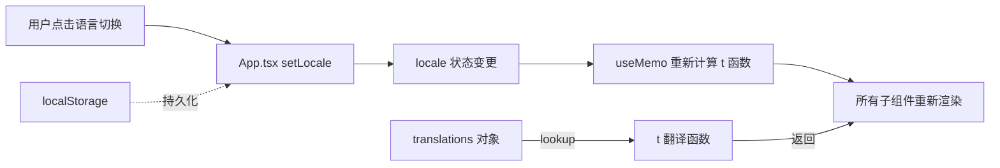

本页面介绍 Stateful Interview Agent 前端的国际化（i18n）架构设计与实现细节。该系统采用轻量级的 **扁平键值 JSON 翻译方案**，结合 TypeScript 类型安全和 React 状态管理，实现了完整的中英文双语切换能力。

## 架构概览

i18n 系统的核心设计理念是**零运行时依赖**——不使用 react-i18next 或 i18next 等重型库，而是通过纯 TypeScript 函数实现翻译逻辑。这种方式的优势在于：

- **bundle 体积最小化**：无需额外依赖
- **类型安全**：TranslationKey 作为字面量类型在编译期检查
- **渲染性能优**：translator 是纯函数，可通过 `useMemo` 缓存



## 核心类型定义

i18n 系统的基础是 `Locale` 类型定义和翻译键的集中管理：

```typescript
export type Locale = 'en' | 'zh-CN'
export const LOCALE_STORAGE_KEY = 'stateful-interview-agent:locale'
```

翻译键采用 **命名空间前缀** 约定，按功能模块组织：

| 前缀 | 覆盖范围 |
|------|---------|
| `app.*` | 应用程序全局标题、导航 |
| `status.*` | 项目状态、会话健康度 |
| `composer.*` | 回答编辑区所有文案 |
| `generation.*` | 生成控制面板 |
| `sidebar.*` | 项目侧边栏 |
| `transcript.*` | 访谈记录展示 |
| `trace.*` | 执行轨迹面板 |
| `token.*` | Token 统计 |
| `language.*` | 语言切换器标签 |

Sources: [frontend/src/i18n.ts](frontend/src/i18n.ts#L1-L3)

## 翻译存储结构

翻译内容以双层嵌套对象存储，外层键为语言代码，内层键为翻译键：

```typescript
const translations = {
  en: {
    'app.title': 'Stateful Interview Agent',
    'app.subtitle': 'Readable orchestration workspace...',
    // ... 其他英文翻译
  },
  'zh-CN': {
    'app.title': 'Stateful Interview Agent',
    'app.subtitle': '面向长程项目访谈的可读化编排工作台。',
    // ... 其他中文翻译
  }
}
```

这种结构确保 **键名完全对齐**，无论选择哪种语言，开发者都能获得一致的代码补全体验。

Sources: [frontend/src/i18n.ts](frontend/src/i18n.ts#L5-L258)

## Translator 函数实现

Translator 是整个 i18n 系统的核心函数，其实现简洁高效：

```typescript
export function createTranslator(locale: Locale) {
  return function translate(key: TranslationKey) {
    return translations[locale][key] ?? translations.en[key]
  }
}
```

**设计要点**：
1. **回退机制**：若指定语言缺少某键，自动回退到英文
2. **Memo 友好**：无副作用的纯函数，便于 React `useMemo` 优化
3. **类型推断**：key 参数被约束为 `TranslationKey`，防止拼写错误

Sources: [frontend/src/i18n.ts](frontend/src/i18n.ts#L608-L612)

## 语言切换与持久化

语言状态在 `App.tsx` 中管理，遵循 React 最佳实践：

```typescript
const [locale, setLocale] = useState<Locale>(() => 
  normalizeLocale(localStorage.getItem(LOCALE_STORAGE_KEY))
)

const t = useMemo(() => createTranslator(locale), [locale])

useEffect(() => {
  localStorage.setItem(LOCALE_STORAGE_KEY, locale)
}, [locale])
```

语言选择器采用 **Pill Toggle** 样式，与页面导航栏保持视觉一致性：

```typescript
{(['en', 'zh-CN'] as const).map((option) => {
  const active = option === locale
  return (
    <button
      key={option}
      className={`rounded-full px-4 py-2 text-sm font-medium transition ${
        active ? 'bg-slate-950 text-white' : 'text-slate-600 hover:bg-slate-100'
      }`}
      onClick={() => setLocale(option)}
    >
      {option === 'en' ? t('language.enLabel') : t('language.zhLabel')}
    </button>
  )
})}
```

Sources: [frontend/src/App.tsx](frontend/src/App.tsx#L44-L53)  
Sources: [frontend/src/App.tsx](frontend/src/App.tsx#L192-L210)

## 场景化标签函数

除通用翻译外，系统还提供了针对特定业务场景的**标签格式化函数**：

### 阶段标签

```typescript
export function getDisplayStageLabel(
  rawStage: string | null | undefined, 
  locale: Locale
) {
  if (!rawStage) {
    return locale === 'zh-CN' ? '未开始' : 'Not started'
  }
  const normalizedStage = rawStage.trim().toLowerCase().replace(/\s+/g, '_')
  return stageLabels[normalizedStage]?.[locale] ?? humanizeSnakeCase(normalizedStage)
}
```

该函数处理两种情况：空值返回默认文本，非空值则先规范化输入格式再查表，找不到对应翻译时自动将蛇形命名转换为标题格。

Sources: [frontend/src/i18n.ts](frontend/src/i18n.ts#L622-L629)

### 评审相关标签

```typescript
export function getReviewVerdictLabel(verdict: string | null | undefined, locale: Locale)
export function getReviewDirectionLabel(direction: string | null | undefined, locale: Locale)
export function getReviewFocusLabel(focus: string | null | undefined, locale: Locale)
```

这些函数用于将后端返回的枚举值（如 `drifted`、`insufficient`、`code_detail`）转换为用户可读的本地化标签。

Sources: [frontend/src/i18n.ts](frontend/src/i18n.ts#L631-L672)

### 运行时状态标签

```typescript
export function getRuntimeStatusText(status: 'finished' | 'in_progress' | 'ready' | 'empty', locale: Locale)
export function getRunStatusLabel(status: string | null | undefined, locale: Locale)
```

这些函数为分析页面和状态面板提供统一的文本输出。

Sources: [frontend/src/i18n.ts](frontend/src/i18n.ts#L674-L684)

## 翻译键的组织策略

项目采用 **功能域前缀** 而非按页面划分翻译键，这种策略的优势在于：

1. **可发现性**：输入 `composer.` 即可获得所有回答编辑区的翻译
2. **一致性**：相同含义的文案在不同页面共享同一键名
3. **维护性**：新增语言只需在对应分支补充翻译

翻译键的命名遵循 **动作-对象** 模式，例如：
- `composer.saveAnswer`（动作 + 对象）
- `status.generating`（状态描述）
- `trace.tokensUsed`（资源计量）

Sources: [frontend/src/i18n.ts](frontend/src/i18n.ts#L1-L258)

## 测试覆盖

i18n 系统通过 Vitest 单元测试确保翻译正确性和标签函数行为：

```typescript
describe('i18n display helpers', () => {
  it('translates common interface copy to Chinese', () => {
    const t = createTranslator('zh-CN')
    expect(t('status.start')).toBe('开始访谈')
  })

  it.each([
    ['zh-CN', 'architecture_understanding', '架构理解'],
  ])('formats stage labels for %s', (locale, rawStage, expected) => {
    expect(getDisplayStageLabel(rawStage, locale)).toBe(expected)
  })
})
```

测试覆盖三类场景：通用文案翻译、阶段标签格式化、评审信号标签格式化。

Sources: [frontend/src/i18n.test.ts](frontend/src/i18n.test.ts#L1-L49)

## 扩展新语言

若需添加新语言（如日语），只需在 `translations` 对象中添加新分支，并在 `Locale` 类型中注册：

```typescript
export type Locale = 'en' | 'zh-CN' | 'ja'

const translations = {
  en: { /* ... */ },
  'zh-CN': { /* ... */ },
  ja: {
    'app.title': 'ステートフルInterview Agent',
    // ... 其他日语翻译
  }
}
```

新增语言时，建议先复制 `en` 分支作为翻译模板，确保键名完整性。

---

## 相关文档

- [React前端架构：组件与状态管理](19-reactqian-duan-jia-gou-zu-jian-yu-zhuang-tai-guan-li) — 了解前端整体架构
- [环境配置：.env变量与API密钥设置](20-huan-jing-pei-zhi-envbian-liang-yu-apimi-yao-she-zhi) — 前端环境配置