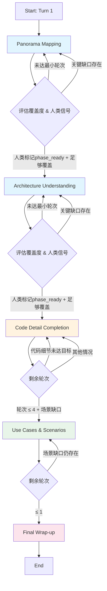

在状态化访谈Agent中，**阶段（Stage）** 是组织访谈进程的核心抽象层。它将一个可能包含数十轮的漫长访谈拆解为具有明确认知目标的阶段，使得Agent能够在不同阶段聚焦不同类型的问题，从而系统性地构建对目标项目的完整理解。本文档将带你从全景视角理解这一阶段体系的设计理念、五个核心阶段的职责划分、阶段间的流转决策机制，以及验证器如何确保每个阶段的问题符合其认知目标。

## 阶段体系的设计理念

传统的单轮问答系统往往缺乏对「访谈应该往哪里走」的系统性规划，导致访谈容易陷入两种极端：要么在不同深度的问题之间随机跳变，要么在某个局部细节上过度纠缠而忽视全局。阶段体系的出现正是为了解决这两个问题——**它为每一轮问题提供了认知上下文，使得Agent能够提出与当前访谈进度相匹配的问题**。

从技术实现角度看，阶段体系的核心价值体现在三个维度。首先，**问题生成的可控性**：不同阶段对应不同的Prompt模板和问题意图（question_intent），这使得系统能够针对「全景图」「架构设计」「代码细节」等不同认知层次生成对应的问题。其次，**覆盖度追踪的精细化**：`coverage_service.py` 中的 `framework` 对象为每个阶段维护独立的覆盖维度，例如全景图阶段追踪 `purpose`、`target_users`、`major_modules` 等维度，而代码细节阶段则追踪 `specific_files_count`、`specific_methods_count` 等维度。最后，**人类干预的锚点**：阶段边界是人类评审（Human Review）最常介入的时机，评审者可以基于当前阶段的覆盖情况决定是否「放行」进入下一阶段。

_sources: [stage_manager.py](app/services/stage_manager.py#L1-L50), [interview_state.py](app/graphs/interview_state.py#L1-L44)_

## 五阶段详解：从全景图到最终收口

该系统定义了五个依次递进的阶段，每个阶段有明确的认知目标、建议轮次范围、以及对应的覆盖度追踪维度。下面我们逐个解析每个阶段的职责定位。

### 第一阶段：Panorama Mapping（全景图映射）

**Panorama Mapping** 是访谈的起点，其核心目标是建立对项目的**宏观理解**。在这个阶段，Agent应该询问关于项目整体目的、目标用户、主要模块、以及高层工作流程的问题，而**不应该深入具体的代码实现细节**。

在轮次分配上，系统采用软性引导策略：`stage_manager.py` 中的 `determine_stage_by_turn` 函数将第1-5轮默认映射到 Panorama 阶段，但这并非硬性约束——实际的阶段推进取决于覆盖度状态和人类评审信号。

覆盖度追踪维度定义在 `coverage_service.py` 的 `default_framework_coverage` 函数中，Panorama 阶段对应以下维度：

| 覆盖维度 | 含义 | 追踪方式 |
|---------|------|---------|
| purpose | 项目核心目的 | 布尔标记 |
| target_users | 目标用户群体 | 布尔标记 |
| boundaries | 项目边界与范围 | 布尔标记 |
| major_modules | 主要模块划分 | 布尔标记 |
| high_level_workflow | 高层工作流程 | 布尔标记 |

阶段指令（来自 `stage_manager.py` 的 `get_stage_instruction` 函数）明确告知Agent：**"Focus on the overall purpose, target users, project boundaries, major modules, and high-level workflow. Avoid deep implementation details."**

_sources: [stage_manager.py](app/services/stage_manager.py#L269-L274), [coverage_service.py](app/services/coverage_service.py#L276-L285)_

### 第二阶段：Architecture Understanding（架构理解）

当全景图信息收集到一定程度后，访谈进入 **Architecture Understanding** 阶段。这一阶段聚焦于**模块间的协作关系、关键调用链、以及系统组织结构**，帮助理解「各个模块是如何配合工作的」而不是「具体代码是怎么写的」。

该阶段的建议轮次范围是第6-10轮，但同样遵循软性引导原则。覆盖度追踪维度包括：

| 覆盖维度 | 含义 | 追踪方式 |
|---------|------|---------|
| architecture_style_or_organization | 架构风格或组织方式 | 布尔标记 |
| module_responsibilities | 模块职责划分 | 布尔标记 |
| collaboration_mechanisms | 模块间协作机制 | 布尔标记 |
| key_call_chains | 关键调用链 | 布尔标记 |
| system_structure | 系统结构 | 布尔标记 |
| design_rationale_or_quality_attributes | 设计理由或质量属性 | 布尔标记 |

值得注意的是，`question_validator.py` 对这个阶段有特殊验证规则：如果问题中直接出现了 `.py`、`.ts` 等文件扩展名，验证器会拒绝该问题，因为它认为架构层面的问题不应该已经「缩放」到文件级别。

_sources: [stage_manager.py](app/services/stage_manager.py#L275-L278), [question_validator.py](app/services/question_validator.py#L186-L190), [coverage_service.py](app/services/coverage_service.py#L286-L100)_

### 第三阶段：Code Detail Completion（代码细节补全）

**Code Detail Completion** 是访谈的主体阶段，通常占用最多轮次（第11-32轮）。这一阶段的认知目标是**深入具体的实现细节**：询问具体的文件、类、函数、方法和执行路径，理解错误处理机制和第三方库的使用方式。

这个阶段采用**硬性主导**策略——`decide_next_stage` 函数的逻辑明确要求代码细节阶段在剩余访谈中占据主导地位（至少55%的剩余轮次）。这是因为代码细节是访谈的核心产出，没有足够的实现细节，就无法为后续的测试用例生成提供充分上下文。

覆盖度追踪维度采用**计数方式**而非布尔标记：

| 覆盖维度 | 含义 | 追踪方式 |
|---------|------|---------|
| specific_files_count | 涉及的具体文件数 | 计数 |
| specific_classes_count | 涉及的具体类数 | 计数 |
| specific_methods_count | 涉及的具体方法数 | 计数 |
| execution_paths_count | 覆盖的执行路径数 | 计数 |
| library_usage_points_count | 第三方库使用点数 | 计数 |
| error_handling_points_count | 错误处理点数 | 计数 |

验证器对这一阶段的要求是：问题必须包含代码级别的标记（如文件名、类名、方法名、execution path 等），且不能使用过于笼统的「整体」「通常」等表述——问题必须足够具体。

_sources: [stage_manager.py](app/services/stage_manager.py#L279-L282), [question_validator.py](app/services/question_validator.py#L192-L198), [coverage_service.py](app/services/coverage_service.py#L294-L303)_

### 第四阶段：Use Cases & Scenarios（用例与场景）

当代码细节收集到一定程度后，访谈进入 **Use Cases & Scenarios** 阶段。这一阶段关注的是**实际使用场景、用户角色、输入输出模式、以及边界条件**——换言之，它是「代码做什么」到「代码如何被使用」的视角转换。

该阶段的覆盖度追踪同样采用计数方式：

| 覆盖维度 | 含义 | 追踪方式 |
|---------|------|---------|
| representative_scenarios_count | 典型场景数量 | 计数 |
| actors_roles_count | 涉及的角色数 | 计数 |
| input_output_patterns_count | 输入输出模式数 | 计数 |
| boundary_conditions_count | 边界条件数 | 计数 |
| extension_points_count | 扩展点数 | 计数 |

系统对这个阶段有一个特殊的时间窗口机制：当剩余轮次减少到 `max(4, len(use_case_core_gaps) + 1)` 时，即使代码细节阶段尚未完成，也会强制切换到 Use Cases 阶段，确保在访谈结束前至少收集到场景信息。

_sources: [stage_manager.py](app/services/stage_manager.py#L283-L286), [stage_manager.py](app/services/stage_manager.py#L192-L199)_

### 第五阶段：Final Wrap-up（最终收口）

**Final Wrap-up** 是访谈的收尾阶段，通常只有最后1-2轮。这一阶段的任务不是提出新的探索性问题，而是**确认覆盖完整性、标记待补充项、以及准备交接**。

系统通过以下条件自动进入 Wrap-up 阶段：`wrap_up_ready` 标志位为真且剩余轮次小于等于1，或者人类评审标记 `phase_ready` 为真且当前阶段是 Use Cases 且没有剩余的场景缺口。

阶段指令简洁明确：**"Focus on final wrap-up readiness, missing evidence call-outs, and clean handoff preparation."**

_sources: [stage_manager.py](app/services/stage_manager.py#L287-L292), [stage_manager.py](app/services/stage_manager.py#L202-L207)_

## 阶段流转机制：决策逻辑与边界条件

阶段之间的流转并非简单的线性推进，而是由 `stage_manager.py` 中的 `decide_next_stage` 函数驱动的**多因素决策过程**。理解这个决策逻辑是掌握整个阶段体系的关键。

### 决策入口：decide_progress 节点

在 LangGraph 工作流中，每个轮次开始时都会经过 `decide_progress` 节点（定义在 `interview_nodes.py` 中）。该节点首先检查是否已达到最大轮次限制，然后调用 `decide_next_stage` 函数计算下一阶段。

```python
# interview_nodes.py, 行 532-558
def decide_progress(state):
    current_turn_no = state["current_turn_no"]
    
    if not can_continue_interview(current_turn_no):
        return {
            "interview_finished": True,
            "minimum_goal_reached": is_minimum_goal_rereached(current_turn_no),
        }
    
    next_turn_no = current_turn_no + 1
    stage_decision = decide_next_stage(
        next_turn_no=next_turn_no,
        coverage_state=state.get("coverage_state", {}),
        current_stage=state.get("current_stage", ""),
        max_turns=settings.interview_max_turns,
        human_review_signal=state.get("human_review_review_ignal"),
    )
```

### 核心决策算法：decide_next_stage

`decide_next_stage` 函数采用**分层判断**策略，按照优先级依次检查各个条件：

**第一层：人类评审信号（最高优先级）**

如果人类评审明确标记了 `phase_ready`，系统会尊重这一判断并提前推进阶段。例如，即使 Panorama 阶段只进行了2轮，如果人类标记 `phase_ready=True` 且关键覆盖项（purpose, target_users, major_modules, high_level_workflow）已至少覆盖3项，系统就会允许进入 Architecture 阶段。

```python
# stage_manager.py, 行 140-145
if current_stage == PANORAMA_STAGE and human_phase_ready and panorama_turns >= 2 and len(panorama_critical_gaps) <= 1:
    return {
        "next_stage": clamp_stage_not_before_current(ARCHITECTURE_STAGE, current_stage),
        "reason": "A human marked panorama coverage as sufficiently complete...",
    }
```

**第二层：阶段最小轮次约束**

每个阶段都有最小轮次要求：Panorama 至少2轮，Architecture 至少3轮，Code Detail 至少8轮。如果未达到最小轮次，系统不会推进到下一阶段，即使覆盖度看起来已经足够。

**第三层：覆盖度缺口分析**

系统使用 `framework_gaps_for_stage` 函数计算每个阶段的剩余缺口。如果当前阶段存在关键缺口（critical gaps），系统会拒绝推进。例如，Panorama 阶段的关键缺口定义是 `{purpose, target_users, major_modules, high_level_workflow}` —— 只要这些维度中还有未覆盖的，访谈就会停留在 Panorama 阶段。

**第四层：剩余轮次与时间窗口**

当访谈接近尾声时，系统会启动「时间窗口」逻辑：

- **场景窗口**：如果剩余轮次 ≤ 4 + 场景缺口数，系统会强制切换到 Use Cases 阶段
- **收口窗口**：如果剩余轮次 ≤ 1，系统会进入 Final Wrap-up 阶段
- **代码主导逻辑**：如果代码细节轮次 < 目标值（默认 max(10, max_turns * 0.65)）且没有场景缺口，系统会继续停留在 Code Detail 阶段

**第五层：默认回退**

如果上述条件都不满足，系统会默认停留在 Code Detail 阶段以保持实现细节的主导地位。

_sources: [interview_nodes.py](app/graphs/interview_nodes.py#L532-L558), [stage_manager.py](app/services/stage_manager.py#L95-L266), [coverage_service.py](app/services/coverage_service.py#L625-L687)_

## 阶段验证体系：确保问题与阶段匹配

每个阶段不仅决定了问题的**内容方向**，还通过验证器（Validator）确保生成的问题**符合该阶段的认知约束**。这种机制防止了「在 Panorama 阶段问具体代码实现」这类认知错配的问题。

### 阶段特定的验证规则

`question_validator.py` 中的 `validate_question_for_函数` 为每个阶段实现了不同的验证规则：

**Panorama Mapping 阶段**：
- 禁止出现 `PANORAMA_DEEP_DETAIL_MARKERS`（如 `import`、`function definition`、`class implementation` 等）
- 问题必须保持「宏观」视角

**Architecture Understanding 阶段**：
- 必须包含 `ARCHITECTURE_MARKERS`（如 `module`, `layer`, `call chain`, `handoff`, `routes to` 等）
- 不能出现文件扩展名（`.py`, `.ts`, `.tsx`, `.js`）

**Code Detail Completion 阶段**：
- 必须包含 `CODE_DETAIL_MARKERS`（如文件名、类名、方法名、execution path、request path 等）
- 不能使用过于笼统的「整体」「通常」等表述（除非同时有具体的代码引用）

**Use Cases 阶段**：
- 问题应聚焦于场景、角色、输入输出、边界条件
- 通常不需要代码级别的具体实现细节

_sources: [question_validator.py](app/sequences/question_validator.py#L117-L200)_

### 语义冗余检测

除了阶段特定的规则，验证器还实现了**语义冗余检测**机制，通过 `is_question_语义_redundant` 函数检查当前问题是否与近期问题过于相似。如果检测到冗余，验证器会拒绝该问题并触发重规划流程。这一机制与 `repetition_guard.py` 服务协同工作，确保访谈能够持续探索新的维度而不是重复已解决的问题。

_sources: [question_validator.py](app/services/question_validator.py#L164-L173), [interview_nodes.py](app/graphs/interview_nodes.py#L172-L200)_

## 完整的阶段流转流程图

下面用 Mermaid  diagram 展示一个标准访谈的阶段流转过程：



## 总结与后续建议

本文档系统性地介绍了状态化访谈Agent的阶段体系，从设计理念到五个核心阶段的职责划分，再到阶段流转的决策算法和验证机制。核心要点可以归纳为：

1. **五阶段模型**：Panorama → Architecture → Code Detail → Use Cases → Wrap-up，每个阶段有明确的认知目标和覆盖维度
2. **多因素决策**：阶段推进由人类评审信号、覆盖度缺口、剩余轮次三个维度共同决定
3. **验证器保障**：每个阶段有特定的问题验证规则，确保问题与认知目标匹配
4. **时间窗口机制**：在访谈尾声自动调整策略，确保场景覆盖和顺利收口

如果你是初次接触这个系统，建议按以下路径继续学习：

- 首先阅读 [问题规划器：QuestionPlanner的生成策略](10-wen-ti-gui-hua-qi-questionplannerde-sheng-cheng-ce-lue) 了解每个阶段如何决定下一问题
- 然后阅读 [覆盖度服务：CoverageState的分支与主题追踪](12-fu-gai-du-fu-wu-coveragestatede-fen-zhi-yu-zhu-ti-zhui-zong) 深入理解覆盖度如何驱动阶段决策
- 最后阅读 [Human-in-the-Loop：评审信号如何影响工作流](14-human-in-the-loop-ping-shen-xin-hao-ru-he-ying-xiang-gong-zuo-liu) 了解人类如何介入阶段控制