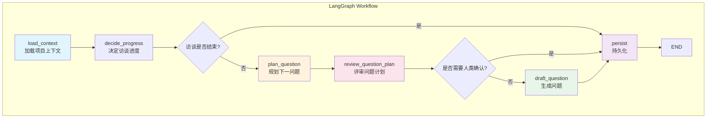

本文档深入分析状态化访谈Agent的核心代码模式，阐释这些设计决策背后的架构思想，并说明为何当前实现与常见的重构建议保持**硬分离**——这并非技术债务，而是有意为之的架构选择。

## 核心架构模式概览

该项目采用 **LangGraph + TypedDict状态驱动** 的工作流架构。不同于传统的函数式管道或面向对象的命令模式，这里选择了一种**状态快照模式**，将整个访谈会话的上下文压缩到一个 TypedDict 中进行流转。

### 工作流图谱



这种工作流设计的核心特征是**每个节点都是状态转换函数**，接收完整状态，返回需要更新的字段。这种模式在 `interview_graph.py` 中定义，通过 `_run_logged_node` 包装器实现统一的日志和错误处理。

Sources: [interview_graph.py](app/graphs/interview_graph.py#L1-L151)

---

## 模式一：状态作为单一真相来源

### 当前实现

整个访谈的上下文被压缩到 `InterviewGraphState` 这个 TypedDict 中。这个状态在节点间流动，携带了从项目ID到覆盖度状态的所有信息：

```python
class InterviewGraphState(TypedDict, total=False):
    run_id: int
    project_id: int
    answer_text: str
    human_review_signal: dict
    current_turn_no: int
    current_stage: str
    coverage_state: dict
    # ... 44个字段总计
```

Sources: [interview_state.py](app/graphs/interview_state.py#L1-L44)

### 为何不拆分成独立服务？

常见的重构建议会提倡将状态拆分为独立的领域对象（如 `Coverage`, `TaskBoard`, `Scenario`），每个对象管理自己的生命周期。但当前设计选择**扁平化状态**的原因有三：

**1. 状态一致性保证**

在分布式或多步工作流中，维护跨对象的状态一致性是复杂的。当前方案确保任何状态更新都是原子性的——要么整个状态更新成功，要么失败。

**2. 检查点恢复的简洁性**

LangGraph 的 `MemorySaver` 检查点机制依赖于状态的序列化。扁平化的 TypedDict 可以直接序列化/反序列化，无需处理对象图的复杂关系。

**3. 调试可观测性**

当需要追踪一个bug时，查看完整的状态快照比追踪多个对象之间的引用关系要直观得多。

---

## 模式二：覆盖度状态作为JSON存储

### 当前实现

`coverage_state` 是一个JSON字段，存储在数据库的 `project_sessions` 表中：

```python
# coverage_service.py
def default_coverage_state() -> dict[str, Any]:
    return {
        "version": 2,
        "branch_count": 0,
        "branches": [],           # 主题分支
        "question_history": [],   # 问题历史
        "framework": {}           # 框架覆盖度
    }
```

Sources: [coverage_service.py](app/services/coverage_service.py#L130-L138)

这个状态通过 `rebuild_coverage_state` 函数从历史轮次重建，而非实时计算。每次生成新问题时，系统会：
1. 提取回答中的关键词
2. 识别新的主题分支
3. 更新框架覆盖度（基于阶段关键词匹配）

### 重构建议 vs 当前选择

| 重构建议 | 当前选择 | 理由 |
|---------|---------|------|
| 使用独立Coverage表 | JSON字段存储 | 覆盖度是派生状态，可从Turn表重建 |
| 规范化数据库设计 | 扁平化JSON | 覆盖度结构随版本演进，JSON更灵活 |
| 实时计算覆盖度 | 批量重建 | 减少每次查询的复杂度 |

这种设计体现了**计算换空间**的思路：虽然每次生成问题时需要重建状态，但避免了维护实时聚合查询的复杂性。

Sources: [project.py](app/models/project.py#L66-L77)

---

## 模式三：阶段驱动的硬编码约束

### 当前实现

项目采用固定的五阶段访谈模型：

```python
# stage_manager.py
PANORAMA_STAGE = "Panorama Mapping"
ARCHITECTURE_STAGE = "Architecture Understanding"
CODE_DETAIL_STAGE = "Code Detail Completion"
USE_CASE_STAGE = "Use Cases & Scenarios"
WRAP_UP_STAGE = "Final Wrap-up"

STAGE_SEQUENCE = [PANORAMA_STAGE, ARCHITECTURE_STAGE, CODE_DETAIL_STAGE, USE_CASE_STAGE, WRAP_UP_STAGE]
```

Sources: [stage_manager.py](app/services/stage_manager.py#L8-L42)

每个阶段有不同的关键词集合用于验证问题：

```python
PANORAMA_KEYWORDS = {
    "purpose": {"purpose", "goal", "problem", "supports"},
    "target_users": {"user", "customer", "operator", "admin"},
    "major_modules": {"module", "service", "component"},
    # ...
}
```

Sources: [coverage_service.py](app/services/coverage_service.py#L84-L91)

### 重构建议 vs 当前选择

常见的重构建议会提倡**配置化的阶段系统**，支持运行时定义新阶段。然而当前设计选择**硬编码阶段**的原因：

**1. 语义一致性保证**

访谈Agent的阶段不仅是技术概念，也是认知模型。"全景映射"必须有明确的语义边界，否则生成的问题会漂移。硬编码确保所有代码引用同一个定义。

**2. 验证规则的可靠性**

阶段特定的验证规则（如Panorama阶段禁止出现`.py`文件引用）需要在每个生成节点被强制执行。如果阶段可配置，这些规则也需要动态化，大大增加系统复杂度。

**3. 逐步演进的策略**

系统通过 `decide_next_stage` 函数实现阶段推进逻辑，该函数包含复杂的条件判断（最小轮数、关键覆盖度、人类确认等）。将这个逻辑与阶段定义分离会导致行为的不确定性。

---

## 模式四：模式匹配而非机器学习的验证

### 当前实现

问题验证采用**正则表达式+关键词匹配**的规则系统，而非机器学习模型：

```python
# question_validator.py
CHANGE_PROPOSAL_PATTERNS = [
    r"should\s+be\s+(changed|modified|updated|refactored)",
    r"(?:how|what)\s+(?:should|could|would)\s+we\s+(change|modify|fix)",
    # ...
]

def validate_question_for_stage(*, text: str, current_stage: str, ...) -> dict:
    # 模式匹配检查
    for pattern in CHANGE_PROPOSAL_PATTERNS:
        if re.search(pattern, normalized, re.IGNORECASE):
            reasons.append("Question suggests change proposals...")
```

Sources: [question_validator.py](app/services/question_validator.py#L26-L38)

### 为何不用LLM进行验证？

**1. 成本与延迟**

每次问题生成后再调用LLM进行验证会增加一轮API调用（通常是60-100ms延迟和额外成本）。规则系统可在毫秒级完成。

**2. 可解释性**

当验证失败时，规则系统可以精确指出触发了哪个模式。LLM的判断往往难以归因。

**3. 确定性保证**

规则系统的行为是确定性的——给定相同输入，总是产生相同输出。这对于需要审计的访谈记录至关重要。

**4. 渐进式增强的可能**

当前系统设计了 `question_intent_whitelist` 和 `reject_markers` 两层过滤，这实际上模拟了"粗筛+精筛"的流程。第一层用规则快速过滤，第二层（如果需要）可以升级到LLM验证。

---

## 模式五：Prompt资产的文件系统管理

### 当前实现

Prompt模板存储在 `app/prompts/assets/` 目录下的YAML文件中：

```python
# prompts/manager.py
class PromptManager:
    def __init__(self, prompt_directory: Path | None = None):
        self.prompt_directory = prompt_directory or Path(__file__).resolve().parent / "assets"
        self._prompts = self._load_prompts()
    
    def _load_prompts(self) -> dict[str, PromptDefinition]:
        prompts: dict[str, PromptDefinition] = {}
        for prompt_path in sorted(self.prompt_directory.glob("*.yaml")):
            parsed = yaml.safe_load(handle)
            definition = PromptDefinition.model_validate(parsed)
            prompts[definition.id] = definition
        return prompts
```

Sources: [manager.py](app/prompts/manager.py#L16-L23)

### 重构建议 vs 当前选择

| 重构建议 | 当前选择 | 理由 |
|---------|---------|------|
| 数据库存储Prompt | 文件系统+版本控制 | Git可追溯、diff友好 |
| 动态注册Prompt | 约定式加载 | 避免运行时注册复杂性 |
| 数据库+管理界面 | YAML+代码审查 | 访谈场景变更不频繁 |

这种设计将Prompt视为**代码**而非**数据**。每次Prompt变更都需要代码审查，这与访谈Agent的质量要求一致。

---

## 模式六：日志即数据结构的结构化事件

### 当前实现

系统采用JSON格式的结构化日志，每个事件都是完整的上下文快照：

```python
# logging/event.py
class StructuredLogEvent(BaseModel):
    timestamp: str
    level: str
    logger: str
    event: str
    message: str
    
    request_id: str | None = None
    project_id: int | None = None
    turn_no: int | None = None
    stage: str | None = None
    # ... 更多上下文字段
```

Sources: [event.py](app/logging/event.py#L7-L36)

日志通过 `emit_event` 函数发出，被工作流节点包装器自动添加节点级别的开始/完成/错误事件。

### 为何不用标准日志库？

**1. 查询友好性**

JSONL格式可以被 `jq` 或日志分析工具直接查询。每个事件的完整上下文使得关联分析成为可能。

**2. 与追踪系统集成**

`run_trace_service` 创建的 `AgentRun` 和 `AgentRunStep` 记录与日志事件共享 `trace_id` 和 `request_id`，可以实现跨系统的请求追踪。

**3. 审计合规**

访谈场景可能涉及代码知识产权审计。完整的操作日志是合规要求的一部分。

Sources: [run_trace_service.py](app/services/run_trace_service.py#L78-L116)

---

## 模式七：人类决策门的显式建模

### 当前实现

系统通过 `HumanGate` 模型显式建模人类介入点：

```python
# human_gate_service.py
class HumanGate(BaseModel):
    gate_id: str
    gate_type: GateType  # PHASE_COMPLETION, DRIFT_REDIRECTION, etc.
    phase: str | None
    reason: str
    options: list[GateOption]
    default_action: str
    resolved: bool = False
```

Sources: [human_gate_service.py](app/services/human_gate_ervice.py#L25-L38)

### 重构建议 vs 当前选择

| 重构建议 | 当前选择 | 理由 |
|---------|---------|------|
| 通用工作流引擎 | 硬编码Gate类型 | 访谈场景的Gate类型是可枚举的 |
| 异步回调通知 | 状态字段+轮询 | 简化前端轮询逻辑 |
| 外部任务队列 | 数据库状态 | 避免引入额外基础设施 |

Gate类型的枚举定义在 `mode_service.py` 中：

```python
class GateType(str, Enum):
    PHASE_COMPLETION = "phase_completion"
    DRIFT_REDIRECTION = "drift_redirection"
    BRANCH_PRIORITIZATION = "branch_prioritization"
    LOW_CONFIDENCE = "low_confidence"
    MODE_TRANSITION = "mode_transition"
    SCENARIO_COMPLETION = "scenario_completion"
```

Sources: [mode_service.py](app/services/mode_service.py#L29-L37)

---

## 模式八：模式驱动的智能体模式约束

### 当前实现

Agent模式（理解当前代码 vs 评审 vs 提议变更）通过**模式列表**进行硬约束：

```python
# mode_service.py
CHANGE_PROPOSAL_PATTERNS = [
    r"should\s+be\s+(changed|modified|updated|refactored)",
    r"(?:how|what)\s+(?:should|could|would)\s+we\s+(change|modify|fix)",
    # ... 共10+个模式
]

UNDERSTANDING_PATTERNS = [
    r"how\s+does\s+(?:this|the)",
    r"what\s+does\s+(?:this|the)",
    r"why\s+does\s+(?:this|the)",
    # ...
]
```

Sources: [mode_service.py](app/services/mode_service.py#L40-L65)

这种设计确保Agent在 `understand_current_code` 模式下**永远不会**提出重构建议——这是一个**确定性的行为约束**，而非概率性的输出控制。

### 与重构建议的硬分离

这个模式是**与重构建议硬分离**的典型例子。传统的做法是：
- 让LLM"尽量"不提出变更建议
- 通过few-shot示例引导

当前系统的做法是：
- 在Planner层面就禁止生成变更导向的问题意图
- 在Validator层面检测并拒绝违反模式的问题
- 在Generator层面注入模式约束到Prompt

这是一种**纵深防御**策略，确保模式约束不会被单点失败突破。

---

## 总结：架构决策的上下文

这些模式的选择并非偶然，而是基于以下核心约束：

1. **访谈质量优先于代码简洁性** — 验证规则的可解释性比实现优雅更重要

2. **状态一致性优先于服务化** — 扁平化状态避免了分布式一致性问题

3. **确定性优先于灵活性** — 硬编码阶段、模式列表、规则引擎都服务于可预测的行为

4. **运维简洁优先于功能丰富** — 文件系统Prompt、JSON状态、SQLite兼容都降低了部署复杂度

如果您的团队需要引入新的代码模式，建议首先评估该模式是否与上述约束兼容。**与重构建议的硬分离**不是教条，而是一种有意识的技术取舍。

---

## 相关文档

- [访谈阶段体系：五阶段模型详解](3-fang-tan-jie-duan-ti-xi-cong-quan-jing-tu-dao-zui-zhong-shou-kou)
- [问题规划器：QuestionPlanner的生成策略](10-wen-ti-gui-hua-qi-questionplannerde-sheng-cheng-ce-lue)
- [Human-in-the-Loop：评审信号如何影响工作流](14-human-in-the-loop-ping-shen-xin-hao-ru-he-ying-xiang-gong-zuo-liu)
- [LangGraph工作流：访谈图的节点与边设计](6-langgraphgong-zuo-liu-fang-tan-tu-de-jie-dian-yu-bian-she-ji)