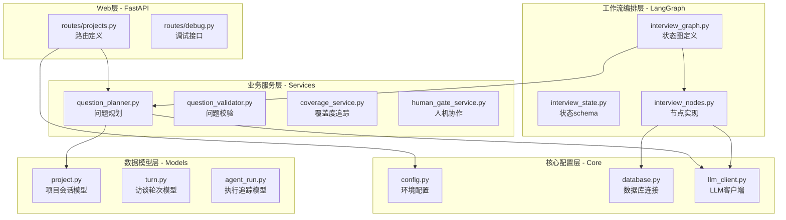
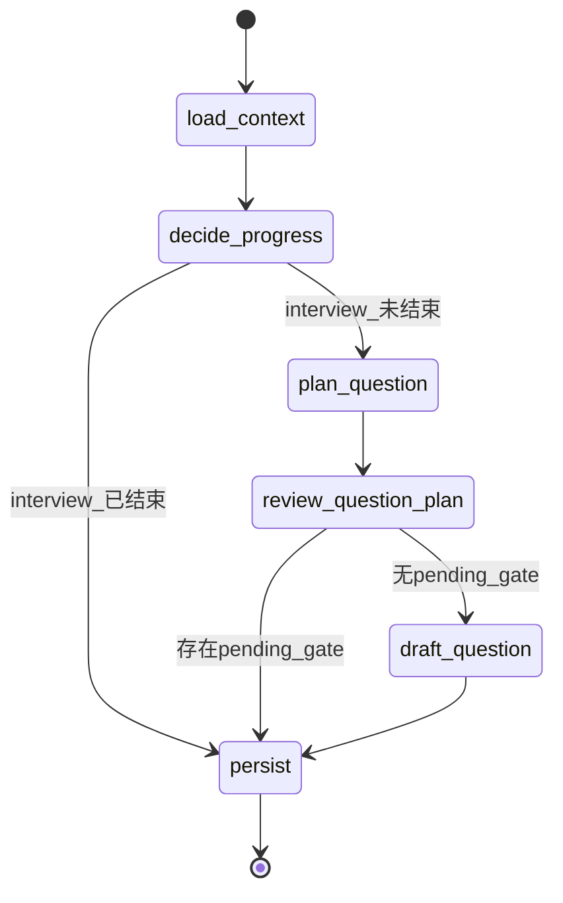

本文档详细介绍状态化访谈Agent的后端技术架构，涵盖Web框架、数据持久化、LLM集成以及基于LangGraph的工作流编排四大核心支柱。该架构采用经典的**分层设计模式**，通过清晰的职责边界实现了业务逻辑的可维护性与可测试性。

## 架构总览

该项目后端采用四层架构设计，各层职责明确、边界清晰。从请求入口到数据持久化的完整调用链路呈现如下特征：



## 技术栈详解

### Web框架：FastAPI

FastAPI作为Web层框架，为系统提供高性能的异步HTTP接口能力。该框架的选择基于以下技术考量：自动OpenAPI文档生成、依赖注入系统、以及原生异步支持。应用入口定义于 `app/main.py`，核心初始化流程包括数据库Schema同步、日志系统配置、以及CORS中间件挂载。

```python
# app/main.py - 核心应用创建
app = FastAPI(title=settings.app_app_name)

app.add_middleware(
    CORSMiddleware,
    allow_origins=["http://127.0.0.1:5173", "http://localhost:5173"],
    allow_credentials=True,
    allow_methods=["*"],
    allow_headers=["*"],
)

app.include_router(project_router)
app.include_router(debug_router)
```

在请求处理层面，系统实现了完整的**中间件链**：从请求ID注入、上下文初始化、到结构化日志输出，形成完整的可观测性链路。`request_Logging_middleware` 函数通过 `set_log_context` 将请求级别的trace_id绑定到日志上下文，确保跨服务调用的追踪能力。

Sources: [main.py](app/main.py#1-87)

### ORM层：SQLAlchemy

数据持久化采用SQLAlchemy作为ORM层，支持SQLite（开发环境）和PostgreSQL（生产环境）的平滑切换。数据库连接管理遵循会话工厂模式，通过 `SessionLocal` 线程本地会话实现请求级别的资源管理。

```python
# app/core/database.py - 数据库引擎配置
engine = create_engine(
    settings.database__url,
    connect_args=(
        {"check_same_thread": False}
        if settings.database_url.startswith("sqlite")
        else {}
    ),
)

SessionLocal = sessionmaker(autocommit=False, autoflush=False, bind=engine)

Base = declarative_base()
```

在Schema管理方面，系统采用**演进式迁移策略**。`ensure_database_schema()` 函数不仅负责初始表创建，还实现了增量字段添加逻辑。这种设计避免了 Alembic 迁移工具的复杂性，特别适合快速迭代的开发阶段。

Sources: [database.py](app/core/database.py#1-126)

### 数据模型设计

系统定义了六个核心数据模型，形成完整的领域建模：

| 模型名称 | 职责 | 核心字段 |
|---------|------|---------|
| `ProjectSession` | 项目会话管理 | project_name, system_prompt, current_stage, status |
| `InterviewTurn` | 单轮访谈记录 | turn_no, stage, question_text, answer_text |
| `LLMUsage` | LLM调用计量 | prompt_tokens, completion_tokens, model_name |
| `AgentRun` | 执行追踪 | status, duration_ms, error_message |
| `AgentRunStep` | 执行步骤 | step_name, input_json, output_json |
| `InterviewQuestionVersion` | 问题版本管理 | version_no, question_text, generation_kind |

`ProjectSession` 模型采用JSON字段存储复杂状态，包括覆盖度状态（coverage_state）、任务看板（rubric_task_board）、以及待处理人机交互（pending_gate_json）。这种设计在保持SQL查询能力的同时，提供了足够的灵活性存储半结构化数据。

```python
# app/models/project.py - 覆盖度状态属性
@property
def coverage_state_data(self) -> dict[str, Any]:
    try:
        parsed = json.loads(self.coverage_state) if self.coverage_state else {}
    except json.JSONDecodeError:
        parsed = {}
    # 提供默认值和类型保障
    parsed.setdefault("version", 1)
    parsed.setdefault("branch_count", len(parsed.get("branches", [])))
    return parsed
```

Sources: [project.py](app/models/project.py#1-169), [turn.py](app/models/turn.py#1-124)

### LLM集成：OpenAI客户端封装

在AI能力接入层面，系统通过 `app/core/llm_client.py` 封装了OpenAI兼容接口。这种设计实现了**接口抽象**，便于在后续切换到其他LLM提供商（如Anthropic、Claude等）时最小化业务代码的改动。

```python
# app/core/llm_client.py - 客户端工厂函数
def get_openai_client() -> OpenAI:
    client_kwargs = {
        "api_key": settings.openai_api_key,
        "base_url": settings.openai_base_url,
    }
    
    # 代理兼容性降级处理
    try:
        return OpenAI(**client_kwargs)
    except ImportError as exc:
        if "socksio" not in str(exc):
            raise
        return OpenAI(
            **client_kwargs,
            http_client=httpx.Client(trust_env=False),
        )
```

配置层支持灵活的环境变量注入，默认指向MiniMax-M2.5模型，同时允许通过 `.env` 文件自定义API端点和密钥。

Sources: [llm_client.py](app/core/llm_client.py#1-33), [config.py](app/core/config.py#1-34)

## LangGraph工作流编排

LangGraph是整个系统的**编排核心**，它将离散的业务服务串联为完整的访谈流程图。与传统的线性流程不同，LangGraph通过状态机模型实现了条件分支、人机交互暂停点、以及可恢复的执行状态。

### 状态定义

`InterviewGraphState` 采用 TypedDict 定义，确保状态字典的类型安全。该状态定义了30+字段，涵盖执行上下文、阶段流转、问题生成、以及覆盖度追踪等维度：

```python
# app/graphs/interview_state.py - 状态schema定义
class InterviewGraphState(TypedDict, total=False):
    run_id: int
    project_id: int
    answer_text: str
    human_review_signal: dict
    human_gate_resolution: dict
    
    current_turn_no: int
    next_turn_no: int
    current_stage: str
    next_stage: str
    
    project_status: str
    agent_mode: str
    task_board: dict
    pending_gate: dict | None
    
    coverage_state: dict
    retrieved_context: str
    repo_grounding_context: str
    
    validation_result: dict
    latest_question: str
    generated_question: str
    
    interview_finished: bool
    minimum_goal_reached: bool
```

状态设计遵循**不可变更新原则**（Immutable Update Pattern）：每个节点返回的状态更新会与现有状态合并，形成新的状态快照。这为LangGraph的检查点（Checkpoint）功能提供了基础。

Sources: [interview_state.py](app/graphs/interview_state.py#1-44)

### 节点与边的设计

工作流图定义了6个核心节点和4条边/条件边：



| 节点名称 | 职责 | 关键依赖 |
|---------|------|---------|
| `load_context` | 加载项目上下文、历史对话、项目状态 | 数据库、会话检索 |
| `decide_progress` | 判断访谈进度、决定是否继续 | 覆盖度、轮次上限 |
| `plan_question` | 生成问题规划、选择主题分支 | 覆盖度服务、规划器 |
| `review_question_plan` | 验证问题规划、触发人机评审 | 校验器服务 |
| `draft_question` | 基于规划生成最终问题文本 | 提示词系统 |
| `persist` | 持久化轮次数据、更新项目状态 | 数据库、覆盖度保存 |

```python
# app/graphs/interview_graph.py - 节点注册与边定义
builder = StateGraph(InterviewGraphState)

builder.add_node("load_context", load_context_node)
builder.add_node("decide_progress", decide_progress_node)
builder.add_node("plan_question", plan_question_node)
builder.add_node("review_question_question_plan", review_plan_node)
builder.add_node("draft_question", draft_question_node)
builder.add_node("persist", persist_node)

builder.set_entry_point("load_context")
builder.add_edge("load_context", "decide_progress")

# 条件边：决策节点根据访谈是否结束分流
builder.add_conditional_edges(
    "decide_progress",
    route_after_decision,
    {"plan_question": "plan_question", "persist": "persist"},
)

# 条件边：评审节点根据pending_gate状态分流
builder.add_conditional_edges(
    "review_question_plan",
    route_after_review,
    {"draft_question": "draft_question", "persist": "persist"},
)

builder.add_edge("draft_question", "persist")
builder.add_edge("persist", END)
```

### 可恢复执行与检查点

系统使用 `MemorySaver` 作为检查点存储器，这意味着工作流执行可以在任意节点处中断并恢复。这对于长时间运行的访谈任务尤为重要——用户提交回答后，系统可能因网络问题或服务重启而中断，再次调用时能够从断点续传：

```python
checkpointer = MemorySaver()
interview_graph = builder.compile(checkpointer=checkpointer)
```

Sources: [interview_graph.py](app/graphs/interview_graph.py#1-152)

## 配置与依赖管理

### 环境配置

系统通过Pydantic Settings实现类型安全的环境配置：

```python
# app/core/config.py - 配置模型
class Settings(BaseSettings):
    app_name: str = "Stateful Interview Agent"
    app_env: str = "dev"
    log_level: str = "INFO"
    
    openai_api_key: str
    openai_base_url: str = "https://api.scnet.cn/api/llm/v1"
    openai_model: str = "MiniMax-M2.5"
    
    interview_min_turns: int = 35
    interview_max_turns: int = 40
    
    database_url: str = "sqlite:///./data/app.db"
    
    model_config = SettingsConfigDict(
        env_file=".env",
        env_file_encoding="utf-8",
    )
```

配置支持 `.env` 文件覆盖，默认值适配本地开发环境，生产环境通过环境变量注入敏感信息。

### 目录结构组织

按照领域驱动设计的思路，代码库组织遵循以下原则：

| 目录 | 职责 | 典型内容 |
|------|------|---------|
| `app/api/routes/` | HTTP路由定义 | projects.py, debug.py |
| `app/core/` | 基础设施配置 | config, database, llm_client |
| `app/models/` | 数据库模型定义 | ORM类及关系映射 |
| `app/services/` | 业务逻辑服务 | 30+个独立服务模块 |
| `app/graphs/` | LangGraph编排 | 状态图、节点实现 |
| `app/schemas/` | API请求/响应模型 | Pydantic模型 |
| `app/logging/` | 日志与可观测性 | 结构化日志、事件追踪 |
| `app/prompts/` | 提示词资产管理 | 提示词模板与版本管理 |

Sources: [config.py](app/core/config.py#1-34)

## 下一步学习路径

完成本章节的架构概览后，建议按以下顺序深入核心模块：

1. **[LangGraph工作流：访谈图的节点与边设计](6-langgraphgong-zuo-liu-fang-tan-tu-de-jie-dian-yu-bian-she-ji)** — 深入理解工作流编排的详细实现

2. **[状态管理：InterviewGraphState设计与持久化](7-zhuang-tai-guan-li-interviewgraphstateshe-ji-yu-chi-jiu-hua)** — 掌握状态机的状态流转机制

3. **[SQLAlchemy模型层：项目、会话与轮次管理](8-sqlalchemymo-xing-ceng-xiang-mu-hui-hua-yu-lun-ci-guan-li)** — 学习数据模型的完整设计

4. **[问题规划器：QuestionPlanner的生成策略](10-wen-ti-gui-hua-qi-questionplannerde-sheng-cheng-ce-lue)** — 理解核心业务逻辑的实现

5. **[Human--in-the-Loop：评审信号如何影响工作流](14-human-in-the-loop-ping-shen-xin-hao-ru-he-ying-xiang-gong-zuo-liu)** — 掌握人机协作机制的实现原理