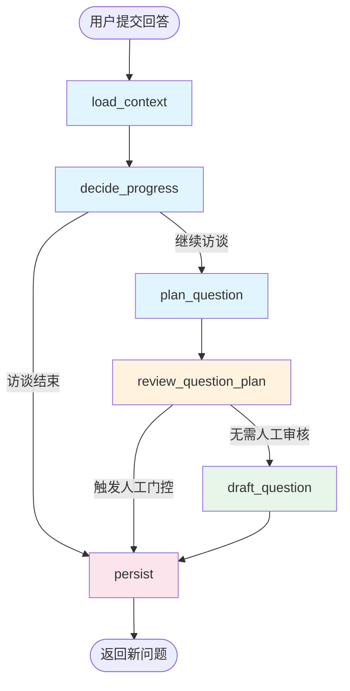
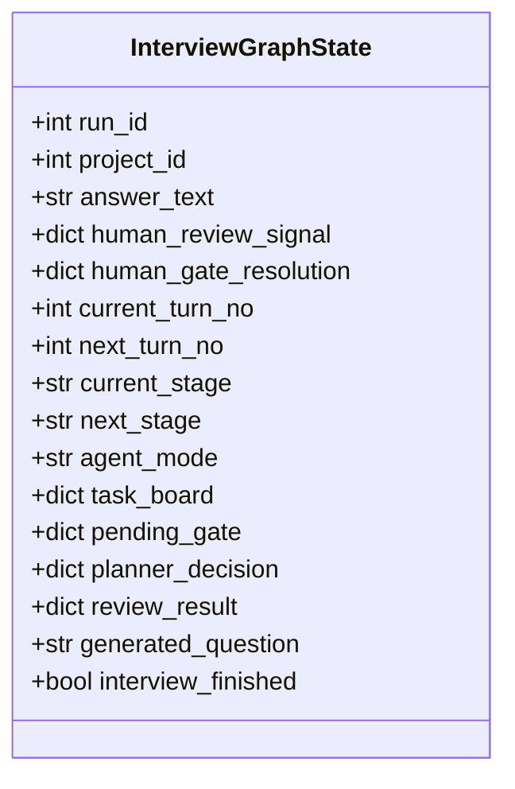
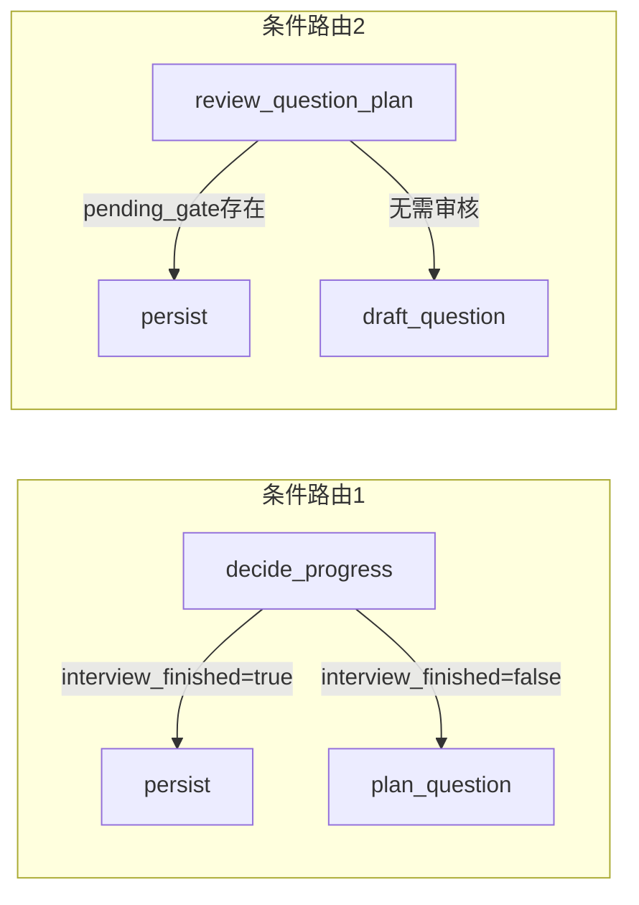

LangGraph工作流是本项目的核心执行引擎，负责协调AI访谈Agent的完整生命周期。从用户提交回答、决定下一阶段的访谈策略，到生成新问题并持久化存储，每个环节都通过精心设计的节点与边来实现。理解这一工作流的架构设计，对于掌握整个系统的行为模式至关重要。

## 整体架构概览

本项目采用LangGraph的**StateGraph**模式构建访谈工作流，通过声明式的节点注册与边连接，将复杂的访谈逻辑分解为可组合的独立步骤。每个节点负责特定的功能职责，边定义了节点间的流转规则，而条件边则根据状态动态决定后续路径。

工作流采用**有向无环图（DAG）**结构，确保了执行路径的可预测性与可调试性。关键的设计决策包括：使用`MemorySaver`作为checkpointer实现状态持久化（在内存中保存检查点，支持恢复）、每个节点通过`_run_logged_node`包装器记录详细的执行指标、以及通过条件边实现灵活的业务流程分支。

## 状态模式设计

工作流的核心是`InterviewGraphState`状态对象，它定义了在整个访谈生命周期中流转的数据结构。这个状态采用`TypedDict`定义，确保了类型安全与IDE自动补全支持。

状态字段可分为几类：**输入参数**（`run_id`、`project_id`、`answer_text`、`human_review_signal`、`human_gate_resolution`）由API层传入；**进度追踪**（`current_turn_no`、`next_turn_no`、`current_stage`、`next_stage`）记录访谈的当前轮次与阶段；**上下文数据**（`coverage_state`、`retrieved_context`、`history_text`）承载检索与记忆压缩的中间结果；**决策与输出**（`planner_decision`、`review_result`、`generated_question`）则是各节点的产出。

Sources: [interview_state.py](app/graphs/interview_state.py#1-44)

## 节点详解

### 1. load_context — 上下文加载节点

这是工作流的入口节点，负责在每次迭代开始时加载项目的完整上下文。`load_project_context`函数执行以下核心操作：

首先从数据库加载项目会话（`ProjectSession`）与最新的访谈轮次（`InterviewTurn`），验证项目状态未结束且存在已回答的轮次。随后加载完整的访谈历史，通过`build_compact_interview_context`构建压缩后的历史文本供后续节点使用。

该节点还负责反序列化任务看板（`task_board`）、待处理的人工门控（`pending_gate`）与事件日志，并将人类审核信号与门控解析结果进行合并，形成统一的`human_review_feedback_signal`传递给下游。

关键返回值包括：`current_turn_no`、`current_stage`（当前轮次与阶段）、`coverage_state`（框架覆盖度状态）、`task_board`（任务看板）、`pending_gate`（待处理的人工门控）以及`scenario_status`（场景完成度）。

Sources: [interview_nodes.py](app/graphs/interview_nodes.py#438-528)

### 2. decide_progress — 进度决策节点

该节点决定访谈是否继续以及下一阶段的目标。`decide_progress`函数首先检查是否达到最大轮次限制——通过`can_continue_interview`判断当前轮次是否在允许范围内。

如果访谈可以继续，节点调用`decide_next_stage`根据当前覆盖度状态、当前阶段、人类审核信号等因素决定下一阶段。这实现了阶段间的智能跳转逻辑。

返回的核心字段是`interview_finished`（布尔值）与`next_stage`（下一阶段名称）。当`interview_finished`为True时，工作流将跳过问题生成直接进入持久化节点。

Sources: [interview_nodes.py](app/graphs/interview_nodes.py#532-558)

### 3. plan_question — 问题规划节点

规划节点负责生成下一问题的策略性决策，而非直接生成问题文本。它调用`plan_next_question`服务，传入当前阶段、覆盖度状态、人类审核信号、Agent模式与任务看板，产出包含以下信息的规划决策：

- `question_intent`：问题的意图（探索、确认、深挖等）
- `target_branch_id`：目标框架分支ID
- `target_type`与`target_label`：目标主题的类型与标签
- `confidence`：规划置信度
- `why_this_question`：规划理由说明

规划决策作为后续生成与审核节点的输入契约，确保问题生成过程有明确的策略指导。

Sources: [interview_nodes.py](app/graphs/interview_nodes.py#561-590)

### 4. review_question_plan — 规划审核节点

审核节点扮演质量关卡角色，对规划决策进行多层验证。它调用`review_question_plan`服务，检查规划是否符合当前模式要求、是否偏离已覆盖的主题、以及是否需要触发人工决策门控。

该节点的关键职责包括：**漂移检测**（如果规划偏离了当前阶段的核心目标）、**人工门控触发**（当AI不确定如何决策时暂停等待人类指示）、以及**替代方案生成**（当原规划不可行时提供备选）。

返回的`pending_gate`字段如果非空，工作流将暂停进入持久化节点，等待人类提供决策信号后再继续。

Sources: [interview_nodes.py](app/graphs/interview_nodes.py#594-645)

### 5. draft_question — 问题生成节点

生成节点负责根据规划决策与上下文生成最终的问题文本。`draft_next_question`通过`draft_question_from_answered_history`函数实现完整的生成流程：

首先刷新历史摘要（确保较早轮次有压缩摘要可用），然后构建紧凑的历史上下文并重建覆盖度状态。接着调用LLM生成问题，并经过**重复过滤**（`is_question_too_similar`检查问题是否与历史问题过于相似）、**阶段验证**（`validate_question_for_stage`检查是否符合当前阶段的约束模式）、以及**文本审核**（`review_question_question`检查问题质量）的多重校验。

如果验证失败，系统会自动重试生成，最终产出经过验证的问题文本与相关的元数据。

Sources: [interview_nodes.py](app/graphs/interview_nodes.py#650-695)

### 6. persist — 持久化节点

持久化节点负责将工作流的执行结果写入数据库，结束当前轮次并准备下一轮迭代。该节点调用`persist_next_step`函数，保存新生成的访谈轮次（包含问题文本、规划决策、验证结果等），同时更新项目的覆盖度状态、当前阶段与任务看板。

Sources: [interview_nodes.py](app/graphs/interview_nodes.py#695-750)

## 边与条件路由

工作流中的边分为**普通边**与**条件边**两种类型。普通边定义固定的流转路径，条件边则根据状态动态决定下一步。

**route_after_decision**函数实现第一层条件路由：当`interview_finished`为True时，路由到持久化节点结束访谈；否则路由到问题规划节点进入正常生成流程。

**route_after_review**函数实现第二层条件路由：当`pending_gate`存在时，路由到持久化节点暂停等待人类决策；否则路由到问题生成节点继续。

这种双层条件设计使得系统能够在关键决策点灵活地引入人工介入，同时保持正常流程的高效执行。

Sources: [interview_graph.py](app/graphs/interview_graph.py#96-120)

## 节点执行日志

每个节点通过`_run_logged_node`包装器实现统一的日志记录，确保工作流执行的完整可观测性。日志涵盖四个关键事件：

- `workflow.node.start`：节点开始执行，记录输入状态键
- `workflow.node.complete`：节点成功完成，记录输出payload预览与执行时长
- `workflow.node.error`：节点执行异常，记录错误信息与堆栈

日志payload包含项目ID、轮次号、阶段名称、节点名称与执行耗时等关键维度，为生产环境的故障排查提供数据基础。

Sources: [interview_graph.py](app/graphs/interview_graph.py#10-63)

## 检查点与状态恢复

工作流使用`MemorySaver`作为checkpointer，在内存中保存每个节点执行后的状态快照。这一设计支持两个关键场景：**容错恢复**（当节点执行中断时可以从上一个检查点恢复）和**调试回溯**（可以检查任意检查点的状态数据）。

在API层调用时，通过`config={"configurable": {"thread_id": f"project-{project_id}"}}`指定线程ID，实现按项目隔离的状态管理。

Sources: [interview_graph.py](app/graphs/interview_graph.py#145-147)

## 架构设计要点

| 设计要素 | 实现方式 | 设计意图 |
|---------|---------|---------|
| 状态管理 | TypedDict + 全局状态对象 | 类型安全、清晰的数据契约 |
| 节点封装 | 函数 + 包装器 | 关注点分离、统一的日志与异常处理 |
| 条件路由 | 状态字段驱动 | 灵活的业务流程分支 |
| 检查点 | MemorySaver | 支持恢复与调试 |
| 上下文传递 | 状态字段累加 | 减少重复查询、保持数据一致性 |

工作流的设计遵循了**单向数据流**原则：每个节点读取输入状态、产生输出状态，状态在节点间流转而非各节点自行维护内部状态。这种设计使得工作流的行为完全可预测，便于调试与测试。

## 总结

LangGraph工作流将复杂的AI访谈逻辑分解为六个职责明确的节点，通过条件边实现访谈结束与人工介入的分支处理。每个节点专注于单一职责（加载、决策、规划、审核、生成、持久化），通过状态对象传递上下文数据，形成清晰的数据流。这种架构设计既保证了执行流程的可控性，又为未来扩展（如新增审核阶段、引入多模态输入）提供了良好的基础。

如果想深入了解状态的具体数据结构与持久化机制，请参阅 [状态管理：InterviewGraphState设计与持久化](7-zhang-tai-guan-li-interviewgraphstateshe-ji-yu-chi-jiu-hua)。如需了解问题规划器的生成策略，参阅 [问题规划器：QuestionPlanner的生成策略](10-wen-ti-gui-hua-qi-questionplannerde-sheng-cheng-ce-lue)。