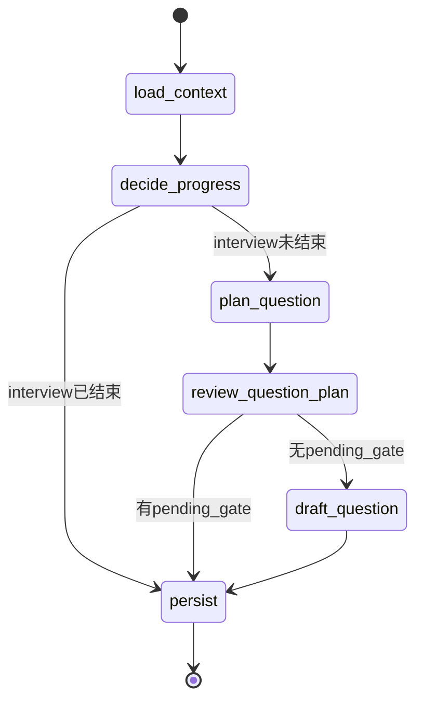

本章节深入剖析状态化访谈Agent的核心状态管理机制。我们将从**LangGraph状态定义**、**工作流状态转换**、**双层持久化架构**三个维度，揭示系统如何在多轮对话中维护上下文一致性。

## 1. 状态架构全景

访谈Agent采用**双层持久化架构**：第一层是LangGraph的内存状态管理，通过MemorySaver实现图执行过程中的状态暂存；第二层是SQLAlchemy ORM实现的数据库持久化，确保访谈会话在进程重启后能够恢复。这两层架构各司其职，形成了一个完整的"运行时状态缓存 + 长期数据存储"体系。

### 1.1 状态模式设计原则

InterviewGraphState采用了**TypedDict + total=False**的声明模式，这在类型安全和灵活性之间取得了平衡。`total=False`意味着所有字段都是可选的，这符合LangGraph状态更新的增量特性——每个节点只需要返回它需要更新的字段，而非完整状态副本。这种设计允许状态在节点间流动时逐渐丰富，同时保持类型可推断性。

```mermaid
graph TD
    subgraph "API层"
        A[POST /answer] --> B[构建初始State]
    end
    
    subgraph "LangGraph Checkpoint"
        B --> C[MemorySaver]
        C -.-> D[thread_id: project-{id}]
    end
    
    subgraph "状态节点"
        C --> E[load_context]
        E --> F[decide_progress]
        F --> G[plan_question]
        G --> H[review_plan]
        H --> I[draft_question]
        I --> J[persist]
    end
    
    subgraph "数据库持久化"
        J --> K[ProjectSession]
        J --> L[InterviewTurn]
        J --> M[AgentRun]
    end
    
    K --> N[coverage_state]
    L --> O[question_plan_json]
    M --> P[step_count]
```

Sources: [interview_graph.py](app/graphs/interview_graph.py#L119-L151), [interview_state.py](app/graphs/interview_state.py#L1-L44)

---

## 2. InterviewGraphState 深度解析

### 2.1 状态字段分类

状态字段按语义可分为五个功能域，这种分类有助于理解每个字段在生命周期中的角色定位：

| 功能域 | 字段 | 作用描述 |
|--------|------|----------|
| **会话标识** | `run_id`, `project_id` | 唯一标识当前执行会话与所属项目 |
| **进度追踪** | `current_turn_no`, `next_turn_no`, `current_stage`, `next_stage` | 维护访谈的轮次与阶段进度 |
| **决策上下文** | `planner_decision`, `stage_decision`, `validation_result` | 记录各阶段AI决策的输入输出 |
| **上下文构建** | `history_text`, `coverage_state`, `retrieved_context`, `repo_grounding_context` | 为问题生成提供历史与检索上下文 |
| **协作信号** | `human_review_signal`, `human_gate_resolution`, `pending_gate` | 实现Human-in-the-Loop的反馈闭环 |

Sources: [interview_state.py](app/graphs/interview_state.py#L4-L43)

### 2.2 状态类型设计

状态中的字段采用了几种典型的类型模式：

**单值字段**：直接存储最终结果，如 `generated_question: str`（生成的问题文本）、`latest_question: str`（最新问题）。

**字典字段**：存储结构化的决策结果，如 `planner_decision: dict` 包含 question_intent、target_branch_id、selected_branch_ids 等决策因子。这种设计允许规划器的决策结构灵活演变，而无需修改状态schema。

**列表字段**：追踪历史与多选结果，如 `selected_turn_ids: list[int]`（用于上下文检索的轮次ID列表）、`question_usage_metrics: list[dict]`（累积的LLM调用计量）。

Sources: [interview_state.py](app/graphs/interview_state.py#L1-L44)

---

## 3. LangGraph工作流与状态流转

### 3.1 图结构设计

访谈工作流由6个节点组成，采用**线性+条件分支**的混合拓扑：



**关键设计要点**：

- `load_context` 是入口节点，负责从数据库加载项目上下文并初始化状态
- `decide_progress` 决定访谈是否继续，并计算下一轮的阶段（stage）
- `plan_question` 与 `review_question_plan` 形成规划-审核的协作模式
- `persist` 是唯一写入数据库的节点，遵循单一职责原则

Sources: [interview_graph.py](app/graphs/interview_graph.py#L119-L151)

### 3.2 状态更新语义

LangGraph的状态更新采用**字典合并**语义。每个节点返回的字典会与当前状态合并，而非替换。理解这一点对于正确实现节点至关重要——例如 `decide_progress` 只需要返回 `next_turn_no` 和 `next_stage`，而无需返回完整的输入状态。

这种设计带来了一个关键约束：**节点的输出字段必须与输入字段类型兼容**。例如，如果某节点需要读取 `coverage_state`，它必须假设该字段在当前状态中已存在（由前置节点填充）。

Sources: [interview_graph.py](app/graphs/interview_graph.py#L71-L151)

### 3.3 Checkpoint机制

LangGraph通过MemorySaver实现状态检查点，其核心配置如下：

```python
checkpointer = MemorySaver()
interview_graph = builder.compile(checkpointer=checkpointer)
```

调用时需指定 `thread_id` 作为会话标识：

```python
result = interview_graph.invoke(
    {"run__id": run.id, "project_id": project_id, ...},
    config={"configurable": {"thread_id": f"project-{project_id}"}}
)
```

**thread_id的生命周期管理**：在本系统中，thread_id使用项目ID作为标识，这意味着同一项目的多次调用会共享同一个检查点状态。这一设计适用于访谈Agent的串行执行模型（用户回答 → Agent生成下一问题 → 用户回答），但需要注意如果存在并行调用场景，需要引入更细粒度的thread_id策略。

Sources: [interview_graph.py](app/graphs/interview_graph.py#L150-L151), [projects.py](app/api/routes/projects.py#L557-L566)

---

## 4. 状态初始化：从数据库到运行时

### 4.1 load_context 节点

`load_context` 是整个工作流的初始化节点，它从数据库中拉取项目当前状态并填充到LangGraph状态中。这一过程包含了三个关键步骤：

**第一步：项目与轮次查询**

```python
project = db.query(ProjectSession).filter(ProjectSession.id == state["project_id"]).first()
turns = db.query(InterviewTurn).filter(InterviewTurn.project_id == state["project_id"]).order_by(InterviewTurn.turn_no.asc()).all()
```

**第二步：JSON字段反序列化**

数据库中的多个字段以JSON字符串形式存储，需要在加载时转换为Python对象：
- `project.coverage_state_data` → 状态中的 `coverage_state`
- `project.rubric_task_board` → 状态中的 `task_board`
- `project.pending_gate_json` → 状态中的 `pending_gate`
- `latest_turn.event_log_json` → 状态中的 `event_log`

**第三步：初始化空值字段**

为确保后续节点能够安全访问状态，节点会初始化一组 `None` 或空值的字段：
```python
return {
    "next_turn_no": None,
    "next_stage": None,
    "generated_question": None,
    "planner_decision": {},
    # ...
}
```

Sources: [interview_nodes.py](app/graphs/interview_nodes.py#L438-L529), [project.py](app/models/project.py#L66-L77)

### 4.2 数据库模型映射关系

状态字段与数据库模型之间存在清晰的映射关系：

| 状态字段 | 来源模型 | 字段路径 |
|----------|----------|----------|
| `current_turn_no` | InterviewTurn | turn.turn_no（最新轮次） |
| `current_stage` | InterviewTurn | turn.stage |
| `coverage_state` | ProjectSession | project.coverage_state_data |
| `task_board` | ProjectSession | project.rubric_task_board |
| `pending_gate` | ProjectSession | project.pending_gate_json |
| `human_review_signal` | InterviewTurn | turn.human_review_json |

Sources: [interview_nodes.py](app/graphs/interview_nodes.py#L498-L512), [project.py](app/models/project.py#L66-L148), [turn.py](app/models/turn.py#L60-L67)

---

## 5. 核心节点的状态转换

### 5.1 decide_progress：进度决策

该节点决定访谈是否继续，并计算下一轮的阶段（stage）：

```python
def decide_progress(state):
    if not can_continue_interview(current_turn_no):
        return {"interview_finished": True, ...}
    
    next_stage = decide_next_stage(
        next_turn_no=next_turn_no,
        coverage_state=state.get("coverage_state"),
        current_stage=state.get("current_stage"),
        human_review_signal=state.get("human_review_signal"),
    )
    return {"interview_finished": False, "next_turn_no": next_turn_no, "next_stage": next_stage}
```

**关键转换**：
- 输入：`current_turn_no`, `current_stage`, `coverage_state`, `human_review_signal`
- 输出：`interview_finished`, `next_turn_no`, `next_stage`, `stage_decision`

Sources: [interview_nodes.py](app/graphs/interview_nodes.py#L532-L558)

### 5.2 plan_question：问题规划

规划节点根据当前阶段、覆盖度状态、人类反馈信号生成问题规划决策。这个决策包含问题的意图、目标分支、目标类型等元信息，但不包含具体的问题文本。

**关键转换**：
- 输入：`next_turn_no`, `next_stage`, `coverage_state`, `human_review_signal`
- 输出：`planner_decision`（包含 question_intent, target_branch_id, selected_turn_ids 等）

Sources: [interview_nodes.py](app/graphs/interview_nodes.py#L561-L591)

### 5.3 persist：持久化节点

`persist` 是整个工作流中最重要的持久化节点，它负责将运行时状态写入数据库。该节点执行以下操作：

1. **更新当前轮次**：将用户的回答写入 `pending_turn.answer_text`
2. **创建下一轮次**：生成 `InterviewTurn` 对象，包含生成的问题
3. **刷新覆盖度状态**：调用 `rebuild_coverage_state` 重新计算分支覆盖度
4. **同步任务看板**：更新 `rubric_task_board`
5. **追加问题版本**：记录问题的版本历史用于追溯

```python
# 持久化核心逻辑
next_turn = InterviewTurn(
    project_id=project.id,
    turn_no=safe_next_turn_no,
    stage=state["next_stage"],
    question_text=state["generated_question"],
    question_plan_json=build_question_question_Plan_json(state),
)
db.add(next_turn)
project.turn_count = next_turn.turn_no
project.current_stage = state["next_stage"]
refreshed_coverage_state = rebuild_coverage_state([*all_turns, next_turn])
save_coverage_state(project, refreshed_coverage_state)
```

**状态输出**：根据访谈是否结束，返回不同的信号给前端
- 结束：`{"message": "Interview finished...", "minimum_goal_reached": bool}`
- 有待处理门：`{"message": "Human input is required...", "pending_gate_active": True}`
- 正常继续：创建下一轮次并返回

Sources: [interview_nodes.py](app/graphs/interview_nodes.py#L695-L933), [interview_ nodes.py](app/graphs/interview_nodes.py#L830-L872)

---

## 6. 持久化策略与数据一致性

### 6.1 写入时序

持久化采用**单节点集中写入**模式，所有状态到数据库的转换都在 `persist` 节点完成。这种设计有两个关键优势：

**原子性保障**：所有数据库写入在一个事务中完成（通过 `db.commit()`），确保轮次、项目、覆盖度状态的一致性更新。

**可追溯性**：每个工作流执行对应一个 `AgentRun` 记录，节点执行被记录到 `AgentRunStep` 中，形成完整的执行轨迹。

### 6.2 状态重建机制

当外部调用（如用户提交回答）触发工作流时，初始状态的构建需要整合多个数据源：

```python
result = interview_graph.invoke(
    {
        "run__id": run.id,
        "project_id": project_id,
        "answer_text": latest_turn.answer_text,
        "human_review_signal": payload.human_review.model_dump() if payload.human_review else None,
        "human_gate_resolution": payload.human_gate.model_dump() if payload.human_gate else None,
    },
    config={"configurable": {"thread_id": f"project-{project_id}"}},
)
```

**注意**：这里的初始状态只包含用户输入（回答、评审信号、门控解决），其他状态（如历史上下文、覆盖度）由 `load_context` 节点从数据库加载。这种设计实现了**用户输入与系统状态的分离**。

Sources: [projects.py](app/api/routes/projects.py#L557-L566), [interview_nodes.py](app/graphs/interview_nodes.py#L438-L529)

### 6.3 JSON字段的设计权衡

项目采用了大量JSON字段（如 `question_plan_json`、`coverage_state`、`rubric_task_board`），这种设计在灵活性与类型安全之间做了权衡：

**优势**：
- 允许数据结构自由演进，无需数据库迁移
- 存储复杂的嵌套结构（如覆盖度状态的 branches 数组）

**挑战**：
- 缺乏数据库级别的类型约束
- 需要手动处理JSON解析错误

系统在每个模型中通过 `@property` 封装JSON解析逻辑，并提供默认空值处理：

```python
@property
def coverage_state_data(self) -> dict[str, Any]:
    try:
        parsed = json.loads(self.coverage_state) if self.coverage_state else {}
    except json.JSONDecodeError:
        parsed = {}
    parsed.setdefault("version", 1)
    parsed.setdefault("branch_count", len(parsed.get("branches", [])))
    return parsed
```

Sources: [project.py](app/models/project.py#L66-L77), [turn.py](app/models/turn.py#L60-L97)

---

## 7. 扩展与演进建议

### 7.1 状态演进路径

当前InterviewGraphState采用扁平字典结构。随着系统复杂度增长，可以考虑以下演进方向：

**类型化子状态**：将相关字段封装为TypedDict子类型，例如将覆盖度相关字段提取为 `CoverageState` 类：

```python
class CoverageState(TypedDict):
    branch_ount: int
    updated_through_turn_no: int
    branches: list[Branch]
```

**状态版本化**：引入 `state_version` 字段，支持状态schema的平滑升级。

### 7.2 持久化层扩展

当前使用MemorySaver的内存检查点，在多实例部署场景下需要外置检查点存储。LangGraph支持：

- **PostgresSaver**：跨进程共享状态
- **RedisSaver**：高性能分布式缓存

对于高可用部署，建议将 `MemorySaver` 替换为持久化检查点。

---

## 延伸阅读

本章节阐述了状态管理的核心机制，建议结合以下章节深入理解：

- [LangGraph工作流：访谈图的节点与边设计](6-langgraphgong-zuo-liu-fang-tan-tu-de-jie-dian-yu-bian-she-ji) — 理解节点与边的高级编排模式
- [SQLAlchemy模型层：项目、会话与轮次管理](8-sqlalchemymo-xing-ceng-xiang-mu-hui-hua-yu-lun-ci-guan-li) — 数据库模型设计细节
- [覆盖度服务：CoverageState的分支与主题追踪](12-fu-gai-du-fu-wu-coveragestatede-fen-zhi-yu-zhu-ti-zhui-zong) — 覆盖度状态的业务语义