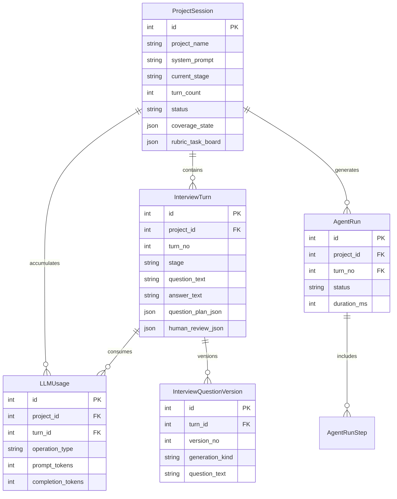

本页面档阐述状态化访谈Agent的**核心数据模型层**，详细说明项目会话（ProjectSession）、访谈轮次（InterviewTurn）以及关联实体的结构设计与关系映射。该模型层采用**一对多关系树**构建，支持完整的访谈生命周期管理——从项目创建、问题生成、用户回答，到运行轨迹追踪与成本分析。

## 一、模型层整体架构

本项目的SQLAlchemy模型层包含六个核心实体，按业务逻辑可分为三个层次：

| 层次 | 核心模型 | 职责 |
|------|----------|------|
| **会话层** | `ProjectSession` | 管理整个访谈会话的全局状态，包括项目配置、当前阶段、代码仓库信息、覆盖度状态等 |
| **轮次层** | `InterviewTurn` | 管理单个访谈轮次的问答数据、问题版本、人类评审结果 |
| **追踪层** | `AgentRun` / `AgentRunStep` / `LLMUsage` | 记录Agent执行轨迹、步骤分解与Token消耗统计 |

整体模型关系可用以下ER图表示：



Sources: [project.py](app/models/project.py), [turn.py](app/models/turn.py), [agent_run.py](app/models/agent_run.py), [llm_usage.py](app/models/llm_usage.py), [question_version.py](app/models/question_version.py)

## 二、会话层模型：ProjectSession

`ProjectSession` 是整个系统的根实体，对应一个完整的访谈会话。它聚合了所有轮次数据、运行轨迹和Token消耗统计，同时维护会话的全局状态，包括当前阶段、代码仓库信息、覆盖度追踪等。

### 2.1 核心字段设计

```python
class ProjectSession(Base):
    __tablename__ = "project_sessions"

    id: Mapped[int] = mapped_column(Integer, primary_key=True, index=True)
    project_name: Mapped[str] = mapped_column(String(255), nullable=False)
    system_prompt: Mapped[str] = mapped_column(Text, nullable=False)
    current_stage: Mapped[str] = mapped_column(String(100), default="Panorama Mapping")
    turn_count: Mapped[int] = mapped_column(Integer, default=0)
    status: Mapped[str] = mapped_column(String(50), default="active")
    
    # 代码仓库配置
    repo_source_type: Mapped[str] = mapped_column(String(32), default="none")
    repo_local_path: Mapped[str | None] = mapped_column(Text, nullable=True)
    repo_git_url: Mapped[str | None] = mapped_column(Text, nullable=True)
    repo_git_ref: Mapped[str | None] = mapped_column(String(255), nullable=True)
    repo_commit_sha: Mapped[str | None] = mapped_column(String(64), nullable=True)
    repo_manifest_json: Mapped[str] = mapped_column(Text, default="{}")
    
    # 状态JSON字段
    coverage_state: Mapped[str] = mapped_column(Text, default='{...}')
    agent_mode: Mapped[str] = mapped_column(String(50), default="understand_current_code")
    rubric_task_board: Mapped[str] = mapped_column(Text, default="{}")
    pending_gate_json: Mapped[str] = mapped_column(Text, default="null")
```

**关键设计决策说明：**

- **系统Prompt存储**：每个项目独立的 `system_prompt` 字段允许不同项目使用不同的访谈策略，这是支持多租户或多种访谈模式的基础
- **阶段追踪**：`current_stage` 字段记录当前所处访谈阶段（如"Panorama Mapping"、"Deep Exploration"），与LangGraph工作流中的状态机对应
- **仓库抽象**：`repo_source_type` 支持多种仓库来源（本地路径、Git URL、无），这种设计使得访谈可以脱离具体代码仓库进行，也可以在访谈过程中动态挂载仓库

Sources: [project.py](app/models/project.py#1-50)

### 2.2 状态JSON字段的序列化模式

项目中多处使用JSON字符串存储复杂状态，通过SQLAlchemy的`property`方法提供类型安全的访问接口：

| JSON字段 | 用途 | 关键属性 |
|----------|------|----------|
| `coverage_state` | 追踪访谈覆盖的代码分支与主题 | `version`, `branch_count`, `branches[]` |
| `rubric_task_board` | 管理访谈评分任务看板 | `phases`, `current_phase`, `phase_status` |
| `pending_gate_json` | 存储待处理的人工 gate 信号 | `gate_type`, `payload` |
| `repo_manifest_json` | 代码仓库的索引清单 | `root_path`, `file_count`, `language_counts` |

这种设计在保持数据库schema简单的同时，提供了足够的灵活性来存储不断演化的状态结构。

Sources: [project.py](app/models/project.py#95-145)

### 2.3 便捷属性方法

`ProjectSession` 提供了多个计算属性，用于聚合统计：

```python
@property
def total_tokens(self) -> int:
    return sum(usage.total_tokens for usage in self.llm_usages)

@property
def coverage_state_data(self) -> dict[str, Any]:
    # 自动解析JSON，提供默认值
    parsed = json.loads(self.coverage_state) if self.coverage_state else {}
    parsed.setdefault("version", 1)
    parsed.setdefault("branch_count", len(parsed.get("branches", [])))
    return parsed

@property
def cumulative_generation_time_ms(self) -> int:
    return sum(run.duration_ms or 0 for run in self.agent_runs 
               if run.status == "completed")
```

这些属性使得API层可以直接通过 `session.total_tokens` 访问聚合数据，无需手动编写复杂的聚合查询。

Sources: [project.py](app/models/project.py#53-169)

## 三、轮次层模型：InterviewTurn

`InterviewTurn` 对应访谈过程中的单个轮次，记录该轮提出的问题、用户的回答、以及相关的元数据。每个轮次都必须关联到一个 `ProjectSession`，并且拥有唯一的 `turn_no` 序号。

### 3.1 核心字段设计

```python
class InterviewTurn(Base):
    __tablename__ = "interview_turns"

    id: Mapped[int] = mapped_column(Integer, primary_key=True, index=True)
    project_id: Mapped[int] = mapped_column(
        ForeignKey("project_sessions.id"), nullable=False, index=True
    )
    
    turn_no: Mapped[int] = mapped_column(Integer, nullable=False)
    stage: Mapped[str] = mapped_column(String(100), nullable=False)
    
    question_text: Mapped[str] = mapped_column(Text, nullable=False)
    question_plan_json: Mapped[str | None] = mapped_column(Text, nullable=True)
    answer_text: Mapped[str | None] = mapped_column(Text, nullable=True)
    answer_summary: Mapped[str | None] = mapped_column(Text, nullable=True)
    answer_analysis_json: Mapped[str | None] = mapped_column(Text, nullable=True)
    human_review_json: Mapped[str | None] = mapped_column(Text, nullable=True)
    event_log_json: Mapped[str] = mapped_column(Text, default="[]")
```

**问答数据的生命周期：**

| 阶段 | 字段填充情况 |
|------|--------------|
| 问题生成后 | `question_text`, `question_plan_json` 已填充；`answer_text` 为 NULL |
| 用户回答后 | `answer_text` 填充；`answer_summary` 和 `answer_analysis_json` 可能由后端自动生成 |
| 人工评审后 | `human_review_json` 填充评审结果 |
| 全流程 | `event_log_json` 记录该轮所有关键事件 |

Sources: [turn.py](app/models/turn.py#1-35)

### 3.2 问题版本管理机制

项目采用 **问题版本化** 设计，允许对同一轮次的问题进行重写和版本追踪：

```python
question_versions = relationship(
    "InterviewQuestionVersion",
    back_populates="turn",
    cascade="all, delete-orphan",
    order_by="InterviewQuestionVersion.version_no",
)

@property
def current_question_version_no(self) -> int:
    if self.question_versions:
        return self.question_versions[-1].version_no
    return 1

@property
def question_regeneration_count(self) -> int:
    return max(0, self.current_question_version_no - 1)
```

当问题被重写（例如基于人类评审反馈重新生成），系统会创建新的 `InterviewQuestionVersion` 记录而非覆盖原问题。这种设计支持：
- 问题演化的完整审计追溯
- 不同版本问题的对比分析
- 问题重写Token消耗的独立统计

Sources: [turn.py](app/models/turn.py#83-96), [question_version.py](app/models/question_version.py)

## 四、运行轨迹与成本追踪模型

### 4.1 AgentRun：执行单元

`AgentRun` 记录一次完整的Agent执行周期。它与 `ProjectSession` 和 `InterviewTurn` 都有外键关系——某些运行是轮次无关的（如初始化运行），某些运行则明确关联到特定轮次。

```python
class AgentRun(Base):
    __tablename__ = "agent_runs"

    id: Mapped[int] = mapped_column(Integer, primary_key=True, index=True)
    project_id: Mapped[int] = mapped_column(
        ForeignKey("project_sessions.id"), nullable=False, index=True
    )
    turn_no: Mapped[int | None] = mapped_column(Integer, nullable=True, index=True)
    
    status: Mapped[str] = mapped_column(String(32), default="running", index=True)
    started_at: Mapped[datetime] = mapped_column(DateTime, default=datetime.utcnow)
    ended_at: Mapped[datetime | None] = mapped_column(DateTime, nullable=True)
    duration_ms: Mapped[int | None] = mapped_column(Integer, nullable=True)
    
    total_llm_tokens: Mapped[int] = mapped_column(Integer, default=0)
    total_llm_calls: Mapped[int] = mapped_column(Integer, default=0)
    step_count: Mapped[int] = mapped_column(Integer, default=0)
```

**status 字段的取值：**
- `running`：执行中
- `completed`：成功完成
- `failed`：执行失败
- `cancelled`：被取消

Sources: [agent_run.py](app/models/agent_run.py)

### 4.2 LLMUsage：Token消耗追踪

`LLMUsage` 是细粒度的Token消耗记录，关联到项目和（可选的）轮次：

```python
class LLMUsage(Base):
    __tablename__ = "llm_usages"

    id: Mapped[int] = mapped_column(Integer, primary_key=True, index=True)
    project_id: Mapped[int] = mapped_column(
        ForeignKey("project_sessions.id"), nullable=False, index=True
    )
    turn_id: Mapped[int | None] = mapped_column(
        ForeignKey("interview_turns.id"), nullable=True, index=True
    )
    
    operation_type: Mapped[str] = mapped_column(String(64), nullable=False, index=True)
    # operation_type 示例："question_generation", "answer_summary", "coverage_analysis"
    
    prompt_tokens: Mapped[int] = mapped_column(Integer, default=0)
    completion_tokens: Mapped[int] = mapped_column(Integer, default=0)
    total_tokens: Mapped[int] = mapped_column(Integer, default=0)
    is_estimated: Mapped[bool] = mapped_column(Boolean, default=False)
```

`operation_type` 字段允许按操作类型进行成本分析，例如统计"问题生成"阶段累计消耗了多少Token。

Sources: [llm_usage.py](app/models/llm_usage.py)

## 五、关系映射与级联设计

### 5.1 SQLAlchemy 关系配置

模型间的关系配置采用双向 `relationship` + `back_populates` 模式：

```python
# ProjectSession 侧
turns = relationship(
    "InterviewTurn", 
    back_populates="project", 
    cascade="all, delete-orphan"
)
llm_usages = relationship(
    "LLMUsage", 
    back_populates="project", 
    cascade="all, delete-orphan"
)
agent_runs = relationship(
    "AgentRun", 
    back_populates="project", 
    cascade="all, delete-orphan"
)

# InterviewTurn 侧
project = relationship("ProjectSession", back_populates="turns")
llm_usages = relationship(
    "LLMUsage", 
    back_populates="turn", 
    cascade="all, delete-orphan"
)
question_versions = relationship(
    "InterviewQuestionVersion",
    back_populates="turn",
    cascade="all, delete-orphan",
    order_by="InterviewQuestionVersion.version_no",
)
```

**级联删除策略**：`cascade="all, delete-orphan"` 确保当父实体被删除时，所有子实体自动被清理。这对于测试场景和会话重置尤为重要——删除一个项目会话会自动清理所有关联的轮次、运行记录和Token消耗数据，避免数据孤岛。

Sources: [project.py](app/models/project.py#43-51), [turn.py](app/models/turn.py#37-48)

### 5.2 索引策略

关键字段上建立了适当的索引以优化查询性能：

| 表 | 索引字段 | 目的 |
|---|----------|------|
| `project_sessions` | `id` (PK) | 主键索引 |
| `interview_turns` | `project_id`, `id` | 按项目查询轮次 |
| `agent_runs` | `project_id`, `turn_no`, `status` | 按项目/轮次查询运行状态 |
| `llm_usages` | `project_id`, `turn_id`, `operation_type` | 成本分析与轮次归因 |
| `interview_question_versions` | `turn_id` | 查询某轮次的所有问题版本 |

Sources: [project.py](app/models/project.py), [turn.py](app/models/turn.py), [agent_run.py](app/models/agent_run.py), [llm_usage.py](app/models/llm_usage.py)

## 六、数据库Schema演进支持

项目采用SQLite作为默认数据库，并在 `database.py` 中实现了轻量级的Schema迁移机制：

```python
def ensure_database_schema():
    Base.metadata.create_all(bind=engine)
    
    if not settings.database_url.startswith("sqlite"):
        return
    
    inspector = inspect(engine)
    if "interview_turns" in inspector.get_table_names():
        existing_columns = {
            column["name"] for column in inspector.get_columns("interview_turns")
        }
        with engine.begin() as connection:
            if "answer_summary" not in existing_columns:
                connection.execute(text("ALTER TABLE interview_turns ADD COLUMN ..."))
```

这种方式允许在不停机的情况下为现有数据库添加新字段（如 `answer_summary`、`answer_analysis_json` 等），而不需要完整的数据库迁移工具。

Sources: [database.py](app/core/database.py)

## 七、模型层使用模式总结

### 数据创建流程

```
创建 ProjectSession
    ↓
创建 InterviewTurn (关联 project_id + turn_no)
    ↓
创建 LLMUsage (记录问题生成的Token消耗)
    ↓
创建 InterviewQuestionVersion (保存问题版本)
    ↓
用户回答 → 更新 InterviewTurn.answer_text
    ↓
创建 AgentRun + AgentRunStep (记录执行轨迹)
    ↓
创建 LLMUsage (记录回答分析的Token消耗)
```

### 典型查询模式

| 场景 | 查询方式 |
|------|----------|
| 获取项目所有轮次 | `session.query(InterviewTurn).filter_by(project_id=pid).order_by(InterviewTurn.turn_no)` |
| 获取当前轮次 | `session.query(ProjectSession).filter(...).first() → project.turn_count` |
| 统计项目Token消耗 | `project.total_tokens` 属性或 `sum(LLMUsage.total_tokens).where(LLMUsage.project_id == pid)` |
| 获取问题历史版本 | `turn.question_versions` 关系按 `version_no` 排序 |

Sources: [project.py](app/models/project.py#53-55), [turn.py](app/models/turn.py#44-48)

---

本模型层设计体现了以下核心原则：**层次化的实体关系**支持访谈会话的完整生命周期管理；**JSON字段的灵活运用**在保持schema简洁的同时承载了复杂业务状态；**级联删除与版本化设计**确保了数据的完整性与可追溯性。后续页面将介绍[运行轨迹模型](9-yun-xing-gui-ji-mo-xing-agent-runyu-stepde-zhui-zong-she-ji)如何与LangGraph工作流集成，完成从数据层到执行层的完整闭环。