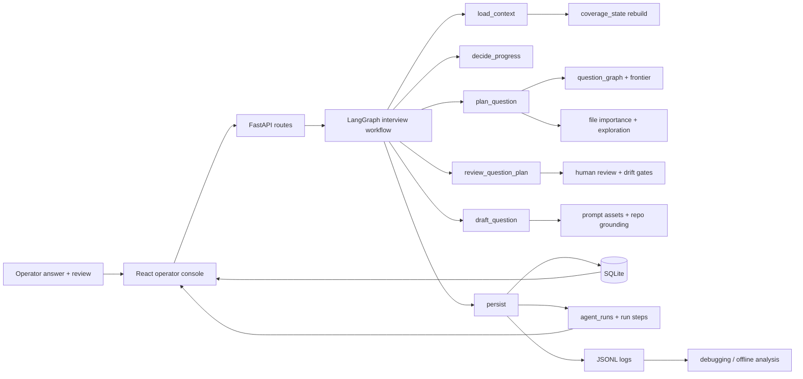
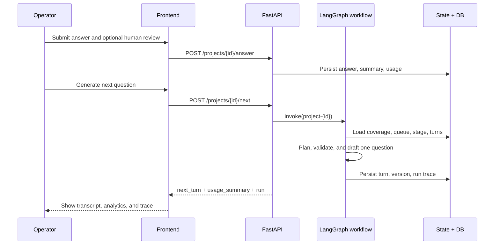

# Stateful Interview Agent

[中文说明](README_zh.md)


> A local full-stack system for interviewing a codebase over dozens of turns without losing the plot.

Stateful Interview Agent is built for a specific job: produce a high-quality understanding transcript of an existing repository. Instead of treating each question as a stateless prompt, it keeps durable interview state, tracks what has already been explored, asks exactly one visible question per turn, accepts human correction, and exposes run traces so operators can inspect how the next question was produced.

## Why It Exists

Most "ask the repo a question" tools collapse after a few turns: they repeat themselves, drift into redesign advice, or lose continuity across files and concepts.

This project attacks that failure mode directly:

- It keeps the interview in `understand_current_code` mode by default.
- It plans against explicit stages: panorama, architecture, code detail, use cases, wrap-up.
- It tracks coverage over frameworks, files, branches, intents, and unanswered follow-up opportunities.
- It lets a human reviewer redirect or regenerate the current question without breaking the transcript.
- It records execution traces, question versions, token usage, and coverage state for inspection.

## At A Glance

| Surface | What it does |
| --- | --- |
| Stateful interview loop | Continues a repository interview across 36-37 turns with durable project state |
| Planner + validator | Chooses the next focus, checks drift, and keeps each question narrow and open-ended |
| Question network | Builds `question_graph` and `investigation_frontier` so code-detail turns stay connected |
| Coverage balancing | Tracks file importance, exploration, and coverage gaps to avoid over-focusing one file |
| Human-in-the-loop review | Redirects focus, corrects stage, and regenerates the current question as a new version |
| Operator console | Bilingual local UI for transcript review, analytics, trace inspection, and project management |
| Research outputs | Extracts metrics from SQLite and logs, then emits CSV and LaTeX tables |
| Packaging | Bundles the app for Windows and Linux with PyInstaller |

## What Makes It Different

- It is not a thin chat wrapper. The core value is orchestration.
- It preserves exactly one user-facing question per turn, even when internal planning decomposes a compound topic into a queue of smaller follow-ups.
- It does not rely on raw history stuffing. Older turns can be summarized and reintroduced through retrieval-oriented context assembly.
- It treats human review as real workflow input, not just a comment box.
- It separates engineering logs from operator-facing execution traces.
- It exposes repository coverage and question-network health as product surfaces, not hidden internals.


## System Flow



## Turn Lifecycle



## Key Product Capabilities

### Interview Orchestration

- Create projects, start an interview, answer turn by turn, and keep the transcript persistent in SQLite.
- Generate the first question and each next question through LangGraph-controlled stages.
- Regenerate the current question from the previous answered turn without advancing turn number.
- Keep question versions, regeneration counts, diffs, and human-intervention token accounting.
- Support answer automation through OpenCode-related routes when configured.

### Coverage, Memory, And Continuity

- Maintain `coverage_state` with stage coverage, branch evidence, repository file coverage, queue state, and question-network stats.
- Summarize older answered turns to reduce context bloat.
- Track `question_graph`, `investigation_frontier`, and `developer_intent_coverage`.
- Use file-level `importance_score`, `exploration_score`, and `coverage_gap_score` to rebalance deep-dive questions.
- Prune queued sub-questions when the latest human answer already resolved them.

### Human Review And Control

- Collect verdicts such as sufficient, insufficient, and drifted.
- Redirect the next focus toward architecture, use cases, or a specific repository topic.
- Correct stage progression when the planner goes too early or too late.
- Regenerate the current question as a new version while preserving history.

### Observability

- Store `agent_runs` and `agent_run_steps` for operator-facing execution trace UX.
- Emit structured JSONL logs to `logs/`.
- Provide dedicated debug endpoints for coverage, queue summary, file coverage summary, and question-network summary.
- Surface analytics in the UI for token mix, runtime, stage movement, frontier health, and repository exploration.

### Question Set Generation

- Generate a complete question set for repository code understanding in one batch.
- Analyze repository structure, detect languages/frameworks, identify core files with importance scoring.
- Generate 35+ questions organized by phases: Panorama Mapping, Architecture Understanding, Code Detail Completion, Use Cases & Scenarios.
- Ensure Code Detail Completion questions ≥85% of total and core file coverage ≥90%.
- Support Chinese instruction-based question revision with validation pipeline.
- Provide validation reports with duplicate detection, modification-intent filtering, and coverage tracking.
- **Quality controls**: Each question is enforced to be a single short question sentence, avoiding multiple consecutive questions.
- **Coherence**: Questions are generated with natural flow and connection between them, avoiding AI-style mechanical library-scanning patterns.

## UI Surfaces

| View | Main value |
| --- | --- |
| Workspace | Create projects, answer turns, inspect current transcript, manage question versions |
| Status panel | Track stage, counts, generation runtime, and active run information |
| Transcript panel | Review every turn, copy the latest question, delete turn tail, and inspect regeneration |
| Execution trace | Watch step-by-step workflow progress and durations |
| Analytics | Inspect token usage, stage transitions, repository coverage, and question-network health |
| Bilingual shell | Switch between English and Chinese in the operator console |

## Architecture Map

```text
stateful_interview_agent/
├─ app/
│  ├─ api/routes/              FastAPI project and debug endpoints
│  ├─ core/                    config, DB wiring, runtime path handling, LLM provider setup
│  ├─ graphs/                  LangGraph state, nodes, and workflow assembly
│  ├─ logging/                 JSONL logging and trace context
│  ├─ models/                  SQLAlchemy persistence models
│  ├─ prompts/                 typed YAML prompt assets
│  ├─ schemas/                 API contracts
│  └─ services/                planning, validation, coverage, retrieval, review, run trace, question set generation
├─ frontend/
│  ├─ src/api/                 frontend API client
│  ├─ src/components/          workspace, transcript, analytics, trace UI
│  ├─ src/hooks/               project-level orchestration hooks
│  └─ src/types/               frontend response types
├─ tests/                      orchestration, coverage, routing, and UI-facing contract tests
├─ scripts/                    metrics extraction and LaTeX export
├─ packaging/                  Windows and Linux PyInstaller specs
├─ docs/plans/                 product and implementation plans
└─ detai_doc/                  deep-dive notes on planner, coverage, HITL, trace, and prompt assets
```

## Quick Start

### 1. Install dependencies

```bash
uv sync
cd frontend && npm install
```

### 2. Configure environment

Copy `.env.example` to `.env` and set the provider you want. The project supports:

- `LLM_PROVIDER=openai_compatible`
- `LLM_PROVIDER=anthropic`
- `LLM_PROVIDER=opencode`

The most important settings are:

```bash
APP_HOST=127.0.0.1
APP_PORT=8000
DATABASE_URL=sqlite:///./data/app.db
OPENAI_API_KEY=your_key
OPENAI_BASE_URL=https://api.scnet.cn/api/llm/v1
OPENAI_MODEL=your_model
QUESTION_GRAPH_ENABLED=true
GRAPH_FRONTIER_PLANNING_ENABLED=true
DEVELOPER_INTENT_BALANCING_ENABLED=true
GRAPH_CONTINUITY_VALIDATION_ENABLED=true
```

### 3. Run the app

Backend only:

```bash
uv run uvicorn app.main:app --reload
```

Frontend only:

```bash
cd frontend
npm run dev
```

Combined launcher from the repo root:

```bash
uv run python main.py
```

Default URLs:

- Backend: `http://127.0.0.1:8000`
- Frontend: `http://127.0.0.1:5173`

## Recommended Daily Workflow

1. Create a project in the UI.
2. Optionally attach repository grounding information.
3. Start the interview and review `Q1`.
4. Save an answer, then generate the next question.
5. Use human review when the question drifts or the stage is wrong.
6. Watch the execution trace and analytics page while iterating.
7. Inspect debug endpoints when planner or coverage behavior looks suspicious.

## Debug And Analytics Surfaces

| Endpoint / Surface | Why you would use it |
| --- | --- |
| `GET /debug/projects/{id}/coverage` | Full `coverage_state`, including framework coverage, queue state, and repo file coverage |
| `GET /debug/projects/{id}/queue-summary` | Inspect deferred sub-question queue in code-detail mode |
| `GET /debug/projects/{id}/file-coverage-summary` | See importance, exploration progress, and coverage gaps by file |
| `GET /debug/projects/{id}/question-network-summary` | Inspect connected ratio, frontier health, top intents, and degradation flags |
| `GET /projects/{id}/runs/latest` | Fetch the latest run trace |
| Analytics page | Inspect token composition, stage transitions, coverage tree, and network diagnostics |

## Tests

Backend:

```bash
uv run python -m unittest tests.test_project_api_flow -v
uv run python -m unittest tests.test_question_planner tests.test_queue_lifecycle -v
uv run python -m unittest tests.test_run_trace_api tests.test_repository_grounding -v
```

Frontend:

```bash
cd frontend
npm test
npm run build
```

## Packaging

The repo supports packaged delivery for Windows and Linux through PyInstaller.

Build steps:

```bash
cd frontend
npm install
npm run build
cd ..
uv sync --extra build
```

Windows:

```bash
uv run pyinstaller packaging/windows/stateful_interview_agent.spec
```

Linux:

```bash
uv run pyinstaller packaging/linux/stateful_interview_agent.spec
```

Packaged mode keeps `.env`, `data/`, and `logs/` outside the executable so operators can reconfigure the app after distribution.

## Research And Offline Analysis

The `scripts/` directory is not filler. It supports a lightweight evaluation loop:

- `scripts/extract_metrics.py` reads SQLite plus runtime logs and emits CSV metrics.
- `scripts/generate_latex_tables.py` converts those metrics into publication-oriented LaTeX tables.

Example:

```bash
python scripts/extract_metrics.py \
  --db-path data/app.db \
  --logs-root logs \
  --output-dir results

python scripts/generate_latex_tables.py \
  --input-dir results \
  --output-dir results/tables
```

## API Snapshot

<details>
<summary>Common project routes</summary>

- `POST /projects`
- `GET /projects`
- `GET /projects/{id}`
- `PATCH /projects/{id}`
- `DELETE /projects/{id}`
- `POST /projects/{id}/start`
- `POST /projects/{id}/answer`
- `POST /projects/{id}/next`
- `POST /projects/{id}/auto-answer-latest`
- `POST /projects/{id}/auto-step`
- `POST /projects/{id}/turns/{turn_id}/regenerate-question`
- `PATCH /projects/{id}/turns/{turn_id}/question`
- `GET /projects/{id}/turns`
- `GET /projects/{id}/status`
- `GET /projects/{id}/transcript`
- `GET /projects/{id}/runs`

</details>

<details>
<summary>Question set routes</summary>

- `POST /question-sets` - Create a new question set generation task
- `GET /question-sets` - List all question sets
- `GET /question-sets/{id}` - Get question set details
- `DELETE /question-sets/{id}` - Delete a question set
- `POST /question-sets/{id}/revise` - Revise a question with Chinese instruction
- `GET /question-sets/{id}/validate` - Get validation report
- `GET /question-sets/{id}/coverage` - Get coverage report

</details>

## Reference Material Inside The Repo

- [`detai_doc/`](detai_doc/) contains deep implementation notes on planner behavior, coverage, execution trace contracts, prompt assets, memory compression, and human-in-the-loop design.
- [`docs/plans/`](docs/plans/) contains iteration plans for features like analytics refresh, queue balancing, and question-network upgrades.
- [`docs/architecture/stateful_interview_agent_architecture.html`](docs/architecture/stateful_interview_agent_architecture.html) contains a dedicated architecture artifact checked into the repo.

## Known Limits

- This project optimizes for understanding current code, not for proposing refactors by default.
- Long interviews still depend on prompt quality and model reliability.
- The deepest code-detail quality depends on how much repository grounding is configured.
- Packaged mode is convenient for operators, but local source mode is still the best setup for active development.
