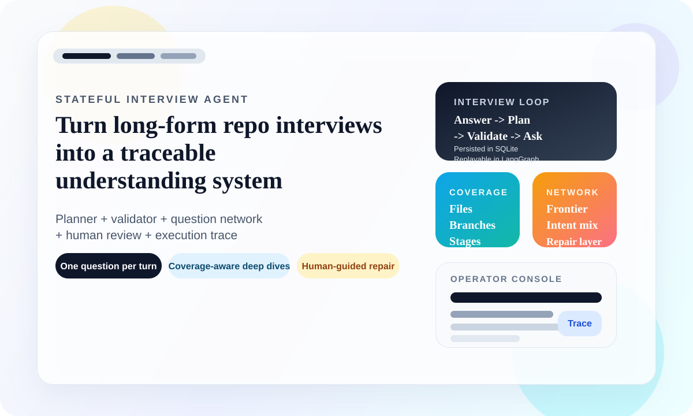
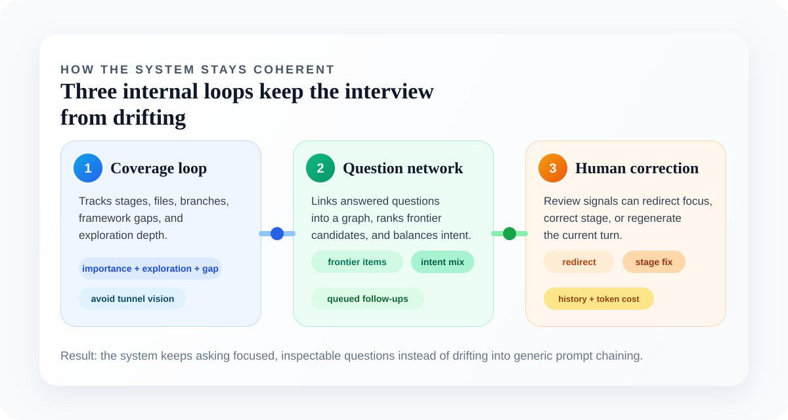
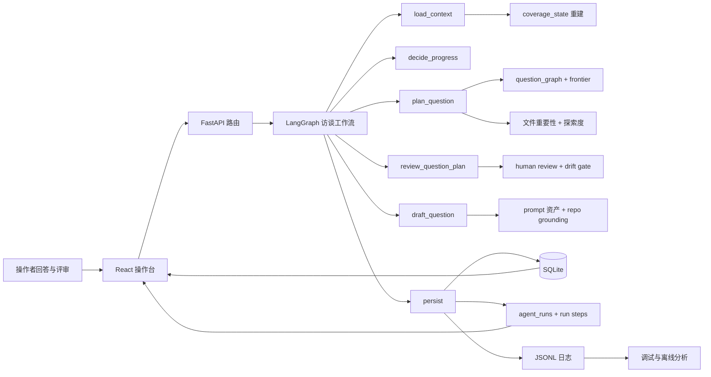
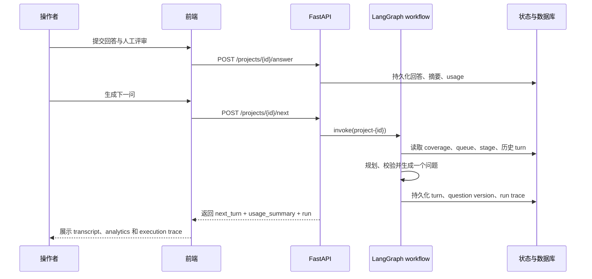

# Stateful Interview Agent

[English README](README.md)




> 一个面向代码仓理解的本地全栈系统，用很多轮连续追问，稳定产出“真正能交付”的理解型 transcript。

Stateful Interview Agent 的核心目标很明确：不是让模型随手回答几个仓库问题，而是围绕一个真实项目，持续做 30 多轮有连续性、可检查、可纠偏的理解式访谈。它会保留项目状态、追踪覆盖缺口、严格维持“一轮一个可见问题”、接收人工评审，并把每次生成过程变成可回放的 run trace。

## 这个项目解决什么问题

很多“问代码库”的工具做两三轮还行，但一拉长就开始出现这些问题：

- 重复问同一类问题
- 很快从“理解当前实现”滑向“应该怎么改”
- 在单个文件里打转，失去全局结构
- 人工纠偏没有真正进入下一轮规划
- 很难解释“这个问题为什么会被问出来”

这个仓库就是围绕这些失效模式设计的：

- 默认锁定在 `understand_current_code` 模式
- 明确分阶段推进：全景、架构、代码细节、用例、收口
- 对文件、分支、框架覆盖、开发者意图和待展开 frontier 做状态追踪
- 支持人工重定向、阶段纠偏和“重写当前问题”
- 把版本历史、token 使用、执行轨迹和覆盖状态都暴露出来

## 一眼看懂

| 能力面 | 作用 |
| --- | --- |
| 状态化访谈主链路 | 在 36-37 轮访谈里持续保留上下文和项目状态 |
| Planner + Validator | 规划下一问，校验漂移，控制单题聚焦 |
| Question network | 通过 `question_graph` 和 `investigation_frontier` 让 code-detail 追问有连续性 |
| Coverage balancing | 用文件重要性、探索度和 gap 避免只围着一个文件转 |
| Human review | 支持重定向、阶段修正、当前问题重生成 |
| Operator console | 本地双语 UI，用于 transcript、analytics、trace 和项目管理 |
| 研究脚本 | 从 SQLite 和日志抽取指标，再导出 LaTeX 表格 |
| 打包分发 | 通过 PyInstaller 打成 Windows / Linux 可执行包 |

## 它和普通 Prompt App 最大的区别

- 它不是简单的聊天壳子，核心价值在编排。
- 即使内部把复杂 code-detail 主题拆成多个子问题，产品层仍然保持“一轮只显示一个问题”。
- 它不靠把所有历史原文粗暴塞回模型，而是做摘要与检索式上下文工程。
- 人工评审不是摆设，会真实改变后续规划和当前问题版本。
- 工程日志与操作者可见的 run trace 是两层设计，不混在一起。
- repository coverage 和 question-network health 被当成产品特性，而不是藏在后端里的内部状态。



## 系统总览



## 一轮问题是怎么长出来的



## 关键能力

### 访谈编排

- 创建项目、启动访谈、逐轮回答，并把 transcript 长期保存在 SQLite。
- 通过 LangGraph 控制第一问和后续每一问的生成。
- 支持“基于上一轮已回答内容重写当前问题”，但不推进 turn 编号。
- 保存 question versions、重生成次数、diff 和人工干预 token 成本。
- 在配置 OpenCode 时，可以走自动回答和 plan-step 相关流程。

### 覆盖、记忆与连续性

- 维护 `coverage_state`，其中包含阶段覆盖、branch evidence、repo file coverage、queue 状态和 question-network 统计。
- 对较早回答做摘要，降低上下文膨胀。
- 跟踪 `question_graph`、`investigation_frontier` 和 `developer_intent_coverage`。
- 用 `importance_score`、`exploration_score`、`coverage_gap_score` 重新平衡深挖问题。
- 当最新回答已经隐式解决排队子问题时，自动裁剪 queue。

### 人机协作

- 接收 sufficient、insufficient、drifted 等 verdict。
- 把下一轮显式重定向到架构、用例或某个特定仓库主题。
- 在阶段走偏时进行人工阶段修正。
- 把当前问题重写成新版本，同时保留历史版本和差异。

### 可观测性

- 使用 `agent_runs` 和 `agent_run_steps` 支撑面向操作者的 execution trace。
- 向 `logs/` 输出结构化 JSONL 日志。
- 提供 coverage、queue summary、file coverage summary、question-network summary 等专用 debug API。
- 在前端 analytics 中展示 token 组成、耗时、阶段迁移、frontier 健康度和仓库覆盖情况。

### 问题集生成

- 一次性批量生成完整的代码理解问题集。
- 分析仓库结构，检测语言/框架，识别核心文件并进行重要性评分。
- 按阶段组织生成 35+ 个问题：全景映射、架构理解、代码细节完成、用例与场景。
- 确保代码细节完成问题 ≥85%，核心文件覆盖率 ≥90%。
- 支持基于中文指令的问题修改，并提供验证流水线。
- 提供验证报告，包括重复检测、修改意图过滤和覆盖跟踪。
- **质量控制**：强制每个问题为单个简短问句，避免多个连续问句。
- **连贯性**：问题之间具有自然的流动和承接关系，避免AI式机械扫库提问。

## UI 能看什么

| 页面 / 面板 | 价值 |
| --- | --- |
| Workspace | 创建项目、回答问题、查看 transcript、管理问题版本 |
| Status panel | 查看阶段、轮次、累计耗时和当前 run 状态 |
| Transcript panel | 浏览每一轮，复制最新问题、删除尾部 turn、触发当前问题重生成 |
| Execution trace | 逐步查看 workflow 正在执行什么、耗时多久 |
| Analytics | 查看 token、阶段迁移、仓库覆盖树和 question-network 诊断 |
| 双语界面 | 可在英文和中文之间切换操作台文案 |

## 代码结构地图

```text
stateful_interview_agent/
├─ app/
│  ├─ api/routes/              FastAPI 项目接口与调试接口
│  ├─ core/                    配置、数据库、运行时路径、LLM provider
│  ├─ graphs/                  LangGraph state、node 与工作流装配
│  ├─ logging/                 JSONL 日志与 trace 上下文
│  ├─ models/                  SQLAlchemy 持久化模型
│  ├─ prompts/                 带类型的 YAML prompt 资产
│  ├─ schemas/                 API 契约
│  └─ services/                planner、validator、coverage、retrieval、run trace、question set generation
├─ frontend/
│  ├─ src/api/                 前端 API client
│  ├─ src/components/          workspace、transcript、analytics、trace UI
│  ├─ src/hooks/               项目级 orchestration hooks
│  └─ src/types/               前端响应类型
├─ tests/                      编排、覆盖、路由和前端契约相关测试
├─ scripts/                    指标抽取与 LaTeX 导出
├─ packaging/                  Windows / Linux PyInstaller 规格
├─ docs/plans/                 产品与实现计划
└─ detai_doc/                  planner、coverage、HITL、trace、prompt 资产深度笔记
```

## 快速开始

### 1. 安装依赖

```bash
uv sync
cd frontend && npm install
```

### 2. 配置环境变量

复制 `.env.example` 为 `.env`，然后选择你要使用的 provider。项目支持：

- `LLM_PROVIDER=openai_compatible`
- `LLM_PROVIDER=anthropic`
- `LLM_PROVIDER=opencode`

最关键的配置项通常是：

```bash
APP_HOST=127.0.0.1
APP_PORT=8000
DATABASE_URL=sqlite:///./data/app.db
OPENAI_API_KEY=your_key
OPENAI_BASE_URL=https://api.scnet.cn/api/llm/v1
OPENAI_MODEL=your_model
QUESTION_GRAPH_ENABLED=true
GRAPH_FRONTIER_PLANNING_ENABLED=true
DEVELOPER_INTENT_BALANCING_ENABLED=true
GRAPH_CONTINUITY_VALIDATION_ENABLED=true
```

### 3. 启动项目

只启动后端：

```bash
uv run uvicorn app.main:app --reload
```

只启动前端：

```bash
cd frontend
npm run dev
```

从仓库根目录一键启动前后端：

```bash
uv run python main.py
```

默认地址：

- Backend: `http://127.0.0.1:8000`
- Frontend: `http://127.0.0.1:5173`

## 推荐使用流

1. 在 UI 中创建一个项目。
2. 如有需要，先配置 repository grounding。
3. 启动访谈，查看 `Q1`。
4. 保存回答，再生成下一问。
5. 当问题漂移或阶段不对时，使用 human review 纠偏。
6. 一边迭代，一边看 execution trace 和 analytics。
7. 当 planner、coverage 或 queue 行为不符合预期时，转去调试接口检查。

## 调试与 Analytics 入口

| 接口 / 视图 | 作用 |
| --- | --- |
| `GET /debug/projects/{id}/coverage` | 查看完整 `coverage_state`，包含 framework coverage、queue 和 repo file coverage |
| `GET /debug/projects/{id}/queue-summary` | 查看 code-detail 阶段尚未展开的内部子问题队列 |
| `GET /debug/projects/{id}/file-coverage-summary` | 查看每个文件的重要性、探索进度和 coverage gap |
| `GET /debug/projects/{id}/question-network-summary` | 查看 connected ratio、frontier 健康度、top intents 和 degradation flags |
| `GET /projects/{id}/runs/latest` | 查看最近一次运行的 execution trace |
| Analytics 页面 | 可视化查看 token、阶段迁移、覆盖树和问题网络诊断 |

## 测试

后端：

```bash
uv run python -m unittest tests.test_project_api_flow -v
uv run python -m unittest tests.test_question_planner tests.test_queue_lifecycle -v
uv run python -m unittest tests.test_run_trace_api tests.test_repository_grounding -v
```

前端：

```bash
cd frontend
npm test
npm run build
```

## 打包分发

仓库支持通过 PyInstaller 打成 Windows 和 Linux 分发包。

构建步骤：

```bash
cd frontend
npm install
npm run build
cd ..
uv sync --extra build
```

Windows：

```bash
uv run pyinstaller packaging/windows/stateful_interview_agent.spec
```

Linux：

```bash
uv run pyinstaller packaging/linux/stateful_interview_agent.spec
```

打包模式会把 `.env`、`data/`、`logs/` 保留在可执行文件之外，方便交付后继续调整配置。

## 研究与离线分析脚本

`scripts/` 目录不是摆设，它支撑一条轻量研究评估链路：

- `scripts/extract_metrics.py` 读取 SQLite 与运行日志，输出 CSV 指标。
- `scripts/generate_latex_tables.py` 把这些指标进一步整理成论文风格的 LaTeX 表格。

示例：

```bash
python scripts/extract_metrics.py \
  --db-path data/app.db \
  --logs-root logs \
  --output-dir results

python scripts/generate_latex_tables.py \
  --input-dir results \
  --output-dir results/tables
```

## API 速览

<details>
<summary>常用项目接口</summary>

- `POST /projects`
- `GET /projects`
- `GET /projects/{id}`
- `PATCH /projects/{id}`
- `DELETE /projects/{id}`
- `POST /projects/{id}/start`
- `POST /projects/{id}/answer`
- `POST /projects/{id}/next`
- `POST /projects/{id}/auto-answer-latest`
- `POST /projects/{id}/auto-step`
- `POST /projects/{id}/turns/{turn_id}/regenerate-question`
- `PATCH /projects/{id}/turns/{turn_id}/question`
- `GET /projects/{id}/turns`
- `GET /projects/{id}/status`
- `GET /projects/{id}/transcript`
- `GET /projects/{id}/runs`

</details>

<details>
<summary>问题集接口</summary>

- `POST /question-sets` - 创建新的问题集生成任务
- `GET /question-sets` - 列出所有问题集
- `GET /question-sets/{id}` - 获取问题集详情
- `DELETE /question-sets/{id}` - 删除问题集
- `POST /question-sets/{id}/revise` - 使用中文指令修改问题
- `GET /question-sets/{id}/validate` - 获取验证报告
- `GET /question-sets/{id}/coverage` - 获取覆盖报告

</details>

## 仓库内现成参考资料

- [`detai_doc/`](detai_doc/) 收录了关于 planner、coverage、execution trace 契约、prompt 资产、记忆压缩和人机协作的深度说明。
- [`docs/plans/`](docs/plans/) 记录了 analytics 刷新、queue balancing、question-network 升级等多轮迭代计划。
- [`docs/architecture/stateful_interview_agent_architecture.html`](docs/architecture/stateful_interview_agent_architecture.html) 是仓库内已有的架构图工件。

## 当前限制

- 这个项目默认优化的是“理解当前代码”，不是“提出改造建议”。
- 长访谈质量仍然会受到 prompt 设计与模型稳定性的影响。
- code-detail 深挖的质量，和 repository grounding 的配置强相关。
- 打包模式适合交付给操作者，本地源码模式仍然最适合开发和调试。
