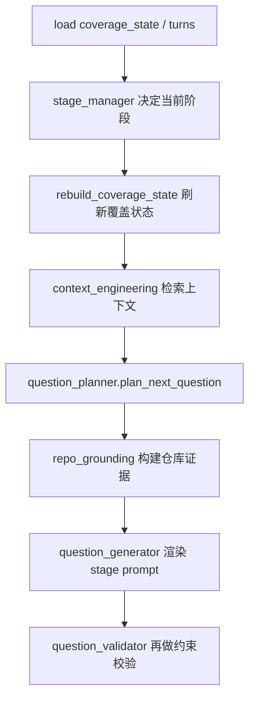

# `question_planner.py` 逐函数拆解

本文专门拆 [`app/services/question_planner.py`](../app/services/question_planner.py)。

目标不是解释“这个模块大概做什么”，而是直接回答下面这些问题：

- `plan_next_question()` 到底按什么顺序做决策
- human review、drift repair、stage gap、branch 选择谁优先
- Code Detail 阶段怎样被强行限制成“理解当前实现”而不是“提修改方案”
- 当你要改“下一问为什么这样问”时，应该从哪个函数切入

---

## 1. 这个文件在整体链路里的位置

它不是直接调用 LLM 的文件，而是“在生成问题之前，先决定到底要问什么”的规划层。

典型调用顺序是：



补充说明：

1. 在当前实现里，`generate_question_for_state()` 会先 `rebuild_coverage_state()`，再进入 planner。
2. planner 决策输出后，会继续走 `build_repo_grounding_context()`，最后才进入 question generator。
3. 因此 planner 不是“紧挨着 stage_manager 的唯一决策点”，而是处在覆盖状态刷新与仓库证据增强之间。

所以这个文件决定的是：

- 问题意图 `question_intent`
- 问题目标 `target_type / target_label`
- 该阶段应该用哪类 prompt
- 这题为什么值得问
- 校验器应该强制哪些约束

如果生成的问题“方向错了”，先看这里，不要先改 prompt。

---

## 2. 文件顶部正则：它们不是工具函数，而是 target 提取规则

源码位置：

- [`question_planner.py:20`](../app/services/question_planner.py#L20)
- [`question_planner.py:21`](../app/services/question_planner.py#L21)
- [`question_planner.py:22`](../app/services/question_planner.py#L22)

```python
FILE_PATTERN = re.compile(r"\b[\w./-]+\.(?:py|ts|tsx|js|jsx|java|go|rb|yaml|yml|json)\b")
CLASS_PATTERN = re.compile(r"\b[A-Z][A-Za-z0-9_]{2,}\b")
METHOD_PATTERN = re.compile(r"\b[a-z_][a-z0-9_]{2,}\s*\(")
```

补充说明：

1. 这组正则并不只在 planner 语义上有意义，`coverage_service.py` 也使用了同类模式来累计 code_detail 覆盖度。
2. 可以把它视作“跨服务共享的代码目标识别约定”，而不是某个函数的私有技巧。

### 含义

这三条正则决定了 Code Detail 阶段怎样把一个 branch 的 summary/label 识别成更具体的代码目标：

- `FILE_PATTERN`
  - 匹配文件路径或文件名
  - 例如 `app/services/question_generator.py`
- `CLASS_PATTERN`
  - 匹配类名风格的 token
  - 例如 `ProjectSession`、`InterviewTurn`
- `METHOD_PATTERN`
  - 匹配函数/方法调用式片段
  - 例如 `plan_next_question(`

### 为什么重要

Code Detail 阶段“是否够具体”很大程度取决于这里。

如果你的项目主要语言不是 Python/TS，而是：

- Rust
- C#
- Kotlin
- C++

那这里的匹配能力就会明显变差，后面 `choose_code_detail_target()` 选到的 target 会更泛。

### 修改切入点

如果你发现系统老是问：

- “这个执行路径如何工作”

却很少问：

- “`FooService.handle()` 在 `foo_service.py` 里是如何处理请求的”

第一步先扩展这里的正则，而不是先调 prompt。

---

## 3. `plan_next_question()`：整个 planner 的主控函数

源码位置：

- [`question_planner.py:25-349`](../app/services/question_planner.py#L25)

这是最关键的函数。它本质上是一个“有优先级的规则决策树”。

---

### 3.1 输入参数逐个解释

源码位置：

- [`question_planner.py:25-34`](../app/services/question_planner.py#L25)

```python
def plan_next_question(
    *,
    turns: list[InterviewTurn],
    current_stage: str,
    next_turn_no: int,
    coverage_state: dict[str, Any],
    human_review_signal: dict[str, Any] | None = None,
    excluded_branch_ids: set[str] | None = None,
    excluded_target_signatures: set[str] | None = None,
) -> dict[str, Any]:
```

#### `turns`

- 当前项目全部 turn 列表
- 这个函数本身没有深度遍历 `turns` 内容，主要依赖 `coverage_state`
- 但保留 `turns` 参数是为了未来 planner 需要更细的历史时能直接用

#### `current_stage`

- 当前阶段名
- 值通常是：
  - `Panorama Mapping`
  - `Architecture Understanding`
  - `Code Detail Completion`
  - `Use Cases & Scenarios`
  - `Final Wrap-up`

#### `next_turn_no`

- 下一题的 turn 编号
- 当前实现里几乎没直接用它做逻辑判断
- 更多是接口保留和未来扩展位

#### `coverage_state`

- planner 的主数据源
- 里面至少包含：
  - `framework`
  - `branches`
  - `question_history`

#### `human_review_signal`

- 来自前端的人类输入信号
- 例如：
  - `verdict`
  - `direction`
  - `preferred_next_focus`
  - `note`
  - `phase_ready`

#### `excluded_branch_ids`

- 用于重试时屏蔽某些 branch
- 典型场景：上一轮 planner 选了这个 branch，但验证器判为重复或不合适，需要重新规划

#### `excluded_target_signatures`

- 用于屏蔽已经被证明“太像旧问题”的 target
- 这是重复问题治理的重要入口

---

### 3.2 开头预处理：把状态整理成 planner 可直接使用的局部变量

源码位置：

- [`question_planner.py:35-59`](../app/services/question_planner.py#L35)

```python
framework = normalize_framework_coverage(...)
branches = coverage_state.get("branches", [])
question_history = coverage_state.get("question_history", [])
recent_question_history = question_history[-8:]
...
branch = choose_branch_for_stage(...)
stage_gaps = prioritized_stage_gaps(...)
selected_framework_gap = stage_gaps[0] if stage_gaps else None
...
drift = detect_topic_drift(...)
review = human_review_signal or {}
...
intent_mode = "understand_current_code"
```

### 这一段逐句意义

#### `normalize_framework_coverage(...)`

- 先把 coverage 的旧字段名/新字段名统一
- 避免 planner 读到不一致 schema

#### `recent_question_history = question_history[-8:]`

- 只取最近 8 个问题来做“近期重复”判断
- 这是一个典型的工程折中：
  - 全历史太重
  - 只看最近 2 个又太短

#### `branch = choose_branch_for_stage(...)`

- 先选当前阶段最可能值得追问的 branch
- 注意：这个时候还没决定到底要问 branch 里的哪个具体 target

#### `stage_gaps = prioritized_stage_gaps(...)`

- 先取当前阶段的 coverage gaps
- 再按阶段专属顺序排序
- 这一步很重要，因为它把“缺什么”变成“先补什么”

#### `drift = detect_topic_drift(...)`

- 在真正规划问题前先做跑题检测
- 这是 planner 比单纯 prompt 更强的地方

#### `intent_mode = "understand_current_code"`

- 这里直接把默认模式钉死
- 这就是为什么默认主流程不会自然滑进“应该怎么改”

---

## 4. human review 分支：为什么它永远优先于普通 planner

源码位置：

- [`question_planner.py:61-102`](../app/services/question_planner.py#L61)

这段逻辑的优先级是整个函数里最高的。

```python
if review and (
    review.get("direction") == "redirect"
    or review.get("verdict") in {"insufficient", "drifted"}
    or preferred_focus
    or review_note
):
    ...
    return {...}
```

### 为什么要放在最前面

因为这里代表真实用户输入。

如果把它放在 drift repair、Panorama gap、Code Detail 规则之后，系统就会继续“按自己觉得合理的轨道走”，而不是把人类判断视为显式控制信号。

### 触发条件

只要用户给了以下任一信号就会触发：

- `direction == redirect`
- `verdict == insufficient`
- `verdict == drifted`
- 选择了 `preferred_next_focus`
- 填了 `note`

注意：这里已经支持“没有 verdict 也能生效”的情况，这一点是之前修过的。

### 返回内容里最关键的字段

- `question_intent = "human_guided_redirect"`
- `target_type = "human_selected_focus"`
- `human_review_applied = True`
- `human_review_signal = review`
- `why_this_question = ...`

这决定了：

- transcript 可以显示“这题为什么是跟着人类重定向出来的”
- 后续 debug 接口也能看见这题不是系统自己决定的

### `resolve_human_review_target()` 起什么作用

这里并不直接把用户输入原样塞进去，而是通过 helper 归一化成更稳定的 target 文本。

比如：

- `preferred_focus = architecture`
  - 会转成 `the main module responsibilities and call chain`
- `preferred_focus = scenario`
  - 会转成 `a representative current usage scenario`

这样做的好处是：

- prompt 更稳定
- validator 更容易判断这题是否符合阶段

---

## 5. drift repair 分支：什么时候 planner 会主动打断当前 branch

源码位置：

- [`question_planner.py:104-139`](../app/services/question_planner.py#L104)

```python
panorama_repeated_drift = (
    current_stage == PANORAMA_STAGE
    and drift["detected"]
    and branch is not None
    and len(branch.get("evidence_turn_nos", [])) >= 2
)
if drift["detected"] and (current_stage != PANORAMA_STAGE or panorama_repeated_drift):
    return {...}
```

### 这段逻辑的精华

它不是“一检测到 drift 就立刻修复”，而是有一条 Panorama 特例：

- 在 `Panorama Mapping` 阶段
- 即便检测到 drift
- 也只有在这个 branch 已经重复出现过至少两次时，才强制 drift repair

### 为什么这么做

Panorama 阶段有时会出现正常的局部展开。如果一检测到窄话题就强制打断，整体会显得机械。

所以这里的策略是：

- 第一次偏一点，允许
- 连续两次都还在这个窄 branch 上，才判定为真正 drift

### 返回值里最重要的工程含义

- `prompt_id = "drift_repair_question"`
- `target_type = "framework_gap"`
- `target_label = 当前最高优先级 framework gap`

这意味着 drift repair 的核心不是“换个问法”，而是：

- 回到 rubric 缺口
- 而不是继续当前 branch

---

## 6. Panorama 分支：为什么它故意不够“聪明”

源码位置：

- [`question_planner.py:141-170`](../app/services/question_planner.py#L141)

这段逻辑返回得非常直接：

- `question_intent = "overview_gap_fill"`
- `target_type = "framework_gap"`
- `prompt_id = "next_question_panorama"`

### 为什么不直接跟着最强 branch 走

因为 Panorama 的目标不是挖 branch，而是建立全局认知框架。

这里真正优先的是：

- purpose
- users
- boundaries
- modules
- workflow
- initial relationships

所以返回值里有这些硬约束：

```python
"constraints": [
    "Stay at macro level",
    "Avoid file/class/method detail",
    ...
]
```

### 如果你觉得 Panorama 老是太“空泛”

不要直接把它改成提文件名。

更合理的改法是：

- 让 `selected_framework_gap` 更准
- 让 `why_this_question` 更具体
- 让 prompt 要求“用模块关系或工作流回答宏观问题”

而不是直接跳到 code detail。

---

## 7. Architecture 分支：它问的是“组织方式”，不是“代码细节”

源码位置：

- [`question_planner.py:172-201`](../app/services/question_planner.py#L172)

Architecture 分支的关键字段：

- `question_intent = "architecture_clarification"`
- `target_type = "module_or_call_chain"`
- `retrieval_focus = "architecture gaps, collaboration mechanisms, and key branch evidence"`

### 关键约束

```python
"constraints": [
    "Ask about collaboration or call chains",
    "Avoid shallow overview repetition",
    "Avoid jumping to file-level implementation detail unless naming a path is necessary",
    "Stay focused on how the current structure is organized rather than proposing changes",
]
```

### 真正的设计意图

Architecture 阶段不是：

- 再问一遍全局是什么

也不是：

- 立刻切到某个文件函数

而是：

- 站在系统组织视角解释“模块如何协作”

如果你发现 Architecture 阶段老是两头不到岸，就优先调整这部分的：

- `target_type`
- `retrieval_focus`
- `why_this_question`

---

## 8. Code Detail 分支：最复杂，也最值得你重点读

源码位置：

- [`question_planner.py:203-289`](../app/services/question_planner.py#L203)

这一段决定了后期绝大多数问题。

---

### 8.1 先看 human gate，而不是直接深挖代码

源码位置：

- [`question_planner.py:203-243`](../app/services/question_planner.py#L203)

```python
code_detail_turns = framework.get("stage_turn_counts", {}).get(CODE_DETAIL_STAGE, 0)
branch_requests_human_choice = bool(...)
if (
    collaboration_gap_count >= 3
    and framework_gaps_for_stage(coverage_state, CODE_DETAIL_STAGE)
    and (code_detail_turns >= 4 or branch_requests_human_choice)
):
    return {... human_review ...}
```

### 这段不是“多余的人类交互”

它的真实作用是：

- 防止 transcript 看起来像 AI 在自问自答
- 在即将深入实现细节前，插入一次真实的人类优先级选择

### 触发条件拆解

#### `collaboration_gap_count >= 3`

- 说明 human collaboration 证据仍然偏薄

#### `framework_gaps_for_stage(..., CODE_DETAIL_STAGE)`

- 说明 code detail 还没补全，继续往下问是合理的

#### `code_detail_turns >= 4 or branch_requests_human_choice`

- 避免太早打断
- 但如果 unresolved points 里明确写了“human should choose / prioritize”，也可以提前触发

### 什么时候应该改这里

如果你觉得系统：

- 人机协作太少
  - 降低 `collaboration_gap_count` 门槛
- 协作问题太多，妨碍主线
  - 提高门槛，或增加“最近 3 轮已出现 human review 就不再触发”

---

### 8.2 真正的 code-detail 目标选择

源码位置：

- [`question_planner.py:245-289`](../app/services/question_planner.py#L245)

```python
target_type, target_label = choose_code_detail_target(branch)
if branch:
    branch, target_type, target_label = choose_non_redundant_code_detail_target(...)
return {
    "question_intent": "code_detail_deep_dive",
    ...
}
```

### 设计要点

这是两步走：

1. 先从默认 branch 猜一个目标
2. 再做“非重复目标”替换

所以 planner 不是简单问：

- “这个 branch 详细说说”

而是尽量问：

- 文件
- 类
- 方法
- execution path

### 返回结果里最关键的约束

```python
"constraints": [
    "Must reference a specific file, class, method, execution path, library usage, or error path",
    "Reject broad implementation questions without a concrete target",
    "Prefer actual code artifact names when available",
    "Ask how the current implementation works, not what should be changed",
    "Keep the question focused on the current code artifact rather than redesign ideas",
]
```

这基本上就是“默认主流程必须 stay in understand_current_code”的核心实现之一。

---

## 9. Use Cases 分支：它不是收尾闲聊，而是 scenario contract 收集器

源码位置：

- [`question_planner.py:291-322`](../app/services/question_planner.py#L291)

它固定返回：

- `question_intent = "scenario_completion"`
- `target_type = "scenario"`

并硬编码要求问题必须收集：

- trigger
- actor
- inputs
- process
- outputs
- boundary conditions

### 为什么要这么硬

因为如果只靠“自由发挥式 use-case prompt”，很容易出现：

- 又回去问架构
- 又回去问代码细节
- 问了一个宽泛“典型场景是什么”
  但没有真正形成可交付的场景结构

这里的写法就是在强制把 use-case 变成一个 contract。

---

## 10. Wrap-up 分支：为什么它几乎什么都不做

源码位置：

- [`question_planner.py:324-349`](../app/services/question_planner.py#L324)

这个阶段的约束很少，但很硬：

```python
"constraints": [
    "Do not reopen large new topics",
    "Ask one final readiness or remaining-gap question",
]
```

这说明 wrap-up 不是新阶段的深挖，而是：

- 判断是否还缺最后一块证据
- 做交付前补洞

如果你将来要加入“总结导出 / final deliverable 预检查”，这里是最合理的扩展点。

---

## 11. `prioritized_stage_gaps()`：决定“同一阶段里先补什么”

源码位置：

- [`question_planner.py:352-389`](../app/services/question_planner.py#L352)

这个函数的价值不是排序本身，而是把 rubric 转成明确优先级。

### Panorama 的顺序

- purpose
- target_users
- boundaries
- major_modules
- high_level_workflow
- initial_module_relationships

### Code Detail 的顺序

- `specific_files_count`
- `specific_methods_count`
- `execution_paths_count`
- `error_handling_points_count`
- `library_usage_points_count`
- `protocol_implementation_points_count`
- `state_management_points_count`
- `specific_classes_count`

### 为什么 `specific_classes_count` 反而更后

因为当前系统默认认为：

- 文件
- 方法
- 执行路径

更接近真实“如何实现”的理解，而不是单纯类名统计。

如果你的项目是强 OO 设计，类是主组织单位，可以把它往前提。

---

## 12. `resolve_human_review_target()`：把用户输入转成 planner 能用的标准目标

源码位置：

- [`question_planner.py:404-429`](../app/services/question_planner.py#L404)

这个函数的设计很实际：

优先级是：

1. `preferred_focus` 命中预设映射
2. `review_note`
3. `stage_gaps[0]`
4. `branch.label`
5. fallback

### 为什么不是直接用 `note`

因为自由文本 note 太不稳定。

如果用户只是选择了：

- `architecture`

那系统应该生成稳定目标：

- `the main module responsibilities and call chain`

而不是生成一个过于随意的短语。

---

## 13. `pick_use_case_target()`：Use Case 阶段的缺口转问题目标

源码位置：

- [`question_planner.py:432-443`](../app/services/question_planner.py#L432)

它的规则很清晰：

- 缺 scenario 数量 -> 问 `the next representative scenario`
- 缺 actor/role -> 问角色
- 缺 input/output -> 问输入输出
- 缺 boundary -> 问边界条件
- 都不缺但有 branch -> 跟 branch

这是 Use Case 阶段稳定性的关键。

如果你发现 use-case 总是问得太空，可以在这里把目标变得更细，比如：

- trigger
- actor
- input payload
- success output
- failure boundary

---

## 14. `choose_code_detail_target()`：从 branch 文本里猜具体代码目标

源码位置：

- [`question_planner.py:446-473`](../app/services/question_planner.py#L446)

### 规则顺序

1. 先找文件
2. 再找类
3. 再找方法
4. 再找 path / chain
5. 再退回关键词
6. 最后 fallback

### 为什么先文件再类再方法

当前项目更偏服务式和流程式实现，文件路径往往最稳定。

对这个仓库来说，问：

- `app/services/question_generator.py`

通常比问：

- `QuestionGenerator`

更靠谱，因为很多逻辑是函数级而不是重类封装。

如果你后续项目主要是 Java / Spring / C# 服务，就可以改成：

- 类 > 方法 > 文件

---

## 15. `choose_branch_for_stage()`：branch 层面的第一道去重

源码位置：

- [`question_planner.py:476-500`](../app/services/question_planner.py#L476)

这个函数很短，但意义很大。

### 它做了什么

- 取最近 4 轮的 `branch_id`
- 在 Code Detail 阶段，尽量不重复选最近 branch
- 如果没有更好分支，再退回默认 branch

### 这就是“不要一直追一个 branch”的第一层保险

注意它不是语义相似度判断，只是 branch recurrence penalty。

所以它更适合解决：

- “连续好几轮总是在同一模块/同一路径上打转”

---

## 16. `choose_non_redundant_code_detail_target()`：target 层面的第二道去重

源码位置：

- [`question_planner.py:503` 起](../app/services/question_planner.py#L503)

这段代码是 Code Detail 质量提升的关键。

它的作用不是换 branch，而是：

- 在允许的 branches 中，挑一个 target signature 不重复的具体目标

它依赖：

- `recent_question_history`
- `excluded_target_signatures`
- `build_question_signature()`
- `normalize_target_label()`

### 你应该如何理解它

上一层 `choose_branch_for_stage()` 解决的是：

- 最近不要总选同一 branch

这一层解决的是：

- 即使 branch 不同，如果最后问出来的 target 本质上还是同一个，也不要重复

这就是为什么系统现在比只做 `SequenceMatcher` 文本比对更稳。

---

## 17. `build_code_detail_why_text()`：给 transcript/debug 一个可读的解释

源码位置：

- 这个 helper 定义在文件更后面，和 `choose_non_redundant_code_detail_target()` 配套

它的价值不在业务逻辑，而在可解释性。

当前系统不是只把 planner 当内部状态，而是把：

- `why_this_question`

暴露给：

- debug 接口
- transcript turn card

所以这类 helper 直接决定“用户能不能看懂这题为什么会出现”。

如果你想提升交付可读性，这个函数非常值得单独继续雕。

---

## 18. 这个文件里最常见的改动切入点

### 场景 A：Panorama 老是太快掉进细节

优先改：

1. `plan_next_question()` 的 Panorama 分支
2. `detect_topic_drift()`
3. `prioritized_stage_gaps()` 的 Panorama 顺序

不要先改 `next_question_panorama.yaml`。

### 场景 B：Code Detail 还是不够具体

优先改：

1. `choose_code_detail_target()`
2. `choose_non_redundant_code_detail_target()`
3. Code Detail 分支的 `constraints`

### 场景 C：human review 明明输入了，但规划没变

优先排查：

1. 前端是否真的传了 `human_review_signal`
2. `plan_next_question()` 第一个 `if review and (...)`
3. `resolve_human_review_target()`

### 场景 D：老是重复问差不多的问题

优先改：

1. `choose_branch_for_stage()`
2. `choose_non_redundant_code_detail_target()`
3. `excluded_target_signatures` 的传递链

---

## 19. 你后续可以怎样继续增强它

### 方向 1：把 planner 输出做成 typed schema

现在返回的是大 dict，很灵活，但也容易字段漂移。

可升级为：

- Pydantic `QuestionPlan`
- `ValidationConstraint`
- `RetrievalSelection`

这样：

- 更好测
- 前后端 contract 更稳定

### 方向 2：把 branch 选择从“单 branch”升级成“多候选 + 打分”

现在更像是：

- 选一个 branch
- 再做 target 去重

可升级成：

- planner 先产出 top-k branch candidates
- 再根据 novelty / stage fit / human review 打分

### 方向 3：把 human review 的 note 结构化

现在 `note` 还是自由文本。

可升级成：

- `preferred_module`
- `preferred_file`
- `preferred_path`
- `reason`

这样 planner 就不用再猜。

---

## 20. 学这个文件时最值得自己动手改的练习

1. 把 `choose_code_detail_target()` 改成更偏向方法名而不是文件名，观察问题风格怎么变。
2. 把 `choose_branch_for_stage()` 的 recent window 从 4 改成 6，看重复问题是否进一步下降。
3. 在 `resolve_human_review_target()` 里新增一个 focus：
   - `error_handling`
4. 给 `prioritized_stage_gaps()` 的 Use Cases 增加更细的 trigger/output 优先级。
5. 给 planner 返回值加一个 `blocked_candidates` 字段，观察 debug 可解释性是否更强。

---

## 21. 一句话总结

`question_planner.py` 不是“写问题”的地方，而是“决定为什么问这一题、该问哪一题、这题必须满足什么限制”的地方。  
你后续想提升问题质量，优先改这里，而不是先改 prompt。
