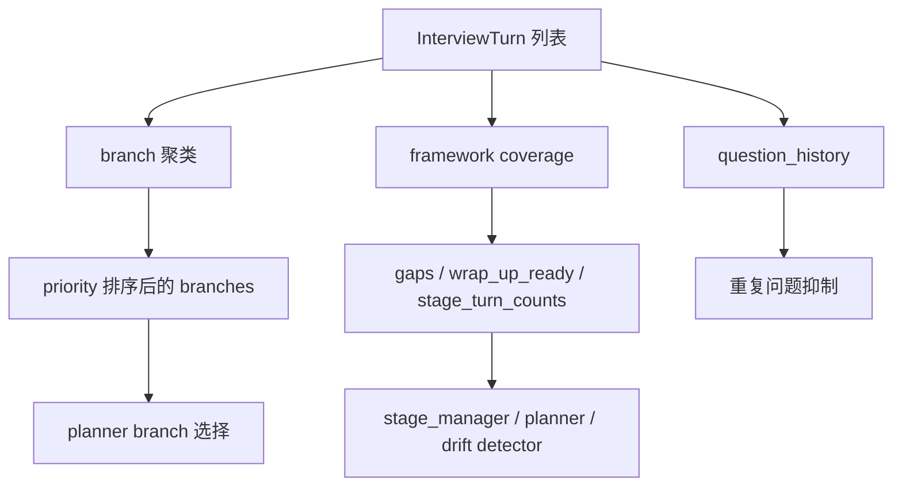

# `coverage_service.py` 逐函数拆解

本文专门拆 [`app/services/coverage_service.py`](../app/services/coverage_service.py)。

这个文件是整个编排系统的“长期记忆整理器”。  
如果说 `question_planner.py` 是决策层，那么 `coverage_service.py` 就是它赖以决策的结构化记忆层。

它负责三件核心事情：
- 把历史 turn 重建成 branch/topic 结构
- 把历史 turn 重建成 rubric/framework coverage
- 产出阶段 gaps 和 drift 判断所需的数据

---

## 1. 文件的实际职责，不是“统计工具”，而是 interview memory compiler

它会把分散的 turn 数据压缩成：



所以这个文件不是边缘工具，而是 planner / stage controller / context retrieval 的共同上游。

---

## 2. 顶部常量：这部分决定了覆盖判定到底“看见什么”

源码位置：
- [`coverage_service.py:9-127`](../app/services/coverage_service.py#L9)

### 2.1 `STOPWORDS`

源码位置：
- [`coverage_service.py:9-61`](../app/services/coverage_service.py#L9)

它用于 `extract_keywords()`，把问题和答案里的高频无意义词过滤掉。

### 设计特点

- 这里不是通用英文 stopwords，而是加了很多 interview/domain 词：
  - `project`
  - `system`
  - `service`
  - `module`
  - `architecture`
  - `question`
  - `answer`

### 为什么重要

如果不把这些词干掉，branch 关键词会退化成：
- service
- module
- project

最后所有 branch 都变得很像，聚类质量会很差。

---

### 2.2 `UNRESOLVED_MARKERS`

源码位置：
- [`coverage_service.py:63-74`](../app/services/coverage_service.py#L63)

```python
UNRESOLVED_MARKERS = (
    "unclear",
    "unknown",
    "unresolved",
    ...
)
```

它用于从 answer summary 里挖出“这题其实还没完全说清”的句子。

后面 `extract_unresolved_points()` 会用它来决定 branch 是：
- `needs_follow_up`
- `partial`
- `covered`

### 风险

这个列表偏启发式。

如果你的 answer 风格不常写：
- unclear
- missing
- needs follow-up

那 `unresolved_points` 就会偏弱，branch priority 也会失真。

---

### 2.3 各类关键词字典：它们就是 framework coverage 的打分器

源码位置：
- [`coverage_service.py:84-115`](../app/services/coverage_service.py#L84)

包括：
- `PANORAMA_KEYWORDS`
- `ARCHITECTURE_KEYWORDS`
- `USE_CASE_KEYWORDS`
- `COLLABORATION_MARKERS`

### 理解重点

这些字典不是“随便写的关键词”。

它们把高层 rubric 变成了可执行的文本判定规则：

- Panorama 关心：
  - purpose
  - target_users
  - boundaries
  - modules
  - workflow
  - relationships

- Architecture 关心：
  - style / organization
  - responsibilities
  - collaboration
  - call chains
  - structure
  - rationale

- Use Cases 关心：
  - scenario
  - actors
  - I/O
  - boundary
  - extension

- Human Collaboration 关心：
  - judgment
  - correction
  - redirection
  - prioritization

### 修改建议

如果你发现某类 coverage 总是不被识别，不要先怪 stage_manager。

先看：
- 是否命中了这些关键词
- 是否这个项目的术语和当前关键词字典不匹配

---

## 3. `default_coverage_state()`：定义整套记忆数据的骨架

源码位置：
- [`coverage_service.py:130-138`](../app/services/coverage_service.py#L130)

```python
def default_coverage_state() -> dict[str, Any]:
    return {
        "version": 2,
        "branch_count": 0,
        "updated_through_turn_no": 0,
        "branches": [],
        "question_history": [],
        "framework": default_framework_coverage(),
    }
```

### 每个字段的意义

- `version`
  - coverage_state 的内部 schema 版本
- `branch_count`
  - 当前 branch 数量
- `updated_through_turn_no`
  - 这份 coverage 状态至少重建到了哪一轮
- `branches`
  - branch/topic 列表
- `question_history`
  - 最近问题的语义签名历史
- `framework`
  - rubric-aware 覆盖状态

### 为什么它重要

后面很多地方都假设这些字段必然存在。

如果你以后继续扩展 coverage state，第一步一定是先加这里。

---

## 4. `load_coverage_state()`：读取数据库 JSON 时的容错逻辑

源码位置：
- [`coverage_service.py:141-161`](../app/services/coverage_service.py#L141)

### 它做了什么

1. 取 `project.coverage_state`
2. `json.loads`
3. 如果解析失败，回退默认值
4. 补齐缺省字段
5. 调 `normalize_framework_coverage()` 统一旧字段

### 逐句理解

```python
raw_value = getattr(project, "coverage_state", None)
if not raw_value:
    return default_coverage_state()
```

- 没有数据时直接返回默认结构

```python
except json.JSONDecodeError:
    return default_coverage_state()
```

- 防止旧数据或损坏 JSON 把整个请求打爆

```python
parsed["framework"] = normalize_framework_coverage(...)
```

- 这是最关键的一行
- 说明数据库里的老 schema 不会直接传给 planner

### 修改切入点

如果你以后给 `framework` 增新字段，必须确保这里的 normalize 流程不会丢失老数据。

---

## 5. `save_coverage_state()`：为什么这里要 `sort_keys=True`

源码位置：
- [`coverage_service.py:164-165`](../app/services/coverage_service.py#L164)

```python
project.coverage_state = json.dumps(coverage_state, ensure_ascii=True, sort_keys=True)
```

### 参数解释

#### `ensure_ascii=True`
- 强制 JSON 用 ASCII 转义输出
- 对数据库兼容性更稳

#### `sort_keys=True`
- 让相同结构的 JSON 在序列化时 key 顺序稳定
- 对 diff、debug、日志排查非常有帮助

### 为什么这是工程上对的

如果不排序，同一份 coverage_state 每次重建出来字段顺序可能不同。
这会让你：
- debug 时难比对
- 审查数据库快照时更乱

---

## 6. `rebuild_coverage_state()`：整个文件最核心的重建函数

源码位置：
- [`coverage_service.py:168-255`](../app/services/coverage_service.py#L168)

这是最重要的函数。它把一串 turn 重建成：
- question_history
- branches
- framework

---

### 6.1 question_history 的构建

源码位置：
- [`coverage_service.py:172-183`](../app/services/coverage_service.py#L172)

```python
question_history.append(
    build_question_history_entry(
        turn_no=turn.turn_no,
        stage=turn.stage,
        question_text=turn.question_text,
        intent=(turn.question_plan or {}).get("question_intent"),
        branch_id=(turn.question_plan or {}).get("target_branch_id"),
        target_type=(turn.question_plan or {}).get("target_type"),
        target_label=(turn.question_plan or {}).get("target_label"),
    )
)
```

### 为什么这里不是只存 question_text

因为重复问题抑制不再只看表层文本，而是看问题语义签名：
- stage
- intent
- branch_id
- target_type
- target_label

这为：
- planner 去重
- validator 去重
- retrieval novelty penalty

提供了更强的结构化基础。

---

### 6.2 为什么没 answer 的 turn 不进 branch 构建

源码位置：
- [`coverage_service.py:184-185`](../app/services/coverage_service.py#L184)

```python
if not turn.answer_text:
    continue
```

### 原因

branch 是“已回答内容所形成的主题簇”，不是“所有提问的集合”。

未回答 turn：
- 不能证明任何 coverage
- 也不能可靠产出 summary / unresolved points

所以只适合进 `question_history`，不适合进 `branches`

---

### 6.3 keyword / unresolved / label / branch_id 的生成顺序

源码位置：
- [`coverage_service.py:187-198`](../app/services/coverage_service.py#L187)

这几行决定了一个 answered turn 最终如何被抽象成 branch 候选。

#### `summary = turn.answer_summary or turn.answer_text`
- 优先用 compact summary
- 没有 summary 才退回全文

#### `candidate_keywords = extract_keywords(...)`
- 关键词从 question、summary、full answer 混合提取
- 这样能兼顾：
  - 问题目标
  - 回答细节
  - 摘要压缩结果

#### `unresolved_points = extract_unresolved_points(summary)`
- unresolved 只从 summary 里抽
- 这是合理的，因为 summary 更像“答案中哪些点仍值得跟进”的抽象层

#### `label = build_branch_label(...)`
- branch 对人展示的名字，优先取问题文本本身

#### `branch_id = build_branch_id(...)`
- branch 的机器标识，更多来自关键词

---

### 6.4 branch 合并规则：不是 embedding 聚类，而是关键词交并比

源码位置：
- [`coverage_service.py:200-238`](../app/services/coverage_service.py#L200)

### 新 branch

当 `find_matching_branch()` 没找到匹配时，会创建一个新 branch：

- `status`
  - 有 unresolved -> `needs_follow_up`
  - 否则 -> `partial`
- `priority`
  - 先给 0，后面统一重算

### 命中已有 branch

会合并：
- `keywords`
- `evidence_turn_ids`
- `evidence_turn_nos`
- `summary`
- `unresolved_points`
- `last_turn_no`

然后重新定状态：
- 有 unresolved -> `needs_follow_up`
- 否则 evidence >= 2 -> `covered`
- 否则 `partial`

### 为什么这套规则有效

因为它把“同一主题被多轮触及”编码成了：
- evidence 增长
- status 变化
- priority 变化

这比简单的“最近一轮说了什么”强很多。

---

### 6.5 返回值里的 `question_history[-12:]`

源码位置：
- [`coverage_service.py:248-255`](../app/services/coverage_service.py#L248)

这里只保留最近 12 条。

### 为什么不是全量

`question_history` 的用途主要是近期 novelty 控制，而不是做长期归档。

保留太多会带来：
- planner 读起来更重
- 近期重复和远古重复被混在一起

这是一个典型的“短记忆用于去重，长记忆交给 branches/framework”的设计。

---

## 7. `default_framework_coverage()`：rubric 的程序化定义

源码位置：
- [`coverage_service.py:258-308`](../app/services/coverage_service.py#L258)

这是整个 interview rubric 的结构化合同。

### Panorama
- `purpose`
- `target_users`
- `boundaries`
- `major_modules`
- `high_level_workflow`
- `initial_module_relationships`

### Architecture
- `architecture_style_or_organization`
- `module_responsibilities`
- `collaboration_mechanisms`
- `key_call_chains`
- `system_structure`
- `design_rationale_or_quality_attributes`

### Code Detail
- `specific_files_count`
- `specific_classes_count`
- `specific_methods_count`
- `execution_paths_count`
- `library_usage_points_count`
- `error_handling_points_count`
- `protocol_implementation_points_count`
- `state_management_points_count`

### Use Cases
- `representative_scenarios_count`
- `actors_roles_count`
- `input_output_patterns_count`
- `boundary_conditions_count`
- `extension_points_count`

### Human Collaboration
- `human_judgment_turn_count`
- `human_correction_turn_count`
- `human_redirection_turn_count`
- `human_prioritization_turn_count`

### 这部分为什么值得你认真看

因为 stage_manager 不是凭空决定阶段，而是围绕这套 contract 在推进。

如果你想加入新的 rubric 指标，这里是第一落点。

---

## 8. `normalize_framework_coverage()`：兼容层，不只是“字段映射”

源码位置：
- [`coverage_service.py:311-393`](../app/services/coverage_service.py#L311)

### 它解决的问题

项目前几轮迭代里字段名发生过升级，例如：
- `architecture_style` -> `architecture_style_or_organization`
- `communication_mechanisms` -> `collaboration_mechanisms`
- `key_files_count` -> `specific_files_count`
- `scenario_count` -> `representative_scenarios_count`

如果没有这层 normalize：
- 旧数据库数据会直接让 planner/stage_manager 误判

### 关键设计

它不是简单覆盖，而是“新字段优先，旧字段兼容 fallback”：

```python
architecture["architecture_style_or_organization"] = incoming_architecture.get(
    "architecture_style_or_organization",
    incoming_architecture.get("architecture_style", ...)
)
```

这意味着：
- 新数据不会被旧别名覆盖
- 旧数据仍能被读懂

### 修改建议

以后如果你再升级 coverage schema：
1. 先加新字段到 `default_framework_coverage()`
2. 再在这里加向后兼容映射
3. 最后在 `add_legacy_framework_aliases()` 决定是否还要继续往外暴露老字段

---

## 9. `rebuild_framework_coverage()`：真正的 rubric 打分器

源码位置：
- [`coverage_service.py:396-492`](../app/services/coverage_service.py#L396)

这是 framework coverage 的重建主函数。

---

### 9.1 为什么它只看 answered turns

源码位置：
- [`coverage_service.py:405-407`](../app/services/coverage_service.py#L405)

```python
if not turn.answer_text:
    continue
```

理由和 branch 一样：
- 没回答就没有 coverage 证据

---

### 9.2 `stage_turn_counts` 的意义

源码位置：
- [`coverage_service.py:409`](../app/services/coverage_service.py#L409)

```python
stage_turn_counts[turn.stage] = stage_turn_counts.get(turn.stage, 0) + 1
```

这不是简单统计，而是 stage_manager 判断“某个阶段是否已经足够 dominant”的重要依据。

比如：
- Code Detail 是否已经占主体
- Use Cases 是否还完全没开始

---

### 9.3 Panorama / Architecture 的 coverage 判定：布尔命中

源码位置：
- [`coverage_service.py:417-423`](../app/services/coverage_service.py#L417)

它们是布尔型覆盖：
- 命中任意关键词 -> 记为 `True`

### 工程含义

这适合早期高层认知阶段，因为你主要关心“是否覆盖过”，而不是“覆盖了多少次”。

---

### 9.4 Code Detail 的 coverage 判定：计数型

源码位置：
- [`coverage_service.py:425-439`](../app/services/coverage_service.py#L425)

这段代码非常关键，因为它决定 Code Detail 是否真的“占据主体”。

#### `specific_files_count`
- `FILE_PATTERN.findall(answer_text)`

#### `specific_classes_count`
- `CLASS_PATTERN.findall(answer_text)`

#### `specific_methods_count`
- `METHOD_PATTERN.findall(answer_text)`

#### `execution_paths_count`
- 文本里是否出现：
  - `execution path`
  - `request path`
  - `call chain`
  - `->`

#### `library_usage_points_count`
- 通过 `LIBRARY_PATTERN` 统计命中的库名

#### `error_handling_points_count`
- 是否提到：
  - error
  - exception
  - retry
  - fallback
  - log

#### `protocol_implementation_points_count`
- 是否提到：
  - schema
  - payload
  - response model
  - request body
  - api / route

#### `state_management_points_count`
- 是否提到：
  - state
  - cache
  - session
  - checkpoint
  - thread_id
  - persistence

### 这一段的本质

它把“实现细节是否真的被谈到”变成了量化指标。

---

### 9.5 Use Cases 为什么只在 `Use Cases & Scenarios` 阶段计数

源码位置：
- [`coverage_service.py:441-443`](../app/services/coverage_service.py#L441)

```python
if turn.stage == "Use Cases & Scenarios" and any(keyword in text for keyword in keywords):
    use_cases[key] += 1
```

### 这是一个非常重要的修正

之前如果 code-detail 回答里出现：
- input
- output
- boundary
- scenario

就会把 use-case coverage 假刷满。

现在只有 turn 本身处在 Use Cases 阶段，才累计 use-case coverage。

### 这说明一个原则

coverage 不只是“文本里有没有这些词”，还要看“这轮访谈在 rubric 上属于哪个阶段”。

---

### 9.6 Human Collaboration 的两套来源

源码位置：
- [`coverage_service.py:445-458`](../app/services/coverage_service.py#L445)

当前 human collaboration 计数来自两部分：

#### 第一部分：文本 marker
- 如果答案文本里出现：
  - `I think`
  - `correct`
  - `redirect`
  - `prioritize`

也会加分

#### 第二部分：结构化 `human_review`
- `verdict`
- `direction`
- `preferred_next_focus`

### 为什么两套都保留

因为项目需要兼容：
- 真实前端结构化输入
- 历史 transcript 中已有的自然语言协作痕迹

### 哪一套更可靠

结构化 `human_review` 更可靠。

如果你以后要继续提升精准度，建议逐渐减少对文本 marker 的依赖。

---

### 9.7 `gaps` 和 `wrap_up_ready`

源码位置：
- [`coverage_service.py:460-492`](../app/services/coverage_service.py#L460)

#### `gaps`
- Panorama / Architecture 看 `False`
- Code Detail / Use Cases / Human Collaboration 看 `count <= 0`

#### `wrap_up_ready`

当前规则要求：
- Panorama gap 剩余 <= 1
- Architecture gap 剩余 <= 1
- Code Detail 至少有：
  - 2 个文件
  - 2 个方法
- Use Cases 至少有：
  - 1 个代表场景
  - 1 组 I/O
  - 1 个 boundary

### 它的作用

wrap_up_ready 不是直接结束，而是给 stage_manager 一个“可以收尾”的信号。

---

## 10. `add_legacy_framework_aliases()`：为什么还要反向加旧字段

源码位置：
- [`coverage_service.py:495-514`](../app/services/coverage_service.py#L495)

这一步和 normalize 是反方向的：

- normalize：把旧字段读成新字段
- alias：把新字段再映射回旧字段名

### 为什么还要这样做

因为项目里可能还有旧前端、旧 debug 输出、旧测试在读这些字段。

这是一个现实主义兼容层，不是理想主义设计。

### 什么时候可以删

只有当你确认：
- 所有读取方都已经切到新字段

否则删掉会造成一串隐式 breakage。

---

## 11. branch helper 组：这些函数决定 branch 长什么样

### 11.1 `build_branch_label()`

源码位置：
- [`coverage_service.py:517-523`](../app/services/coverage_service.py#L517)

它优先取 question 文本去掉 `Qn:` 前缀后的内容作为 label。

这比只拼关键词更像人能看懂的 branch 名。

---

### 11.2 `build_branch_id()`

源码位置：
- [`coverage_service.py:525-529`](../app/services/coverage_service.py#L525)

它把前几个关键词做 slug。

### 风险

如果两个不同 branch 前几个关键词很像，就可能撞得比较近。

如果以后你想增强 branch 稳定性，可以把：
- turn.stage
- target_type
- first evidence turn_no

也拼进 branch_id。

---

### 11.3 `extract_keywords()`

源码位置：
- [`coverage_service.py:531-547`](../app/services/coverage_service.py#L531)

流程是：
1. 正则提 token
2. 去 stopwords / 数字
3. 统计频次
4. 按频次和字典序排序
5. 取前 8 个

### 这一点你要特别注意

这里是“极轻量关键词抽取”，不是 NLP。

优点：
- 快
- 易懂
- 稳定

缺点：
- 不懂同义词
- 不懂实体边界
- 对复合概念支持弱

---

### 11.4 `extract_unresolved_points()`

源码位置：
- [`coverage_service.py:549-556`](../app/services/coverage_service.py#L549)

它按句子切 summary，再筛含 unresolved marker 的句子。

这让 unresolved points 看起来更像真实 follow-up 清单，而不是零碎 token。

---

### 11.5 `find_matching_branch()`

源码位置：
- [`coverage_service.py:559-576`](../app/services/coverage_service.py#L559)

它不是 embedding 聚类，而是：
- overlap >= 2
- 取最高 Jaccard 风格分数

### 工程评价

这套规则足够轻，但不算强语义聚类。

如果后续你要升级 branch 聚类质量，这里是最自然的替换点。

---

### 11.6 `compute_branch_priority()`

源码位置：
- [`coverage_service.py:579-587`](../app/services/coverage_service.py#L579)

分数组成：
- 基础分 `0.4`
- `needs_follow_up` + `0.35`
- `partial` + `0.2`
- unresolved 存在 + `0.15`
- 关键词越多，加一点

### 这说明什么

branch priority 本质上偏向：
- 还没讲清楚
- 已经有一定证据
- 主题比较成型

而不是偏向“最新”

---

## 12. `framework_gaps_for_stage()`：stage controller / planner 的标准缺口接口

源码位置：
- [`coverage_service.py:597-645`](../app/services/coverage_service.py#L597)

它做两件事：

1. 如果 `framework["gaps"]` 已经存在，就直接用
2. 如果没有，就现场按当前 coverage 重新推导

然后再做一次 gap alias 归一化：
- `architecture_style` -> `architecture_style_or_organization`
- `scenario_count` -> `representative_scenarios_count`
- 等等

### 为什么很关键

这个函数是：
- planner
- stage_manager
- debug

读取阶段 gap 的统一入口。

如果你要改“某个阶段到底算不算还缺东西”，这里是必须确认的地方。

---

## 13. `detect_topic_drift()`：当前的 drift detector 到底在看什么

源码位置：
- [`coverage_service.py:648-689`](../app/services/coverage_service.py#L648)

### 当前策略

#### Panorama 阶段
- 如果 Panorama 还有 gap
- 且当前 top branch 同时命中多个窄话题 marker
- 判为 drift

#### Architecture 阶段
- 如果 Architecture 还有 gap
- 且当前 top branch 同时命中多个窄话题 marker
- 判为 drift

#### Architecture / Code Detail 阶段
- 如果 branch 文本里出现：
  - `should change`
  - `redesign`
  - `refactor`
  - `modify`
  - `update tests`
- 判为 drift into change-planning

### 你应该怎么理解它

它不是在判断“这个问题好不好”，而是在判断：
- 当前最强 branch 是否已经偏离 rubric 主线

### 当前局限

它只看 `branches[0]`，也就是 top branch。

如果第二强 branch 才是真正健康的主线，而 top branch 是坏分支，这个 drift 其实是有点粗糙的。

### 升级切入点

未来可以改成：
- 看 top-k branches
- 综合 framework gaps 和 novelty penalty
- 不只看关键词，也看 `question_history`

---

## 14. 这个文件最值得你动手改的地方

### 场景 A：Use Case 总被误判“已完成”

先看：
1. `rebuild_framework_coverage()` 里 Use Case 计数是否只在 Use Case 阶段发生
2. `USE_CASE_KEYWORDS` 是否过宽

### 场景 B：branch 老是聚错

先改：
1. `extract_keywords()`
2. `find_matching_branch()`
3. `build_branch_id()`

### 场景 C：Code Detail 计数不够稳定

先改：
1. `FILE_PATTERN`
2. `CLASS_PATTERN`
3. `METHOD_PATTERN`
4. `protocol/state/error` marker 集合

### 场景 D：human collaboration 统计看起来很假

优先收紧：
1. `COLLABORATION_MARKERS`
2. `rebuild_framework_coverage()` 中对 `human_review` 的优先权

---

## 15. 可以怎样进一步升级这个文件

### 升级方向 1：把启发式统计拆成“抽取器 + 聚合器”

现在所有逻辑写在一个文件里，易读，但会越来越长。

可以拆成：
- `coverage_extractors.py`
- `branch_builder.py`
- `framework_coverage.py`

### 升级方向 2：为 branch 增加结构化 `covered_dimensions`

现在 branch 更像：
- 主题 + 摘要 + unresolved

未来可以变成：
- 这个 branch 已经覆盖了 file / class / method / path / error

这样 planner 会更聪明。

### 升级方向 3：embedding 只用于 branch merge，不碰主流程

当前 branch merge 还是关键词式。

如果你后面想试 embedding，不建议一上来替换整个 planner，只建议先替换：
- `find_matching_branch()`

这样风险最小。

---

## 16. 一句话总结

`coverage_service.py` 不是“做点统计”的工具文件，而是把杂乱访谈历史重编译成 planner 可用长期记忆的核心文件。  
你后续凡是想改阶段推进、问题去重、drift 控制、use-case 完成度，最后大概率都会改回这里。
