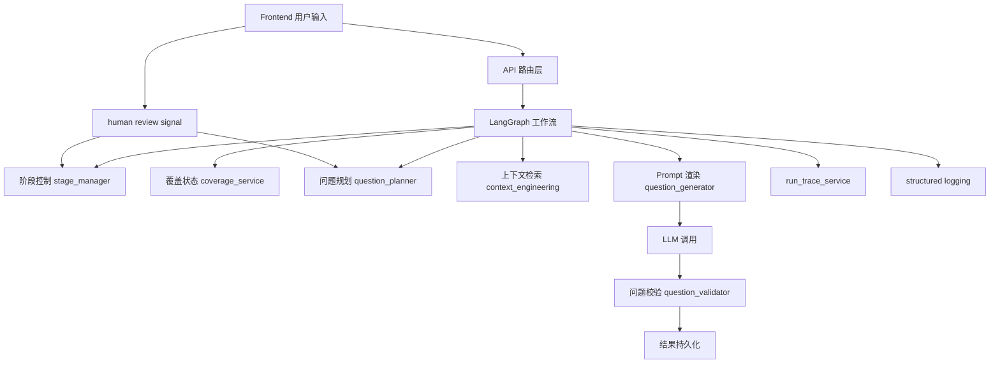

# Harness Engineering 学习总览

这组文档不是单纯讲“这个仓库有哪些文件”，而是把它当成一个可以学习 **AI Agent 工程化** 的完整案例。

这里的核心目标是帮助你理解：

1. 什么是 Harness Engineering  
2. 为什么一个 AI Agent 不能只靠 prompt  
3. 怎样把一个“会回答”的模型，搭建成“可控、可调试、可扩展、可交付”的系统  
4. 这些设计中哪些是这个项目特有的，哪些是今后做主流 AI Agent 都能迁移复用的

---

## 1. 什么是 Harness Engineering

在这个项目里，**Harness** 可以理解为“把模型约束在一个可靠执行框架里的整套工程外壳”。

它通常包含：

- 输入输出契约
- 状态管理
- 阶段控制
- 任务规划
- 上下文选择
- 质量校验
- 人机协作接口
- 运行追踪
- 日志与调试能力

如果没有这些层，一个应用就很容易退化成：

- 用户输入一段话
- 模型自由生成一段话
- 开发者只能靠改 prompt 硬调

而 Harness Engineering 的目标是把它变成：

- 有状态
- 有阶段
- 有规划
- 有质量闸门
- 有人类干预点
- 有调试证据
- 有可持续迭代空间

---

## 2. 为什么这个仓库适合学习 Harness Engineering

这个项目不是最简单的聊天机器人，也不是纯工具调用 demo，而是一个比较完整的 agent 应用：

- 后端有：
  - FastAPI
  - SQLAlchemy + SQLite
  - LangGraph
  - structured prompt assets
  - coverage state
  - planner / validator / stage controller
  - run trace
  - structured logging
- 前端有：
  - project/session 管理
  - transcript
  - human review 输入
  - execution trace
  - run polling

因此它天然覆盖了 Agent 工程里的几类关键问题：

- 如何让多轮交互有记忆
- 如何控制模型不要乱跑
- 如何让下一步决策不是“看上一句就继续接”
- 如何给用户真实的控制权
- 如何把执行过程展示出来
- 如何把模型输出纳入可验证的工作流

---

## 3. 这个项目里的 Harness 分层图

这个图说明：

- 模型并不是系统中心
- 模型只是 Harness 里的一个组件
- 真正决定质量上限的是：
  - 前后端契约
  - 状态结构
  - 规划逻辑
  - 校验逻辑
  - 可观察性

---

## 4. 你应该按什么顺序学习

### 第一阶段：先建立“Agent 工程”整体观

按这个顺序：

1. [05_Harness_Engineering_后端骨架与主链路.md](05_Harness_Engineering_后端骨架与主链路.md)
2. [06_Harness_Engineering_状态_规划_校验三件套.md](06_Harness_Engineering_状态_规划_校验三件套.md)
3. [07_Harness_Engineering_人机协作与前端闭环.md](07_Harness_Engineering_人机协作与前端闭环.md)
4. [08_Harness_Engineering_可观测性_运行轨迹_调试方法.md](08_Harness_Engineering_可观测性_运行轨迹_调试方法.md)
5. [09_Harness_Engineering_从本项目迁移到通用AI_Agent.md](09_Harness_Engineering_从本项目迁移到通用AI_Agent.md)

### 第二阶段：再回去看单文件细节

和这几篇配合看：

- [01_question_planner_py_逐函数拆解.md](01_question_planner_py_逐函数拆解.md)
- [02_coverage_service_py_逐函数拆解.md](02_coverage_service_py_逐函数拆解.md)
- [03_run_trace_service_py_逐函数拆解.md](03_run_trace_service_py_逐函数拆解.md)

这样你就不会掉进“只看函数，不知道它为什么存在”的局部视角。

---

## 5. 学这组文档时要带着的 5 个核心问题

### 问题 1：模型的自由度被限制在什么地方

对应本项目：

- prompt assets
- planner
- validator
- stage controller

### 问题 2：系统记住了什么，忘记了什么

对应本项目：

- coverage_state
- branches
- question_history
- turn summary

### 问题 3：下一步不是随机生成，而是如何被“规划”出来的

对应本项目：

- `question_planner.py`
- `context_engineering.py`
- `stage_manager.py`

### 问题 4：用户的判断如何真的进入系统，而不是只停留在 UI

对应本项目：

- `AnswerComposer.tsx`
- `human_review`
- planner 的 `human_guided_redirect`

### 问题 5：当系统出错时，怎么知道错在哪

对应本项目：

- run trace
- JSONL logging
- debug endpoints

---

## 6. 这个项目里哪些设计最具有通用性和迁移性

最值得迁移到别的 AI Agent 项目的结构：

1. **Prompt 资产化**
- prompt 从代码抽离成 YAML
- 适合任何 LLM 应用

2. **Planner + Validator 双层控制**
- 先规划，再生成，再校验
- 适合问答 agent、工作流 agent、code agent、research agent

3. **Coverage State / Working Memory**
- 用结构化状态来表示“已经知道什么、还缺什么”
- 适合任何多轮对话 agent

4. **Run Trace**
- 每次执行都是一个 run，每步有 step
- 适合任何需要展示 agent 执行过程的产品

5. **Human Review Signal**
- 把人类判断做成显式结构化输入
- 适合所有 human-in-the-loop agent

6. **Best-effort Observability**
- logging 和 trace 不应该反向打断主流程
- 这是非常通用的工程原则

---

## 7. 哪些部分更偏这个项目自身，不一定直接通用

1. Interview 四阶段 rubric
- Panorama / Architecture / Code Detail / Use Cases
- 这是当前产品域特有的

2. `问题.md` 参考结构
- 这是这个项目的经验来源
- 不能直接搬去别的领域

3. code-detail 计数方式
- 当前非常偏代码理解场景
- 不适合纯任务代理或纯办公代理直接照搬

---

## 8. 如果你是 AI 初学者，最容易踩的误区

### 误区 1：以为 prompt 就是一切

这个项目最值得学习的一点恰恰是：
- 质量提升的大头不来自 prompt 微调
- 而来自外层编排

### 误区 2：以为有了 LangGraph 就自动有好 agent

LangGraph 只是图框架，不会自动帮你解决：
- drift
- 重复问题
- 阶段控制
- 人机协作

### 误区 3：以为加日志就是可观测性

日志只能帮助排查问题。

真正给用户看的执行体验，还需要：
- run trace
- step model
- current step
- duration

### 误区 4：以为 human-in-the-loop 就是在 UI 上加个输入框

如果用户输入没有进入：
- planner
- stage manager
- persisted transcript

那就不算真正的人机协作。

---

## 9. 建议你接下来怎么学

如果你是第一次系统学习 AI Agent 工程，建议这样做：

1. 先读本组文档 21-25，建立总体工程观
2. 再读 08/09/10，看单文件实现
3. 然后实际在代码里做 3 次小改动：
   - 改一个 stage gate
   - 改一个 planner 约束
   - 改一个 run trace step label
4. 再跑项目，观察前后端行为变化

这样你学到的不是“看懂代码”，而是“能控制 agent 行为”。

---

## 10. 一句话总结

这组 Harness Engineering 文档要教你的，不只是这个仓库怎么写，而是：

**怎样把一个 LLM 应用搭成一个可控、可观测、可协作、可持续演进的 AI Agent 系统。**
