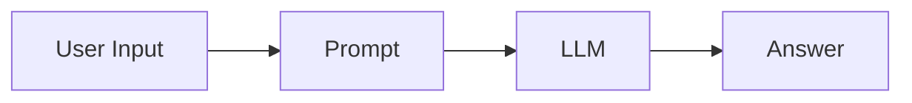
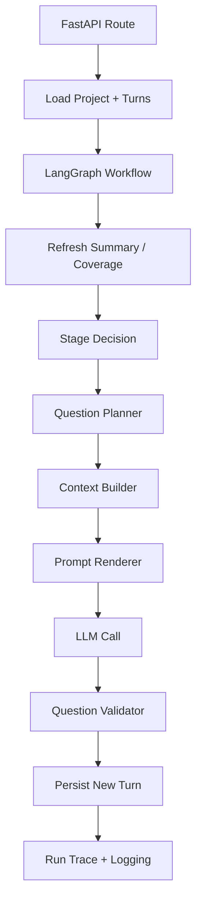
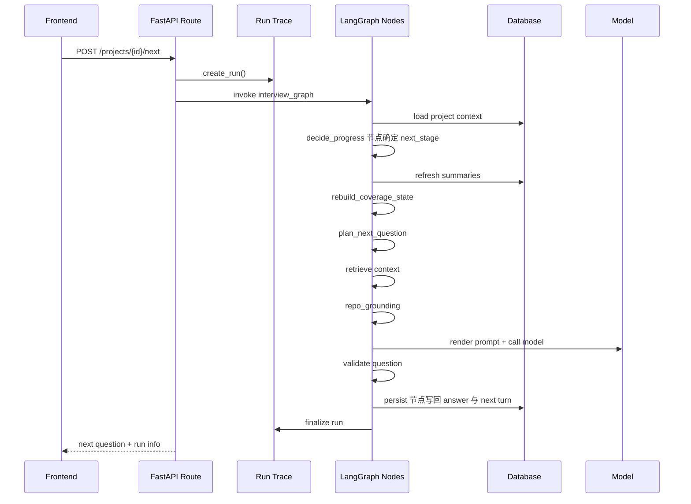
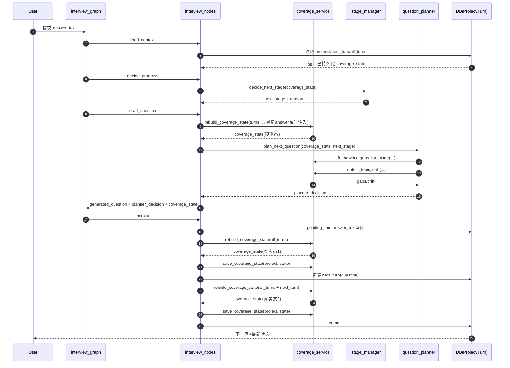

# Harness Engineering：后端骨架与主链路

本文用这个项目来讲一个 AI Agent 后端是怎么被“搭起来”的。

重点不是逐文件扫一遍，而是让你理解：

- 为什么后端要分这些层
- 一次 agent run 实际怎样流动
- 哪一层负责“调模型”，哪一层负责“控制模型”

---

## 1. 先建立最重要的认识：LLM 不是后端架构中心

很多初学者会把后端理解成：



这个项目真正的后端主链路更接近：



这里真正决定系统质量的，是 C 到 J 之间的这些工程层。

---

## 2. 后端骨架的 6 个核心层

### 2.1 API 接入层

关键代码：

- [`app/main.py`](../app/main.py)
- [`app/api/routes/projects.py`](../app/api/routes/projects.py)

负责：

- 接请求
- 组织数据库 session
- 返回 schema 化结果
- 衔接 run trace / logging

这层不应该决定“下一题问什么”，只负责把请求送进正确工作流。

---

### 2.2 持久化层

关键代码：

- [`app/models/project.py`](../app/models/project.py)
- [`app/models/turn.py`](../app/models/turn.py)
- [`app/models/agent_run.py`](../app/models/agent_run.py)
- [`app/models/agent_run_step.py`](../app/models/agent_run_step.py)

负责：

- 项目状态
- turn 历史
- question plan
- human review
- run trace

对 AI Agent 来说，数据库不是“附属品”，而是长期记忆的底盘。

---

### 2.3 工作流调度层

关键代码：

- [`app/graphs/interview_graph.py`](../app/graphs/interview_graph.py)
- [`app/graphs/interview_nodes.py`](../app/graphs/interview_nodes.py)

负责：

- 定义一次 `/next` run 的执行顺序
- 串联各个 service
- 维持 workflow state

LangGraph 的价值在这里是：

- 明确节点顺序
- 明确节点输入输出
- 让“执行步骤”成为显式结构

---

### 2.4 编排决策层

关键代码：

- [`app/services/stage_manager.py`](../app/services/stage_manager.py)
- [`app/services/question_planner.py`](../app/services/question_planner.py)
- [`app/services/question_validator.py`](../app/services/question_validator.py)

这是 Harness 的大脑层。

负责：

- 当前阶段是什么
- 当前最该补哪个 gap
- 这题应该问什么 target
- 这题是否合格

---

### 2.5 记忆与上下文层

关键代码：

- [`app/services/coverage_service.py`](../app/services/coverage_service.py)
- [`app/services/context_engineering.py`](../app/services/context_engineering.py)
- [`app/services/repetition_guard.py`](../app/services/repetition_guard.py)

负责：

- 把 turn 历史压缩成可计算的记忆
- 选哪些历史证据进入 prompt
- 避免重复提问

这层是 Agent 工程里最容易被低估的部分。

---

### 2.6 模型调用层

关键代码：

- [`app/prompts/manager.py`](../app/prompts/manager.py)
- [`app/services/question_generator.py`](../app/services/question_generator.py)
- [`app/services/summarization_service.py`](../app/services/summarization_service.py)

负责：

- 选 prompt 资产
- 渲染变量
- 调模型
- 清洗输出

这层才真正接触 LLM，但它不是全部系统。

---

## 3. 一次 `/projects/{id}/next` 的完整后端流转

建议结合：

- [`app/api/routes/projects.py`](../app/api/routes/projects.py)
- [`app/graphs/interview_nodes.py`](../app/graphs/interview_nodes.py)

理解这条主线：



---

## 4. 为什么主链路必须拆成多个节点，而不是一个大函数

初学者常见写法：

- 一个 `generate_next_question()` 巨大函数
- 里面做：
  - 读历史
  - 拼 prompt
  - 调模型
  - 保存结果

这样短期快，但长期会出 4 个问题：

1. 你很难知道卡在哪一步
2. 你很难替换某一步策略
3. 你很难做运行 trace
4. 你很难做失败恢复和局部 debug

这个项目把链路拆开后，就可以：

- 每步单独 trace
- 每步单独落日志
- 每步单独调试
- 每步单独换策略

这就是 Harness Engineering 的典型思路。

---

## 5. 为什么要把“阶段控制、规划、校验”放在 LLM 前后

最容易理解的一种分层方式是：

### LLM 之前

- stage_manager
- question_planner
- context_engineering

作用：限制问题空间，决定“允许问什么”

### LLM 之后

- question_validator
- repetition_guard

作用：检查生成结果是否偏离要求

这形成了一个典型的 Agent harness 模式：

```text
先约束 -> 再生成 -> 再验收
```

这比“直接让模型自由生成然后希望它听话”稳定得多。

---

## 6. 这个后端骨架哪些部分是通用 AI Agent 都可以复用的

### 高通用性

1. API 路由只做 orchestration entry
2. 工作流节点拆分
3. planner + validator 双层控制
4. structured state / coverage memory
5. run trace + structured logging

### 中等通用性

1. prompt asset YAML
2. branch-based retrieval
3. human review signal

### 低通用性

1. Code Understand 四阶段 rubric
2. code-detail 计数项
3. use-case scenario contract 的具体字段

---

## 7. 如果你自己从零搭一个主流 AI Agent，最小后端骨架应该怎么借鉴

建议先搭这 7 层最小结构：

1. `routes/`

- 只负责进出请求

2. `models/`

- 用户任务、步骤、运行记录

3. `workflow/`

- agent 执行步骤图

4. `planner/`

- 决定下一步做什么

5. `memory/`

- 记录已经知道什么、还缺什么

6. `llm/`

- prompt + model calls

7. `observability/`

- logs + traces

这正是这个仓库已经做出来的骨架。

---

## 8. 学习和改造的建议顺序

### 如果你想先理解

按这个顺序看代码：

1. [`app/api/routes/projects.py`](../app/api/routes/projects.py)
2. [`app/graphs/interview_graph.py`](../app/graphs/interview_graph.py)
3. [`app/graphs/interview_nodes.py`](../app/graphs/interview_nodes.py)
4. [`app/services/question_planner.py`](../app/services/question_planner.py)
5. [`app/services/question_validator.py`](../app/services/question_validator.py)
6. [`app/services/run_trace_service.py`](../app/services/run_trace_service.py)

### 如果你想先动手改

建议从这三个点入手：

1. 改一个 stage gate
2. 改一个 planner 目标选择
3. 给某个 step 增加 run trace meta

这样你能同时理解：

- 控制层
- 工作流层
- 可观测性层

---

## 9. 一句话总结

这个项目的后端最值得学习的不是“怎么调 OpenAI API”，而是：

**怎么把一个本来很自由的 LLM 调用，装进一个分层清晰、阶段可控、运行可见的 Agent harness 里。**

---

## 附录：一次真实 Turn 的全链路回放（已并入原 demo 内容）

这一节用于回答一个实操问题：
“当用户提交当前 turn 的 answer 后，系统怎样一步步生成下一问并持久化？”

### A. 一次真实 turn 的固定节点顺序

1. load_context
2. decide_progress
3. draft_question
4. persist

可对照：

1. [app/graphs/interview_graph.py](../app/graphs/interview_graph.py)

### B. 时序图（建议边看边对照 interview_nodes）



### C. 需要重点盯住的 coverage 三次重建

1. 预测重建（draft 阶段）
2. 真实重建（answer 落库后）
3. 同步重建（next_turn 创建后）

这三次重建的工程意义：

1. 先让 planner 拿到最新上下文（预测态）
2. 再保证数据库状态与已回答事实一致（真实态）
3. 最后把下一轮问题也纳入状态起点（同步态）

### D. 单次 turn 的状态变化总表

| 阶段            | 输入                    | 关键函数                                     | 关键变化                               | 输出用途                |
| --------------- | ----------------------- | -------------------------------------------- | -------------------------------------- | ----------------------- |
| load_context    | project + turns         | load_project_context                         | 读取已保存 coverage_state              | 作为本次执行基线        |
| decide_progress | 基线 coverage           | decide_next_stage                            | 根据 gaps 决定 next_stage              | 约束下一问阶段          |
| draft_question  | turns + latest answer   | rebuild_coverage_state                       | 更新 branches/framework/gaps/drift输入 | 提供 planner 的事实基础 |
| planner         | coverage + human_review | plan_next_question                           | 产出 question_intent/target/gap        | 驱动 prompt 生成        |
| persist(1)      | pending turn answer     | rebuild_coverage_state + save_coverage_state | 真实状态落库                           | 数据一致性              |
| persist(2)      | 新建 next_turn          | rebuild_coverage_state + save_coverage_state | 同步到下一轮起点                       | 下次请求快速启动        |

### E. coverage_service 字段演化看法

可对照：

1. [app/services/coverage_service.py](../app/services/coverage_service.py)

在一次 turn 内，最值得观察的字段是：

1. question_history：最近提问轨迹和 target 信息
2. branches：主题聚类与优先级
3. framework.gaps：当前阶段缺口
4. wrap_up_ready：是否进入收尾条件

### F. planner 如何消费 coverage_state

可对照：

1. [app/services/question_planner.py](../app/services/question_planner.py)

关键消费输入：

1. framework_gaps_for_stage：本阶段最缺什么
2. detect_topic_drift：是否跑偏
3. branches：应该深挖哪条分支
4. human_review_signal：人工纠偏是否覆盖机器默认策略

### G. 实操观测建议

可通过调试路由观察：

1. coverage 快照：[app/api/routes/debug.py](../app/api/routes/debug.py)
2. 下一问上下文预演：[app/api/routes/debug.py](../app/api/routes/debug.py)

建议对照步骤：

1. 记录调用前 coverage 快照
2. 用同一 answer 做 next-context 预演
3. 提交真实 answer 后再读一次 coverage
4. 对比 branch_count、gaps、wrap_up_ready、top_branch
