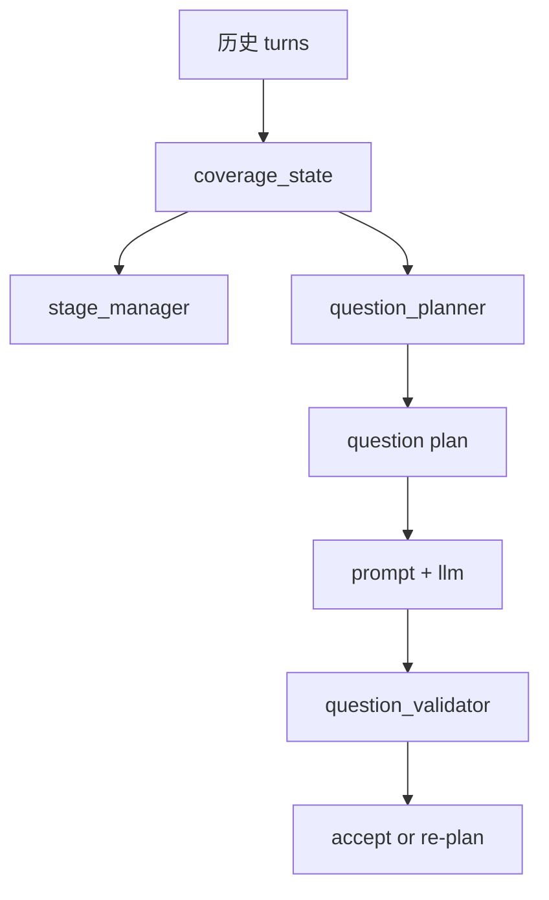

# Harness Engineering：状态、规划、校验三件套

如果只让我挑这个项目里最值得 AI 初学者学习的一组思想，我会选这三件套：

1. 状态 `State`
2. 规划 `Planner`
3. 校验 `Validator`

这是一个非常通用的 Agent 工程模式。

---

## 1. 为什么这三件套比 prompt 更重要

初学者常见想法是：
- “问题质量不够，就改 prompt”

但在工程里，更常见的真实原因是：
- 状态不对
- 规划不对
- 校验不严

这个项目正好是一个典型例子。

如果没有这三层，系统会出现：
- 早期就钻局部细节
- 后期重复问差不多的问题
- 从理解当前代码滑到“建议怎么改代码”

这些问题单靠 prompt 很难稳定解决。

---

## 2. 状态层：系统怎样知道“已经知道了什么”

关键代码：
- [`app/services/coverage_service.py`](../app/services/coverage_service.py)

这个项目的状态层不是简单保存聊天记录，而是把历史 turn 重建成 3 种结构：

### 2.1 branch memory
- 哪些主题分支被聊过
- 哪些分支还有 unresolved points

### 2.2 framework coverage
- Panorama 覆盖了什么
- Architecture 还缺什么
- Code Detail 有多少具体实现证据
- Use Cases 是否真正完整

### 2.3 question history
- 最近已经问过哪些问题
- 这些问题的 target / signature 是什么

### 为什么这是 Harness 思想

因为系统不再只靠“原始对话历史”，而是自己维护一个**面向决策的工作记忆**。

这在主流 AI Agent 里非常常见，例如：
- task progress state
- tool result cache
- planner memory
- scratchpad summary

---

## 3. 规划层：系统怎样知道“下一步该做什么”

关键代码：
- [`app/services/question_planner.py`](../app/services/question_planner.py)

planner 的核心任务不是生成英文问题，而是先做结构化决定：

- 现在在哪个阶段
- 该补哪个 framework gap
- 问哪个 branch / target
- 是否要响应 human review
- 是否要 repair drift
- 这题必须满足哪些约束

这跟很多主流 agent 的 planner 是同一思路：

- research agent 决定下一篇要读哪篇论文
- code agent 决定下一步查哪个文件或跑哪个命令
- workflow agent 决定下一步调用哪个工具

### 这个项目里 planner 最值得学的点

它不是只跟着 latest answer 走，而是同时平衡：

- current stage
- framework gaps
- branch priority
- repetition guard
- human review signal

这就是从“局部连贯”升级成“全局组织”的关键。

---

## 4. 校验层：为什么要在 LLM 后再加一道闸门

关键代码：
- [`app/services/question_validator.py`](../app/services/question_validator.py)

很多 AI 初学者会漏掉这一层。

他们会觉得：
- planner 已经选好了
- prompt 也写好了
- 模型照理应该生成对的结果

但真实情况是：
- 模型仍可能跑偏
- 仍可能生成太宽泛的问题
- 仍可能滑向“怎么改代码”

所以这个项目在生成后还做校验，检查：

- 是否符合当前阶段
- 是否仍然在 `understand_current_code`
- Code Detail 是否够具体
- 是否和最近问题语义重复

### 这就是典型的 harness 骨架

```text
State -> Plan -> Generate -> Validate
```

而不是：

```text
History -> Prompt -> Hope for the best
```

---

## 5. 这三件套是怎么配合工作的



### 核心思想

- 状态层提供事实
- 规划层做决策
- 校验层做兜底

三层相互独立，所以后续可以单独升级某一层，而不会把整个系统推倒重来。

---

## 6. 为什么这个模式具有极强迁移性

你以后做别的 agent，完全可以把这三件套换个领域重用：

### 做代码修复 agent

- State：已读文件、失败测试、定位结果
- Planner：下一步查哪个文件/跑哪个命令
- Validator：补丁是否符合约束、是否过度修改

### 做研究 agent

- State：已读资料、已抽取结论、未覆盖问题
- Planner：下一篇读什么、下一步总结什么
- Validator：回答是否覆盖问题、是否引证充分

### 做工作流自动化 agent

- State：已完成步骤、工具结果、待确认事项
- Planner：下一步调用哪个工具
- Validator：输出是否满足业务规则

所以这不是本项目的小技巧，而是可迁移的 agent 工程骨架。

---

## 7. 如何自己实操理解这三件套

建议你做这三个小实验：

### 实验 1：只改 prompt，不改 planner

观察：
- 问题风格可能变
- 但阶段 drift、重复问题、human review 响应速度不一定本质改善

### 实验 2：改 planner 的 branch 选择

观察：
- 下一题主题可能明显变化
- 即使 prompt 不变，整体轨迹也会变

### 实验 3：改 validator 的限制

例如加一条：
- Code Detail 必须出现文件名或函数名

观察：
- 系统输出会被硬收紧

这三个实验会让你直观看到三件套的不同职责。

---

## 8. AI 初学者最值得记住的一句话

当你发现一个 agent “答得不稳定”，不要第一反应只改 prompt。  
先问自己：

- 状态记录得够不够好？
- 规划是不是太弱？
- 校验是不是缺失？

这个项目最值得学的，就是如何把这三件套真正接进前后端和工作流里。
