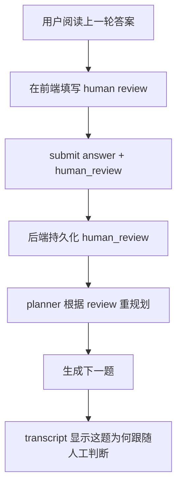

# Harness Engineering：人机协作与前端闭环

很多 AI 项目会说自己是 human-in-the-loop，但实际上只是：

- UI 上有个输入框
- 模型继续自己往下生成

这个项目更值得学习的地方是：  
**人类输入被当成结构化控制信号进入了 agent 编排。**

这篇文档专门讲：
- 前端怎样采集 human review
- 后端怎样消费这个信号
- 为什么这才算真正的人机协作闭环

---

## 1. human-in-the-loop 不等于“用户也说了几句话”

真正的人机协作至少要满足 4 个条件：

1. 人类输入被结构化保存  
2. 人类输入会影响下一步规划  
3. 人类输入在 transcript 中可见  
4. 人类输入在 debug / state 中可追踪  

这个项目这四点都在做。

---

## 2. 前端入口：用户在哪里表达判断

关键代码：
- [`frontend/src/components/AnswerComposer.tsx`](../frontend/src/components/AnswerComposer.tsx)
- [`frontend/src/hooks/useProject.ts`](../frontend/src/hooks/useProject.ts)

当前前端会采集的结构化 review 典型包括：

- `verdict`
  - sufficient / insufficient / drifted
- `direction`
  - continue / redirect
- `preferred_next_focus`
- `note`
- `phase_ready`

### 这比“随便加一句备注”强在哪

因为这些字段不是只展示在前端，而是会进入后端 planner 的决策条件。

---

## 3. 后端如何消费 human review

关键代码：
- [`app/schemas/turn.py`](../app/schemas/turn.py)
- [`app/services/question_planner.py`](../app/services/question_planner.py)
- [`app/services/stage_manager.py`](../app/services/stage_manager.py)

### 在 planner 中

human review 会影响：
- 是否直接 `human_guided_redirect`
- target_label 应该转向什么
- `why_this_question` 是否体现人类重定向

### 在 stage controller 中

`phase_ready` 会影响：
- 是否允许阶段推进

### 在 coverage 中

human review 会进入：
- `human_collaboration` 计数

所以 human review 不是附属信息，而是 Harness 的一部分。

---

## 4. transcript 为什么必须把 human review 显示出来

关键代码：
- [`frontend/src/components/TurnCard.tsx`](../frontend/src/components/TurnCard.tsx)

如果 human review 只存在数据库里，不展示出来，最终 transcript 看起来仍然像：
- AI 在自己提问
- AI 在自己回答

这会直接削弱“可交付的人机协作证据”。

所以 transcript 里要明确区分：

1. AI question  
2. AI answer  
3. human review / redirect / prioritization  

这不仅是 UX，而是 deliverable 质量的一部分。

---

## 5. 为什么前端在 Harness Engineering 里不是次要部分

很多后端导向的开发者容易把前端看成：
- 展示层

但在 AI Agent 里，前端往往还是：
- 控制层
- 证据层
- 反馈层

这个项目里的前端至少承担了 3 个 Harness 角色：

### 5.1 收集结构化 human review

它让人类输入变成 planner 可以理解的信号。

### 5.2 展示 execution trace

它让用户看到 agent 现在在做什么，而不是黑箱。

### 5.3 展示 why this question

它让下一题的来源和原因可感知。

---

## 6. 一个真正的人机协作闭环长什么样

### 这和普通聊天产品的本质区别

普通聊天产品更多是：
- 用户提一句
- AI答一句

而这里是：
- 人类对 AI 的上一轮结果做元判断
- 系统再根据这个元判断重规划

这更接近真正的协作式 agent。

---

## 7. 这套设计有哪些通用迁移价值

### 对 code agent

human review 可以变成：
- patch acceptable?
- keep investigating?
- which file next?

### 对 research agent

human review 可以变成：
- answer sufficient?
- go deeper here?
- switch to another source?

### 对 workflow agent

human review 可以变成：
- continue automation?
- ask for approval?
- choose branch A or B?

也就是说，结构化 human signal 是通用 harness 模式，不是这个项目特例。

---

## 8. 如果你要继续提升这部分，最值得改什么

### 方向 1：把 human review 做得更细但不更重

例如增加：
- preferred module
- preferred file
- confidence

但不要把表单做成很重的问卷。

### 方向 2：在 transcript 中更明确显示“following human redirect”

当前已经能显示，但还能更直观。

### 方向 3：把 debug 输出和前端展示对齐

让用户能看到：
- 是否应用了 human review
- 哪个 planner 分支因此被触发

---

## 9. 一句话总结

这个项目在人机协作上最值得学习的，不是“前端有一个 review 面板”，而是：

**前端采集的人类判断真正进入了 planner、stage control、coverage state 和 transcript。**
