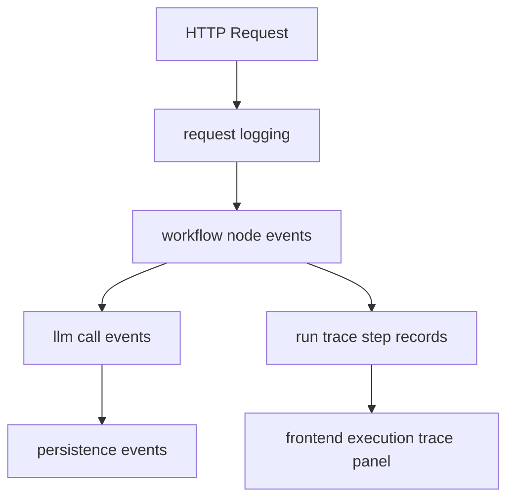

# Harness Engineering：可观测性、运行轨迹与调试方法

AI Agent 最难维护的问题之一，不是“模型不够强”，而是：

**出了问题你根本不知道问题出在哪。**

这个项目已经把可观测性拆成两套：

1. 结构化日志 `logging`
2. 运行轨迹 `run trace`

这篇文档讲它们为什么都需要，以及你实际怎么用。

---

## 1. logging 和 run trace 的区别

### structured logging

面向：
- 开发者排障
- 事件追踪
- 离线分析

典型内容：
- request_id
- trace_id
- workflow event
- llm call
- errors

### run trace

面向：
- 前端 execution UI
- 用户看到 agent 正在干什么
- 某次执行的 step timeline

典型内容：
- run_id
- current step
- duration
- method
- per-step status

### 重要结论

run trace 不是把日志搬到前端。  
它是一个更稳定、更 UI-friendly 的抽象层。

---

## 2. 为什么 AI Agent 特别需要 run trace

因为它的执行不是单步的。

一次 `/next` 可能包含：
- 读项目上下文
- 刷摘要
- 刷 coverage
- 规划问题
- 检索上下文
- 渲染 prompt
- 调模型
- 校验问题
- 持久化结果

如果用户只看到：
- Loading...

那他们会完全不知道：
- 是慢在 LLM
- 还是卡在数据库
- 还是跑在 summary maintenance

所以 execution trace 对 agent 产品是非常自然的需求。

---

## 3. 这个项目的可观测性分层

### 对应代码

- logging:
  - [`app/logging/`](../app/logging)
- run trace:
  - [`app/services/run_trace_service.py`](../app/services/run_trace_service.py)
- UI:
  - [`frontend/src/components/ExecutionTraceSection.tsx`](../frontend/src/components/ExecutionTraceSection.tsx)

---

## 4. 最常见的调试路径应该怎么走

### 场景 A：用户说“卡了很久”

先看：
1. `runs/latest` 当前 step 是什么
2. 对应 step 的 duration
3. 结构化日志里有没有 error

### 场景 B：问题生成成功了，但 UI 还在显示 running

先查：
1. run 是否被 finalize
2. step 是否 stuck 在 running
3. 前端 polling 是否停止

### 场景 C：问题质量不对

先查：
1. debug next-context
2. planner output
3. validation result
4. retrieval branch selection

### 场景 D：SQLite 锁冲突 / trace write failure

先查：
1. errors log 里的 `run_trace.write_error`
2. step finalization 是否 best-effort
3. 主事务是否长时间持锁

---

## 5. 为什么“best-effort trace”是个很重要的工程思想

这个项目里已经明确采用：

- logging / trace 很重要
- 但 logging / trace 自己不能反向拖垮主流程

这背后是一个非常通用的 agent 工程原则：

### 主业务优先级 > 可观测性写入优先级

如果执行已经成功：
- 不能因为 trace 写失败就把整次请求判死

这在真实工程里非常重要，尤其是：
- SQLite
- 单机部署
- 轻量 agent app

---

## 6. 前端 execution trace 为什么也是可观测性的一部分

很多人以为可观测性只属于后端。

但这个项目已经证明：
- 用户看到 agent 当前在干什么
- 也是一种产品级 observability

execution trace panel 做了几件重要的事：

1. 当前 step 突出显示  
2. 历史 step 默认折叠，避免 UI 噪音  
3. 每步耗时清晰可见  
4. run 总耗时可见  
5. project 累计耗时也可见  

这就是“对用户友好的 observability”。

---

## 7. 这套思路对别的 AI Agent 有什么通用价值

非常高。

你以后做任何 agent，只要执行不是一步完成，就应该考虑：

- 是否需要 run model
- 是否需要 per-step trace
- 是否需要 current step
- 是否需要 per-step duration
- 是否需要 cumulative metrics

典型应用：

### code agent
- scan repo
- pick file
- edit file
- run tests
- summarize result

### research agent
- search
- retrieve sources
- extract evidence
- synthesize answer

### workflow agent
- gather inputs
- choose tool
- call tool
- validate output
- persist result

---

## 8. 初学者最应该记住的调试方法

遇到 agent 问题时，不要只问：
- “prompt 有没有写好”

你应该系统地问：

1. 当前 run 到了哪一步？  
2. 哪一步耗时异常？  
3. planner 是怎么选的？  
4. validator 有没有拦？  
5. persistence 有没有成功？  
6. 用户看到的运行状态是否和真实状态一致？  

这就是 Harness Engineering 下的调试方式。

---

## 9. 一句话总结

AI Agent 的可观测性不只是“打点日志”，而是：

**让系统对开发者可追踪、对用户可感知、对故障可定位。**
