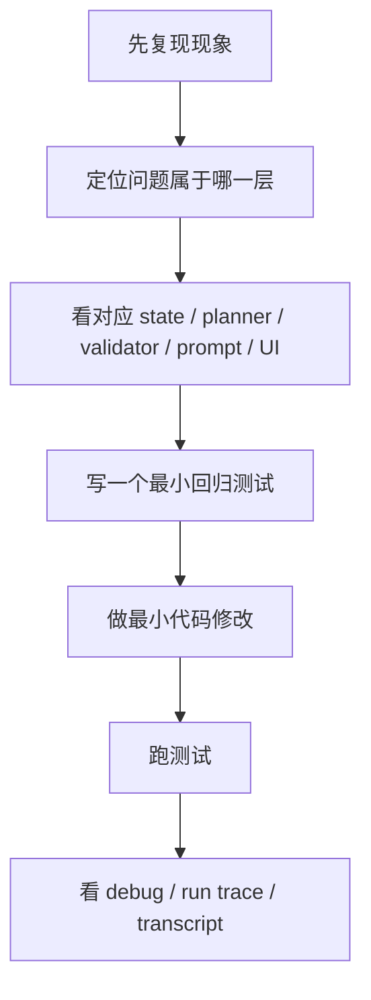

# Harness Engineering：如何实操修改一个 Agent

这篇不是讲概念，而是讲你以后真的要改这个仓库时，应该怎么下手。

目标是让你学会一种通用方法：

> 不是“看到问题就直接改 prompt”，而是先判断问题属于 Harness 的哪一层，再精确修改。

---

## 1. 先把 agent 问题分层归类

你遇到的绝大多数质量问题，都可以先归到下面 6 类之一：

1. **状态问题**
- 系统记错了 / 记漏了 / 误判已覆盖

2. **阶段问题**
- 太早钻细节
- 太晚进入 use cases

3. **规划问题**
- 问错 branch
- 问错 target
- 忽略了 human review

4. **上下文问题**
- prompt 看到了不该看的历史
- 没看到该看的历史

5. **生成问题**
- prompt 约束不够强
- 语言风格不对

6. **校验问题**
- 明明生成错了，却没有被拦住

---

## 2. 典型问题 -> 对应修改入口

### 场景 A：总是重复问差不多的问题

优先看：
- [`app/services/repetition_guard.py`](../app/services/repetition_guard.py)
- [`app/services/question_planner.py`](../app/services/question_planner.py)
- [`app/services/context_engineering.py`](../app/services/context_engineering.py)
- [`app/services/coverage_service.py`](../app/services/coverage_service.py)

修改顺序建议：

1. 先看 `question_history` 是否正确记录
2. 再看 planner 是否避开 recent branch / recent target
3. 再看 retrieval 是否对旧 branch 降权
4. 最后才调 lexical / embedding threshold

### 场景 B：太容易从理解代码滑到“建议怎么改”

优先看：
- [`app/services/question_planner.py`](../app/services/question_planner.py)
- [`app/services/question_validator.py`](../app/services/question_validator.py)
- [`app/prompts/assets/next_question_code_detail.yaml`](../app/prompts/assets/next_question_code_detail.yaml)

修改顺序建议：

1. 先收紧 planner constraints
2. 再收紧 validator 的 forbid list
3. 最后才收紧 prompt wording

### 场景 C：human review 明明填了，但下一题没变

优先看：
- [`frontend/src/components/AnswerComposer.tsx`](../frontend/src/components/AnswerComposer.tsx)
- [`frontend/src/hooks/useProject.ts`](../frontend/src/hooks/useProject.ts)
- [`app/schemas/turn.py`](../app/schemas/turn.py)
- [`app/services/question_planner.py`](../app/services/question_planner.py)

修改顺序建议：

1. 先确认前端是否真的发出 signal
2. 再确认后端 schema 是否接收
3. 再看 planner 第一优先级分支是否命中

### 场景 D：execution trace 看起来不对

优先看：
- [`app/services/run_trace_service.py`](../app/services/run_trace_service.py)
- [`app/api/routes/projects.py`](../app/api/routes/projects.py)
- [`frontend/src/components/ExecutionTraceSection.tsx`](../frontend/src/components/ExecutionTraceSection.tsx)

---

## 3. 修改 agent 时的推荐工作流

### 为什么一定要先分类

因为很多 agent 问题表面看起来像 prompt 问题，实际上是：
- state 不对
- planner 没选对
- validator 没拦

先分类，能少走很多弯路。

---

## 4. 3 个最值得练手的实操改动

### 练习 1：新增一个 planner 约束

目标：
- Code Detail 阶段必须优先问 error handling path

改动点：
- `question_planner.py`
- `question_validator.py`
- `next_question_code_detail.yaml`

你会学到：
- planner 和 prompt 的分工
- validator 为什么是必须的

### 练习 2：新增一个 human review focus

目标：
- 让用户可以显式指定 `error_handling`

改动点：
- `AnswerComposer.tsx`
- `types/api.ts`
- `turn.py`
- `question_planner.py`

你会学到：
- 前后端 contract
- human signal 如何进入 orchestrator

### 练习 3：给 run trace 新增一个 step meta

目标：
- 在 retrieval step 里显示被选中的 branch_id

改动点：
- `run_trace_service.py`
- `interview_nodes.py`
- `ExecutionTraceSection.tsx`

你会学到：
- 执行可观测性如何从后端流到前端

---

## 5. 修改一个 agent 时最常见的错误方法

### 错法 1：先改 prompt，再看效果

问题：
- 你根本不知道错误是在 planner 还是 validator

### 错法 2：一口气改 5 个层

问题：
- 改完了也不知道真正生效的是哪一层

### 错法 3：只看最终问题，不看 debug / trace

问题：
- 你会失去解释能力

### 错法 4：不写回归测试

问题：
- 下次改别的地方时很容易把它打回去

---

## 6. 如何判断某次改动是“通用提升”还是“过拟合这个仓库”

### 更可能是通用提升的改动

- planner 增强
- state schema 更合理
- validator 更明确
- run trace 更可读
- human review 更结构化

### 更可能是过拟合的改动

- 为某个仓库专门硬编码词汇
- 为某个 README 或某个文件名写特殊 case
- 把问题序列写死成固定脚本

---

## 7. 一句话总结

真正好的 agent 修改方法不是“哪里不满意就改 prompt”，而是：

**先判断问题属于哪一层 Harness，再做最小、可验证、可解释的修改。**
