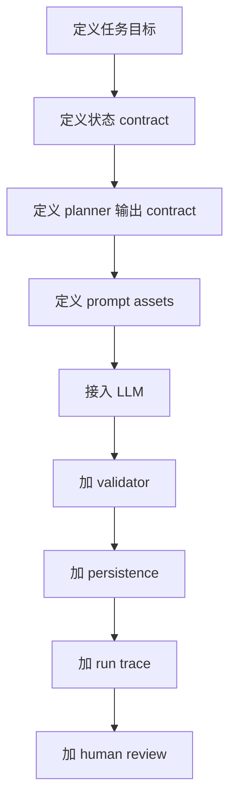

# Harness Engineering：从零搭建一个最小可用 Agent

这篇文档回答一个更通用的问题：

> 如果不直接复制这个仓库，我自己从零做一个最小可用的 AI Agent，应该按什么顺序搭？

这里会用本项目做参照，但不会要求你一开始就做完整版本。

---

## 1. 最小可用 Agent 的正确起步方式

不要一开始就追求：
- LangGraph
- 花哨前端
- 各种优化

正确顺序应该是：



### 关键原则

先搭结构，再调模型。

---

## 2. 第 1 步：先定义 State Contract

这个项目给你的启发是：
- 不要只存原始对话
- 要存“决策需要的结构化状态”

最小版 state 至少包含：

```python
state = {
    "history": [],
    "current_phase": "...",
    "coverage": {},
    "pending_task": None,
}
```

如果是别的 agent，也一样：

### code agent
- files_seen
- hypotheses
- failing_tests

### research agent
- sources_seen
- evidence_map
- unanswered_questions

---

## 3. 第 2 步：定义 Planner Contract

不要让模型直接决定下一步要做什么。

先定义一个 planner 输出结构，例如：

```python
plan = {
    "intent": "...",
    "target": "...",
    "constraints": [...],
    "why": "...",
}
```

本项目里，`question_planner.py` 已经走到了更完整的版本：
- `phase`
- `intent_mode`
- `question_intent`
- `target_type`
- `target_identifier`
- `selected_framework_gap`
- `why_this_question`

你自己的最小版不一定要这么多，但一定要先有“结构化 plan”。

---

## 4. 第 3 步：Prompt 资产化，而不是把 prompt 写死在业务函数里

本项目给你的最佳实践是：
- prompt 放 YAML
- 代码只负责加载和渲染

最小版也可以做成：

```text
prompts/
  next_step.yaml
  summarize.yaml
```

这样你后面切不同阶段 / 不同角色 / 不同任务时，就不会把业务逻辑和 prompt 字符串缠死。

---

## 5. 第 4 步：接入 LLM，但只把它当执行器

此时模型负责的是：
- 根据 planner 给的约束写输出

而不是：
- 自己决定任务应该怎么走

这个区别特别重要。

如果一开始就让模型同时负责：
- 记忆
- 规划
- 生成
- 自检

你很快会失控。

---

## 6. 第 5 步：加 Validator，哪怕一开始只是规则版

很多初学者最容易漏这一层。

最小版 validator 至少应该回答：
- 输出是否为空
- 是否缺关键字段
- 是否明显跑题

本项目进一步演化成：
- 阶段校验
- `understand_current_code` 模式校验
- 语义重复校验

你可以先从最小规则版开始，后续再升级。

---

## 7. 第 6 步：一定要持久化，不要全靠内存

本项目的经验很明确：
- 没有持久化，你就没有真正多轮 agent

最小版至少要持久化：
- session
- turns / steps
- state snapshot

即使你先用 SQLite，也比全内存好很多。

---

## 8. 第 7 步：尽早加 run trace

不要等“以后有空再加可观测性”。

最小版 trace 只要有这两个表/结构就够用：
- runs
- run_steps

只记录：
- status
- started_at
- ended_at
- current step

已经足够比纯黑箱系统强很多。

---

## 9. 第 8 步：加入 human review，系统才真正开始协作化

本项目很值得学习的一点是：
- human review 不是备注
- 它是 planner 的输入

你最小版也可以只做这 3 个字段：
- verdict
- direction
- note

只要它真的能影响下一步规划，就已经进入真正的人机协作了。

---

## 10. 一个推荐的最小目录结构

```text
app/
  routes/
  models/
  state/
  planner/
  validator/
  prompts/
  llm/
  traces/
frontend/
  hooks/
  views/
  review/
```

然后再逐步进化成更完整结构。

---

## 11. 从“最小可用”进化到“像本项目这样较完整”的路线

### V1
- 单 session
- 单 planner
- 单 prompt
- 规则 validator

### V2
- 多 session
- state persistence
- prompt asset system
- basic run trace

### V3
- stage controller
- coverage memory
- retrieval context engineering
- human review

### V4
- richer validator
- duplicate guard
- structured logging
- frontend execution trace

这个项目基本处在 V3-V4 之间。

---

## 12. 一句话总结

从零搭一个 agent 的正确顺序不是“先找最强模型”，而是：

**先搭 state、planner、validator、trace 这些 harness 骨架，再把模型接进去。**
