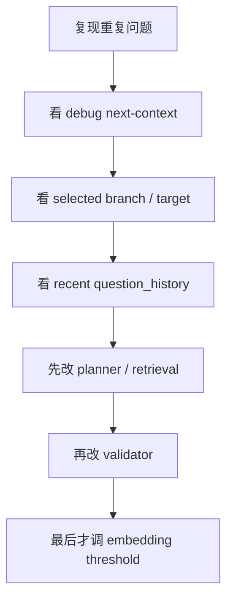

# 案例：如何抑制重复问题

这篇用本项目里一个真实且高频的问题做练习：

> 为什么系统会反复问本质差不多的问题？  
> 应该怎么从 Harness 角度系统修？

---

## 1. 先不要急着调 prompt

重复问题通常不是单一 prompt 问题，而是下面几层共同造成的：

1. `coverage_state` 没记清“已经问过什么”
2. planner 仍然选回同一 branch / target
3. retrieval 继续把老 branch 高权重捞回来
4. validator 没把“语义重复”拦住

也就是说，这是一个典型的：

**State + Planner + Retrieval + Validator 联合问题**

---

## 2. 这个仓库里的关键改动入口

按优先级看：

1. [`app/services/repetition_guard.py`](../app/services/repetition_guard.py)
2. [`app/services/question_planner.py`](../app/services/question_planner.py)
3. [`app/services/context_engineering.py`](../app/services/context_engineering.py)
4. [`app/services/coverage_service.py`](../app/services/coverage_service.py)
5. [`app/services/question_validator.py`](../app/services/question_validator.py)

---

## 3. 正确的修法是什么

### 第一步：让系统记住“问过哪些 target”

不是只记住 question text，而是记住：

- stage
- intent
- branch_id
- target_type
- target_label
- signature

对应本项目：
- `coverage_state.question_history`

这一步解决的是：
- 系统知道“这件事问过了”

### 第二步：planner 不要再优先选最近问过的 branch

对应本项目：
- `choose_branch_for_stage()`
- `choose_non_redundant_code_detail_target()`

这一步解决的是：
- 系统不要总在同一主题簇里兜圈子

### 第三步：retrieval 对老 branch 加 novelty penalty

对应本项目：
- [`app/services/context_engineering.py`](../app/services/context_engineering.py)

这一步解决的是：
- 上下文检索层也别老喂同一批证据

### 第四步：validator 把“本质重复”挡掉

对应本项目：
- `question_validator.py`
- `repetition_guard.py`

这一步是最后兜底。

---

## 4. 为什么 embedding 可以作为辅助，但不能代替整个方案

embedding 的优势是：
- 能识别换了说法但本质同问

但它不能代替：
- branch 记忆
- target 记忆
- stage-aware planning

最稳的结构是：

```text
question_history + planner 去重 + retrieval novelty penalty + validator + 可选 embedding
```

而不是：

```text
全靠 embedding 相似度阈值
```

---

## 5. 你自己动手改时的推荐步骤



---

## 6. 一个最小可做的练习

目标：
- 最近 4 轮问过的 branch，在 Code Detail 阶段直接降权

建议改动：
- `question_planner.py`
- `context_engineering.py`

验证方式：
- 看下一题是否切换 branch
- 看 debug 里被选中的 branch 是否改变

---

## 7. 这一案例背后的通用 Harness 思想

重复问题不是“生成模型笨”，而是：

**系统没有足够强地记忆、约束和重规划。**

这条经验对任何 agent 都通用。
