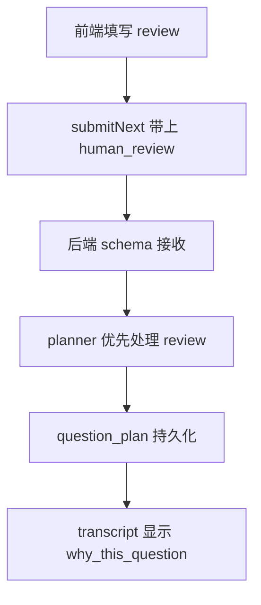

# 案例：如何让 human review 真正影响 planner

这篇讨论另一个非常典型的问题：

> 前端明明让用户填了 human review，为什么下一题还是像系统自己决定的？

这类问题非常适合用来学习 human-in-the-loop agent 的工程闭环。

---

## 1. 一个真正的人机协作链路应该长这样

只要其中任意一段断了，human review 就会变成“看起来有、实际上没用”。

---

## 2. 这个仓库里最常见的断点

### 断点 1：前端没发出去

典型位置：
- [`frontend/src/components/AnswerComposer.tsx`](../frontend/src/components/AnswerComposer.tsx)

常见问题：
- 用户只填了 `preferred_next_focus`，没填 `verdict`
- 前端直接把整个 review signal 视为 `null`

### 断点 2：后端 schema 太严格

典型位置：
- [`app/schemas/turn.py`](../app/schemas/turn.py)

常见问题：
- `verdict` 被设成必填
- 导致部分 review 无法被接收

### 断点 3：planner 没把 review 放在最高优先级

典型位置：
- [`app/services/question_planner.py`](../app/services/question_planner.py)

如果 human review 分支排在 drift / stage gap 后面，系统就会继续“自说自话”。

---

## 3. 正确修法

### 前端层

允许 partial review signal：
- 不要求每次都必须填满所有字段
- 只要有 redirect / preferred focus / note，就应该发到后端

### schema 层

允许：
- `verdict` 可选
- 但整体 review 仍可存在

### planner 层

human review 应该在普通 planner 逻辑之前被处理：
- redirect
- insufficient
- drifted
- preferred focus
- note

### transcript 层

必须显示：
- human review applied
- why this question

否则协作痕迹对最终交付不可见。

---

## 4. 你改这个问题时最推荐的排查顺序

1. 看网络请求里是否真的带了 `human_review`
2. 看后端 schema 是否收到了
3. 看 debug next-context 里 `human_review_applied` 是否为 true
4. 看生成出的 `question_plan` 是否体现 human redirect
5. 看 transcript 是否把这层信息展示出来

---

## 5. 一个最小可做练习

练习目标：
- 用户只选 `direction=redirect`
- 只填 `preferred_next_focus=architecture`
- 不填 `verdict`
- 下一题仍应明显转向 architecture

这能很好检验：
- 前端 partial signal
- schema 兼容
- planner 优先级

---

## 6. 背后的通用 Harness 思想

人机协作不是“给用户一个按钮”，而是：

**把人类判断做成结构化控制信号，并让它真实进入 planner 和 transcript。**
