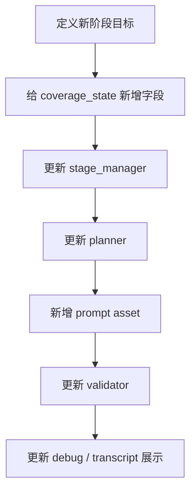

# 案例：如何给 Agent 增加一个新阶段

这篇用一个很有代表性的改造任务来练 Harness Engineering：

> 如果我要给现有 agent 再增加一个新阶段，应该改哪些层？

这个案例非常适合用来理解：
- 为什么阶段不是只改一个枚举
- 为什么 stage 是贯穿 state、planner、prompt、validator、UI 的横切改动

---

## 1. 先理解：阶段是一个“全栈 contract”

在这个项目里，“阶段”至少影响：

1. `stage_manager`
2. `coverage_state.framework`
3. `question_planner`
4. `context_engineering`
5. prompt assets
6. `question_validator`
7. 持久化 turn 的 `stage`
8. 前端 transcript / status 展示

所以新增阶段不是加一条字符串常量，而是要更新整套 Harness contract。

---

## 2. 假设要新增一个阶段：`Risk & Reliability`

只是举例，不是建议你现在真的加。

如果要加，至少要考虑这些问题：

### 状态层
- 这个阶段要覆盖什么指标？
- 是布尔覆盖还是计数覆盖？

### 阶段控制层
- 它在什么阶段后进入？
- 什么条件下结束？

### planner 层
- 它的 `question_intent` 可能有哪些？
- 它的 target 是：
  - module
  - execution path
  - failure path
  - retry mechanism

### prompt 层
- 要不要独立 prompt asset？

### validator 层
- 什么样的问题算这个阶段合格？

### 前端层
- transcript 上要怎么显示这个阶段名？

---

## 3. 真实改动顺序应该是什么

### 为什么这个顺序合理

因为如果你先写 prompt，而没有：
- state contract
- progression rule
- validation rule

这个阶段很快就会变成“只是一个名字不同的 prompt”。

---

## 4. 对应到本项目的具体文件

### 第一步：状态 contract

改：
- [`app/services/coverage_service.py`](../app/services/coverage_service.py)

你要补：
- `default_framework_coverage()`
- `normalize_framework_coverage()`
- `rebuild_framework_coverage()`
- `framework_gaps_for_stage()`

### 第二步：阶段控制

改：
- [`app/services/stage_manager.py`](../app/services/stage_manager.py)

你要补：
- 新阶段常量
- 从哪个阶段迁移过来
- 何时离开这个阶段

### 第三步：planner

改：
- [`app/services/question_planner.py`](../app/services/question_planner.py)

你要补：
- 新阶段 branch/target 选择
- `prompt_id_for_stage()`
- `prioritized_stage_gaps()`

### 第四步：prompt

新增：
- `app/prompts/assets/next_question_risk_reliability.yaml`

### 第五步：validator

改：
- [`app/services/question_validator.py`](../app/services/question_validator.py)

### 第六步：前端显示

改：
- `frontend/src/types/api.ts`
- `frontend/src/components/TurnCard.tsx`
- 可能还有 `StatusPanel.tsx`

---

## 5. 最容易犯的错误

### 错误 1：只改 stage_manager

结果：
- 阶段名切过去了
- 但 planner / prompt / validator 都没变

### 错误 2：只新增 prompt

结果：
- 看起来有新阶段
- 实际只是旧逻辑换个文案

### 错误 3：不改 coverage_state

结果：
- 系统根本不知道这个阶段覆盖完成没有

---

## 6. 最小练习版本

如果你只是想练习，不想真的加大阶段，可以先做一个很小的伪练习：

目标：
- 在现有 Code Detail 里新增一个 `error_handling_submode`

你会接触到同样的思路：
- state
- planner
- prompt
- validator

但改动范围比新增完整阶段小很多。

---

## 7. 背后的通用 Harness 思想

“阶段”在 agent 工程里本质上是一种：

**跨 state、planner、prompt、validator、UI 的全链路约束合同。**

这条经验不仅适用于这个项目，也适用于任何多阶段 agent。
