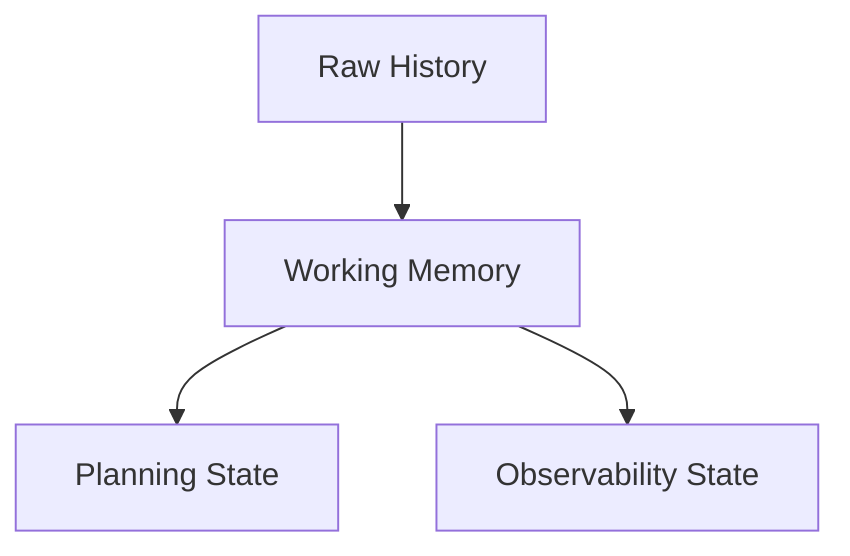

# 专题：如何设计 Agent 的状态 Schema

这篇专题手册讲一个非常基础、但决定 agent 上限的问题：

> 一个 AI Agent 到底应该“记住什么”？

如果状态 schema 设计得差，后面无论你加多少 prompt、planner、validator，系统都会不稳定。

这个仓库最值得学习的一点，就是它没有把“状态”理解成：
- 只有一串原始对话历史

而是逐步把状态升级成了一个能支持规划、校验、协作和调试的结构化模型。

---

## 1. 初学者最常见的错误状态设计

很多人最早的 agent 状态长这样：

```python
state = {
    "messages": [...]
}
```

这不是不能用，但它只能支持：
- 把上下文全喂给模型
- 靠模型自己记住已经发生了什么

它不适合支持：
- 阶段控制
- 覆盖度判断
- 问题去重
- human review
- debug explainability

---

## 2. 一个更像工程系统的状态要分成哪几层

这个项目里的经验可以抽象成 4 层状态：



### 2.1 Raw History

最底层仍然是原始历史：
- project
- turn
- question_text
- answer_text

对应代码：
- [`app/models/project.py`](../app/models/project.py)
- [`app/models/turn.py`](../app/models/turn.py)

### 2.2 Working Memory

从原始历史重建出来的结构化记忆：
- `coverage_state`
- `branches`
- `framework`
- `question_history`

对应代码：
- [`app/services/coverage_service.py`](../app/services/coverage_service.py)

### 2.3 Planning State

为下一步决策准备的中间状态：
- current stage
- selected gap
- selected branch
- question plan

对应代码：
- [`app/services/stage_manager.py`](../app/services/stage_manager.py)
- [`app/services/question_planner.py`](../app/services/question_planner.py)

### 2.4 Observability State

为人类理解执行过程准备的状态：
- run
- run steps
- request_id / trace_id

对应代码：
- [`app/services/run_trace_service.py`](../app/services/run_trace_service.py)
- [`app/logging/`](../app/logging)

---

## 3. 这个项目为什么要把状态分成“持久化状态”和“工作流临时状态”

这点特别重要。

### 持久化状态

应该长期保存在数据库中的：
- project metadata
- turns
- human_review
- question_plan
- coverage_state
- agent_runs

### 工作流临时状态

只在一次 run 内部存在的：
- 当前节点输出
- 本轮 prompt context
- 本轮 selected branch candidates
- 当前 validate result

### 为什么要分开

如果你把短期状态也长期持久化，就会容易出现：
- 上次 run 的中间字段污染下次 run
- 旧的 `next_turn_no`、旧的 `planner_decision` 继续参与下一轮

这个仓库前面就实际踩过这个坑。

---

## 4. 一个好的状态 schema 至少要支持这 5 种问题

你设计状态时，可以拿这 5 个问题做检查：

### 问题 1：系统知道现在进行到哪一步了吗？

需要：
- current_stage
- stage_turn_counts

### 问题 2：系统知道还缺什么吗？

需要：
- framework gaps

### 问题 3：系统知道最近问过什么吗？

需要：
- question_history

### 问题 4：系统知道人类刚刚做了什么判断吗？

需要：
- human_review
- human collaboration counters

### 问题 5：系统知道当前执行卡在哪一步吗？

需要：
- run
- run_step

如果你的状态回答不了这些问题，说明 schema 还不够工程化。

---

## 5. 本项目里最值得你重点学习的状态结构

### 5.1 `coverage_state`

这是当前项目最核心的 working memory。

它不只是缓存，而是 planner 的主要依据。

它包含：
- `branches`
- `question_history`
- `framework`
- `gaps`
- `wrap_up_ready`

### 5.2 `question_plan`

这是“planner 的输出被持久化”的做法。

价值是：
- 方便调试
- 方便 transcript 展示 why_this_question
- 方便把 planning 结果反馈回 coverage_state

### 5.3 `human_review`

这是“人类判断被结构化保存”的做法。

价值是：
- 不再只是自由文本
- 能真的进入后续编排逻辑

---

## 6. 如何自己设计一个新 agent 的状态 schema

建议按这个顺序设计：

### 第一步：先定义持久化实体

例如：
- session
- step / turn
- run

### 第二步：再定义 working memory

例如：
- coverage
- pending tasks
- branch summary

### 第三步：最后定义 planning output

例如：
- selected intent
- selected target
- constraints

不要反过来先写 prompt。

---

## 7. 一个很实用的设计原则：状态必须服务于决策

如果一个字段：
- 不能帮助 planner 决策
- 不能帮助 validator 判断
- 不能帮助 debug 排障
- 不能帮助 UI 展示

那就很可能只是“顺手存了点数据”，而不是真正有价值的 harness state。

---

## 8. 你现在最适合做的练习

练习目标：
- 给 `coverage_state.framework` 新增一个你自己定义的维度

例如：
- `documentation_points_count`

然后你需要同步思考：
- 谁来统计它
- 谁来消费它
- 它会不会影响 stage / planner / validator

做完这个练习，你会真正理解“状态 schema 是系统 contract”的含义。

---

## 9. 一句话总结

一个成熟的 Agent，不是“把历史都发给模型”，而是：

**先把历史重构成有决策价值的状态 schema，再让 planner 和 validator 在这个状态之上工作。**
