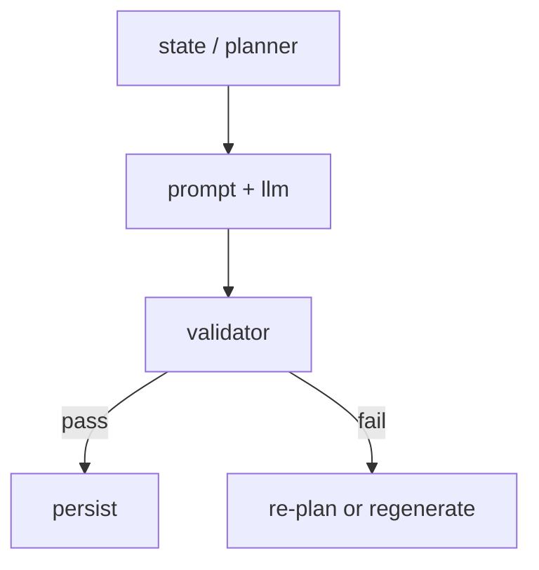

# 专题：如何设计 Validator，而不是只调 Prompt

这一篇专题想讲清一个在 AI 项目里非常常见、也非常容易被忽略的事实：

> Prompt 很重要，但 Validator 往往更能决定系统下限。

如果你只有 prompt，没有 validator，系统迟早会出现：
- 漂移
- 重复
- 越界
- 格式错
- 目标错

这个仓库已经有较明显的 validator 思想，因此非常适合拿来学习。

---

## 1. 为什么很多人不写 validator

因为 prompt 看起来更“直接”：
- 改一行文案
- 模型输出就好像变了

而 validator 看起来更“麻烦”：
- 要定义规则
- 要处理失败分支
- 要想清楚什么叫不合格

但从工程角度看，validator 才是：
- 保底层
- 质量闸门
- 系统边界

---

## 2. 这个项目里的 validator 主要负责什么

关键代码：
- [`app/services/question_validator.py`](../app/services/question_validator.py)

当前 validator 至少在做这几类事情：

1. 阶段匹配
2. `understand_current_code` 模式约束
3. Code Detail 具体性约束
4. 避免 change-planning / redesign 问题
5. 语义重复拦截

这说明它不是只查格式，而是在查“这题是不是仍然属于我们想要的轨迹”。

---

## 3. 一个好 validator 应该检查什么

建议你把 validator 的职责分成 4 层：

### 第一层：基本合法性
- 不是空字符串
- 不是明显损坏格式

### 第二层：阶段合法性
- Panorama 阶段不能太细
- Architecture 阶段不能退回大而空的 overview
- Code Detail 阶段必须足够具体
- Use Cases 阶段必须收集 scenario contract

### 第三层：意图合法性
- 当前是 `understand_current_code`
- 就不能滑到：
  - redesign
  - refactor
  - update tests

### 第四层：历史合法性
- 不能和最近问题本质重复

本项目其实已经在做后 3 层，这是它比较先进的地方。

---

## 4. 为什么 validator 不能只靠 LLM 自检

很多人会想：
- “让模型自己检查一下不就好了？”

这当然可以作为补充，但不适合作为唯一手段。

原因：

1. 成本更高  
2. 不够稳定  
3. 很难解释为什么被拒绝  
4. 容易又回到“把所有问题都交给模型”  

这个项目当前更偏 rule-based validator，这是非常适合初学者学习的路线：
- 明确
- 可解释
- 可调试

---

## 5. validator 在 Harness 里的位置

### 关键理解

validator 不是最后做个“礼貌检查”，而是：
- 直接决定这次生成能不能进入系统状态

所以它是 Harness 的边界守门员。

---

## 6. 这个项目给你的最重要启发

### 启发 1：validator 要知道阶段

不是统一一套规则检查所有问题，而是：
- 不同阶段有不同合法标准

### 启发 2：validator 要知道 intent mode

`understand_current_code` 模式下：
- “应该怎么改” 就不合法

### 启发 3：validator 要知道近期历史

否则它无法拦住“换句话说再问一次”

---

## 7. 如果你自己设计一个最小 validator，该怎么起步

不要一开始就写很复杂。

最小版建议先有 3 条：

1. 非空  
2. 不越当前阶段边界  
3. 不违反当前 intent mode  

然后逐步再加：
- specificity
- duplication
- scenario completeness

---

## 8. 一个非常实用的练习

练习目标：
- 给 Code Detail 阶段新增一条 validator 规则：
  - 必须出现文件名、类名、方法名、执行路径四者之一

你会立刻看到：
- 问题会变得更具体
- prompt 即使没大改，输出也会被收紧

这会非常直观地让你意识到 validator 的价值。

---

## 9. 一句话总结

Prompt 决定模型“倾向怎么说”，  
Validator 决定系统“什么绝对不能接受”。  

真正稳定的 agent，一定不能只有前者没有后者。
