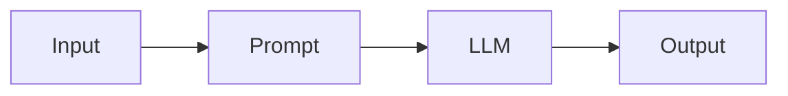
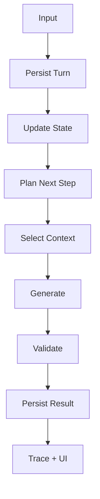
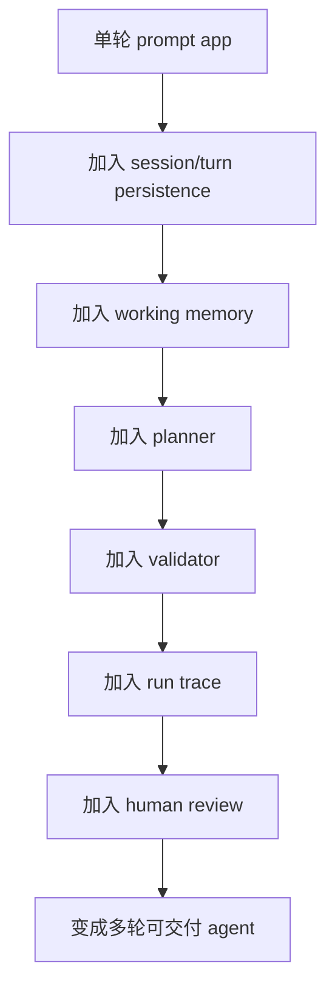

# 专题：如何把单轮应用演进成多轮可交付 Agent

很多 AI 产品一开始都是单轮的：

- 提一个问题
- 模型答一个结果

这没有问题，但当你想让它变成一个“可交付的、多轮、有组织的 agent”，难度会突然增加。

这个仓库最值得学习的地方之一，就是它已经不只是单轮问答，而是一个多轮、带轨迹、带状态、带协作的系统。

---

## 1. 单轮应用和多轮 agent 的本质差别

### 单轮应用

典型结构：

### 多轮可交付 agent

典型结构：

这两者复杂度完全不是一个量级。

---

## 2. 从单轮到多轮，最先要补的不是 UI，而是状态

如果你还停留在：
- 一次请求就是一次回答
- 不保存中间状态

那么系统并不是真正多轮。

要升级成多轮，第一步是：
- session
- turn
- working memory

这个项目对应的是：
- `ProjectSession`
- `InterviewTurn`
- `coverage_state`

---

## 3. 第二步：让系统知道“下一步不是随机继续”，而是被规划

单轮系统通常没有 planner。

但一旦进入多轮，你就必须回答：
- 为什么这轮问这个，不问别的？
- 为什么现在还在这个阶段？
- 为什么不回到 earlier branch？

这就逼着你引入：
- stage manager
- planner
- validator

也就是这个项目现在的核心骨架。

---

## 4. 第三步：给用户一个“能感知 agent 在工作”的执行体验

单轮产品常见体验是：
- 点一下
- 等回答

多轮 agent 如果还是这样，用户会觉得：
- 黑箱
- 不可靠
- 不知道卡哪了

所以这个项目加了：
- run trace
- per-step duration
- current step
- cumulative generation time

这一步很重要，因为多轮 agent 的“执行感”是产品体验的一部分。

---

## 5. 第四步：加入 human review，系统才真正变成“协作式”

如果多轮 agent 完全自己走：
- 它仍然更像自动流水线

而不是协作代理。

当你加上：
- verdict
- redirect
- preferred focus
- phase_ready

系统就会开始表现出：
- 人类控制节奏
- 人类修正方向
- AI 负责执行和组织

这时它才更像真正可交付的协作 agent。

---

## 6. 把单轮系统演进成多轮 agent 的推荐顺序

这就是本项目很适合拿来学习的演进路线。

---

## 7. 哪些信号说明你的系统已经不只是单轮应用

可以用这几个指标判断：

1. 有 session / run 概念  
2. 有结构化 working memory  
3. 下一步由 planner 决定  
4. 输出会被 validator 拦截  
5. 用户能看到执行步骤  
6. 人类反馈会影响下一步  

如果这些都具备，你的系统就已经不是“套了一层 UI 的 LLM 调用”了。

---

## 8. 用本项目学习这条演进路线时，最值得看的对应点

### 从单轮到状态化
- `models/`
- `coverage_service.py`

### 从状态化到可规划
- `stage_manager.py`
- `question_planner.py`

### 从可规划到可约束
- `question_validator.py`

### 从可约束到可观察
- `run_trace_service.py`
- `logging/`

### 从可观察到可协作
- `AnswerComposer.tsx`
- `human_review`

---

## 9. 一句话总结

把单轮应用演进成多轮可交付 agent，本质上不是“加更多 prompt”，而是：

**逐步补齐状态、规划、校验、可观测性和人机协作这几层 harness。**
